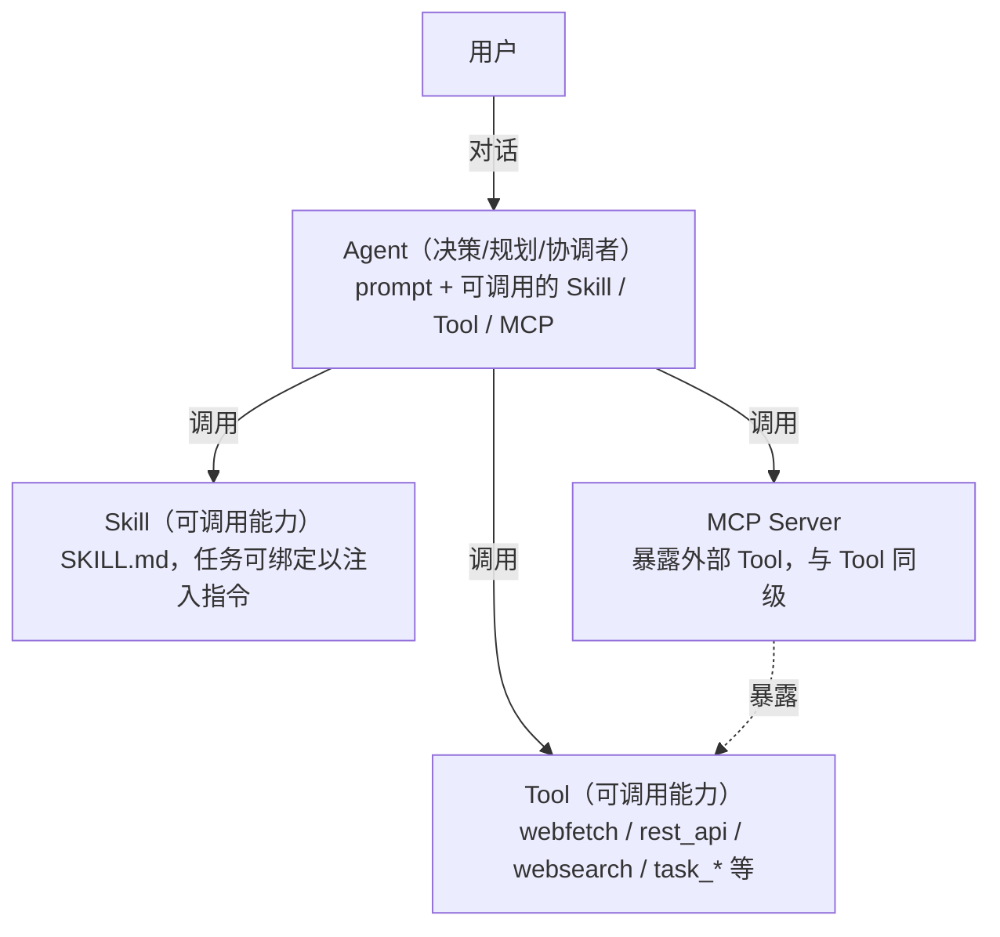
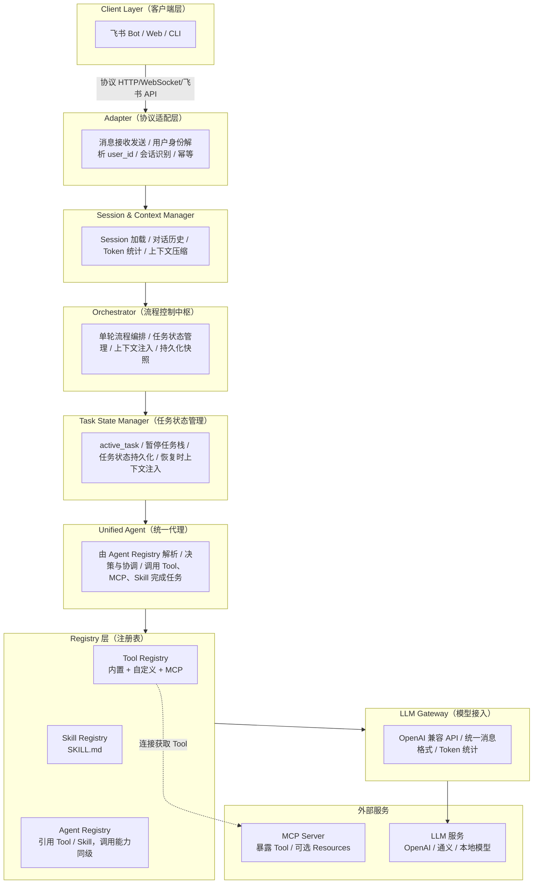
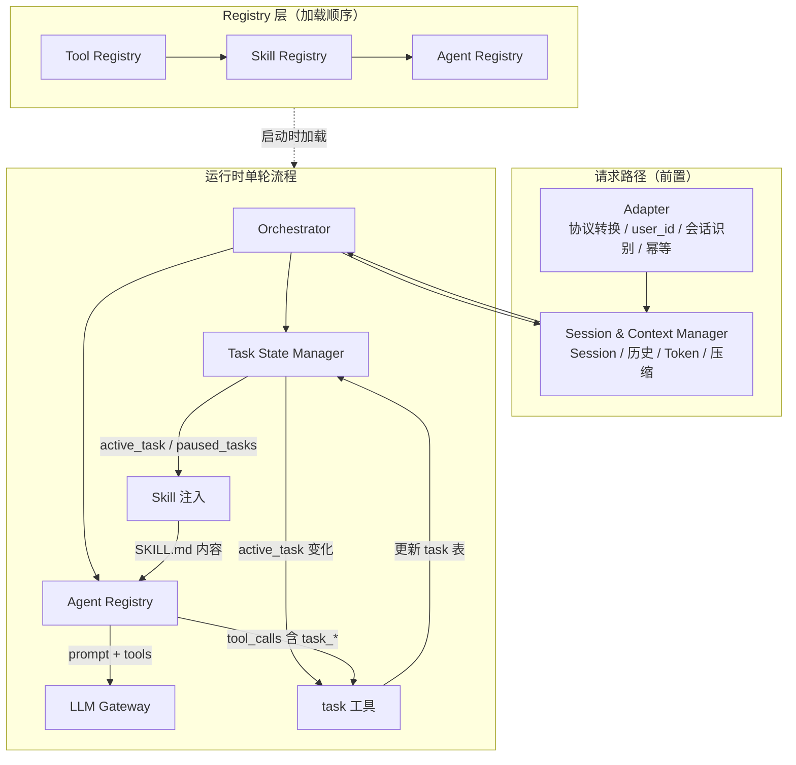
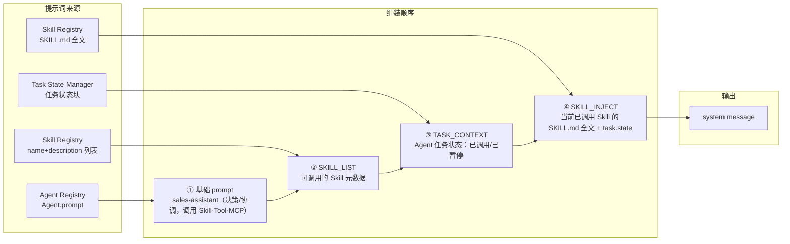
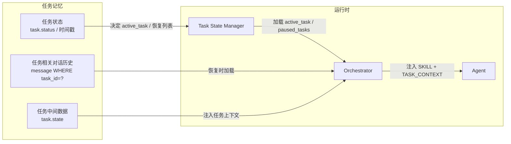

# 销售助手系统设计说明

---

> **For Agent（实施时）**：本文档为已批准的设计规格。实现前请使用 `writing-plans` 将本章节拆为可执行任务计划；执行时使用 `executing-plans` 或 `subagent-driven-development` 逐任务实现并校验。

**Goal：** 面向 To B 销售的对话式助手框架，支持自由对话、LLM 动态任务识别；**Agent 任务**可暂停/恢复/中断并具独立记忆（见第 7 章）；三层记忆（短期/中期/长期）注入提示词以提升规划与决策（见第 8 章）；Tool/MCP/Skill 每次调用为原子执行，无暂停/恢复。

**Architecture：** Client → Adapter → Session/Context → Orchestrator → Task Manager → Agent（决策/规划/协调，调用 Tool、MCP、Skill）→ LLM Gateway；Registry：Tool（含 MCP）、Skill、Agent 并列注册；外部：LLM 服务、MCP Server。

**Tech Stack：** OpenAI 兼容 API、YAML 配置、SKILL.md 规范、MCP 可选。

---

## 1. 文档目的与适用范围

### 1.1 文档目的

本文档定义 **销售助手系统（CRM）** 的总体架构、核心组件、业务流程及实现细节，不绑定具体编程语言。**各层架构中模型提示词的设计**（含 **5.8.0 LLM 统一双轨输出协议**（必遵守）、意图识别与路由、任务拆解与步骤执行、实体提取、任务命名、隐式暂停检测等）见 **5.8 各层模型提示词设计**。适用于：

- 架构师、后端/前端工程师
- LLM 接入工程师
- 产品经理与测试工程师

**文档位置：** 本设计保存于 `crm/design.md`；细分功能设计建议按 Superpowers 约定保存至 `docs/plans/YYYY-MM-DD-<feature>-design.md`。

### 1.2 设计边界（YAGNI）


| 覆盖                                                                                                        | 暂不覆盖                             |
| --------------------------------------------------------------------------------------------------------- | -------------------------------- |
| 运行框架：模型接入、Agent（决策/协调）调用 Skill/Tool/MCP（同级）、Registry 注册维护                                                 | 各销售能力的业务实现（以 Skill/Agent 形式后继接入） |
| 记忆机制：短期/中期/长期记忆、Token 超限 context_compress、知识库向量+BM25 检索、记忆注入提示词（见第 8 章）                                   | 具体 UI 实现                         |
| 基础 Tool：context_compress、task_naming、webfetch、rest_api、websearch（DuckDuckGo）、entity_extract、memory_retrieve_medium/long（见第 6 章） | 具体知识库/向量存储选型（接口约定在设计中）           |


---

## 2. 系统设计目标

### 2.1 能力定位

面向 **销售** 的对话式助手。业务能力以 **Skill** 方式实现，由 **Agent** 使用；用户面向 Agent 对话。


| 能力 ID                | 说明                | 路由意图                 |
| -------------------- | ----------------- | -------------------- |
| work_log             | 以对话方式梳理工作并生成结构化日志 | work_log             |
| opportunity_classify | 商机分类、分级、打标        | opportunity_classify |
| opportunity_report   | 基于商机数据生成分析报告      | opportunity_report   |
| solution_generate    | 根据需求生成销售方案        | solution_generate    |
| bid_generate         | 根据招标要求生成标书文档      | bid_generate         |


### 2.2 交互模式（核心需求）

**自由对话 + 任务感知 + 可暂停/恢复/中断**

1. **自由对话**：用户可自由表达，不强制每轮先识别意图再路由
2. **Agent 任务**：Agent 的一次持续性工作（如按某 Skill 引导用户完成工作日志）称为 **Agent 任务**，具有独立记忆（对话历史、状态、中间数据），存储在任务表及按任务拆分的消息表中（详见第 7 章）。**Tool/MCP/Skill 的每次调用是原子性的**，不存在「暂停某次调用」；可被暂停、恢复、中断的是 **Agent 任务**。
3. **Agent 任务状态与操作**：Agent 任务状态包括 **processing**（执行中）、**paused**（已暂停）、**interrupted**（已中断）、completed、cancelled；**task_start / task_pause / task_resume** 等是管理任务生命周期的工具，操作的是 **Agent 任务** 的状态。
4. **Agent 执行即任务**：Agent 通过**调用 skill/tool/mcp** 执行任务（每次调用原子）；任务开始时可用 task_start(skill_id) 绑定某 Skill，从而注入其指令，后续多轮中 Agent 调用该 Skill 及其他 Tool、MCP 完成工作。
5. **任务引导**：任务绑定某 Skill 后，按该 Skill 的指令引导用户；Agent 在任务中调用 skill/tool/mcp 完成具体步骤（每次调用原子）。
6. **跑题即暂停**：用户跑题或切换话题时，当前 **Agent 任务** **暂停**（task_pause），系统自然响应新话题。若 LLM 未显式调用 task_pause 却直接回答了非任务相关内容，Orchestrator 具备**后验机制**：检测到回复与当前绑定 Skill 不符时自动将任务置为 paused（见 10.1 步骤 9.5），避免任务状态在 LLM 意识之外被挂起。
7. **回归即恢复**：用户再次回到原 Agent 任务时，从暂停处**恢复**（task_resume），沿用该任务的对话历史与 state
8. **重新开始会话**：用户重新开始会话时，系统提醒前次未完成任务（按时间倒序排列），用户可**选择取消**或**选择继续**
9. **超时自动取消**：任务超过 3 天未完成则自动取消，用户重新开始会话时予以提示。**软过期提醒（可选）**：在第 2 天可发送系统触发的回访消息，询问用户是否仍需处理该任务，再于第 3 天未响应时静默取消（见 9.8）。

### 2.3 架构约束

1. **LLM 职责**：语义理解、内容生成、任务匹配与切换决策（可辅以工具调用）
2. **执行机制区分**：**Agent 执行即任务**。Agent 调用 **skill/tool/mcp** 执行任务，每次调用**原子执行**（执行至结束或失败并返回，无暂停/恢复）。**可被暂停、恢复、中断的是任务本身**，由 **task_start / task_pause / task_resume** 等任务生命周期工具管理（详见第 7 章）。
3. **任务驱动**：通过 Agent 任务状态（processing / paused / interrupted 等）与上下文注入实现切换，而非硬路由
4. **可扩展**：Skill/Agent/Tool 通过配置与目录扩展
5. **模型无关**：通过 OpenAI 兼容接口接入任意模型
6. **Client/Server 分离**：支持 TUI、Web、飞书等多种客户端
7. **多用户并发**：系统支持多用户同时使用，数据按用户隔离，请求互不干扰

### 2.4 成功标准（验收/验证）

实施完成后需通过以下验证，方可宣告阶段达标：


| 验证项         | 预期结果                                                                                                                           |
| ----------- | ------------------------------------------------------------------------------------------------------------------------------ |
| 配置加载        | 读取 `crm.yml`，变量替换生效，`CRM_CONFIG_CONTENT` 可覆盖                                                                                   |
| Agent 与 LLM | Agent 作为决策/协调者通过 LLM 决策；请求到达 OpenAI 兼容端点，`temperature`/`max_tokens` 透传正确                                                       |
| 能力调用（同级）    | Agent 可正确调用 Skill、Tool、MCP（逻辑同级）执行任务：Tool/MCP 经 tool_calls 原子执行；任务绑定 Skill 时（task_start(skill_id)）注入 SKILL.md                  |
| 任务切换        | Agent 调用 **task_start** 开始任务（可指定 skill_id 注入该 Skill 指令）；**task_pause** 暂停任务、**task_resume** 恢复任务；执行任务时调用 skill/tool/mcp，每次原子执行 |
| 新会话         | 加载前次未完成任务，超时 (>3d) 自动取消，提醒用户选择继续/取消                                                                                            |
| 多用户         | 不同 `user_id` 的 Session/Task/Message 互不交叉                                                                                       |
| Skill 注入    | 任务绑定某 Skill（active_task.skill_id 对应）时，该 Skill 的 SKILL.md 注入 Agent 上下文                                                          |
| 压缩触发        | 短期或短期+中期记忆 Token 超阈值时触发 context_compress（见第 8 章、6.4）；压缩方法为**摘要 + 抽取要点细节**（对话摘要 + 支撑任务执行的关键要素细节）                                |


---

### 2.5 Agent、Skill、Tool、MCP 概念定义与逻辑关系

> 对齐 [Claude Agent Skills](https://docs.anthropic.com/en/docs/agents-and-tools/agent-skills/overview)、[MCP](https://modelcontextprotocol.io/) 等行业定义。

**与 Claude / MCP 对应关系**：


| 本系统   | Claude / MCP            | 说明                                                                |
| ----- | ----------------------- | ----------------------------------------------------------------- |
| Agent | Claude / AI Agent       | 用户对话对象，决策者/规划/协调者                                                 |
| Skill | Agent Skill (SKILL.md)  | 可调用的过程性能力（流程、知识）；Agent 执行任务时调用（与 Tool/MCP 同级），任务可绑定某 Skill 以注入其指令 |
| Tool  | Function Calling / Tool | 可执行动作，Agent 调用以执行                                                 |
| MCP   | Model Context Protocol  | 外部能力接入协议；暴露的 Tool 与内置 Tool、Skill 对 Agent 同级                       |


#### 2.5.1 定义（对齐 Claude / MCP）


| 概念        | 功能                  | 作用                                                                                                                | 类比                       |
| --------- | ------------------- | ----------------------------------------------------------------------------------------------------------------- | ------------------------ |
| **Agent** | 决策者/规划/协调者，用户直接对话对象 | 承载身份与策略（prompt）；**调用** Skill、Tool、MCP 所暴露的能力完成任务                                                                  | 项目经理（决策与协调，调用各方能力）       |
| **Skill** | 可调用的过程性能力           | 以 SKILL.md 存储的指令、流程、最佳实践；**Skill 只能通过 task_start(skill_id) 绑定调用（原子），绑定后全文注入**；Tool/MCP 由 Agent 通过 tool_calls 直接调用 | 可调用的「流程包」（与 Tool 同级）     |
| **Tool**  | 可执行动作               | 供 Agent **执行任务**时**调用**（抓网页、调 API、task_* 等）；**每次调用原子执行**，执行至结束（或失败）并返回                                            | 可调用的「动作」（与 Skill 同级）     |
| **MCP**   | 外部能力接入协议            | MCP Server 暴露 Tool 等能力；Agent 执行任务时与内置 Tool、Skill **逻辑同级**调用，**每次调用原子执行**                                          | 外部能力源（与内置 Tool/Skill 同级） |


**要点**：对 Agent 来说，**Skill、Tool、外部 MCP 在逻辑上同级**，都是 Agent 为完成任务而可调用的能力；Agent 负责决策何时调用哪一种。**Skill 仅通过 task_start(skill_id) 绑定调用（绑定后全文注入），不另设 skill_call Tool；Tool/MCP 通过 tool_calls 直接调用。**

#### 2.5.2 职责边界


| 概念        | 负责                                         | 不负责                                    |
| --------- | ------------------------------------------ | -------------------------------------- |
| **Agent** | 身份、对话策略、规划与协调；**调用** Skill、Tool、MCP 能力完成任务 | 不定义流程（由 Skill 定义）；不直接执行动作（由 Tool/能力执行） |
| **Skill** | 领域知识、流程、使用场景（SKILL.md）；被 Agent 调用时注入上下文    | 不主动调用 Tool；调用后以文本注入上下文，指导 Agent 决策     |
| **Tool**  | 执行并返回结果                                    | 不参与决策；何时调用由 Agent 决定                   |
| **MCP**   | 暴露外部 Tool 等能力                              | 不参与决策；暴露的能力由 Agent 与 Tool 同级选用         |


#### 2.5.3 逻辑关系




**关系说明**：

1. **用户面向 Agent**：用户只与 Agent 对话，Agent 是唯一入口与决策者
2. **Agent 执行即任务；调用 skill/tool/mcp 执行任务**：Agent 的执行单位是**任务**（由 task_start / task_pause / task_resume 等管理）。执行任务时，Agent **调用** Skill、Tool、MCP 完成具体工作，**每次调用原子执行**（执行至结束或失败并返回）。task_start(skill_id) 表示**开始任务并绑定该 Skill**，框架将对应 SKILL.md 注入下一轮上下文。
3. **任务与 Skill 的关系**：task_start(skill_id) 开始一个任务并绑定该 Skill（注入其指令）；任务执行过程中 Agent 多次调用该 Skill 及其他 Tool、MCP（每次原子）；可被暂停/恢复/中断的是**任务**，由 task_pause / task_resume 等操作
4. **MCP 与 Tool**：MCP Server 暴露的 Tool 与内置 Tool 在 Registry 中统一呈现给 Agent，对 Agent 而言均为可调用的 Tool 能力

#### 2.5.4 典型流程举例

```
用户：「帮我记录今天的客户跟进」        // 用户面向 Agent
  → Agent 识别意图匹配 work-log，决定调用该 Skill
  → Agent 调用 task_start(work-log)  // 开始任务并绑定 work-log，下一轮注入该 Skill 的指令；执行任务时调用 skill/tool/mcp（原子）
  → 下一轮 work-log 的 SKILL.md 注入 Agent 上下文  // 任务已绑定该 Skill，Agent 调用 skill/tool/mcp 执行任务（原子）
  → Agent 按 Skill 引导追问：「今天联系了哪些客户？」
  → 用户回复后，Agent 调用 webfetch 查资料  // 调用 Tool，与调用 Skill 在逻辑上同级
```

---

## 3. 总体架构（参考 OpenCode）

### 3.1 架构图




### 3.2 分层职责


| 层级                        | 职责                                                            |
| ------------------------- | ------------------------------------------------------------- |
| Client                    | 用户输入、结果展示，与框架协议解耦                                             |
| Adapter                   | 协议转换、用户身份解析（user_id）、会话识别；不做状态判断、不参与提示词选择                     |
| Session & Context Manager | Session 生命周期、历史加载、Token 统计、压缩触发                               |
| Orchestrator              | 单轮流程编排、任务状态更新、上下文注入、快照持久化                                     |
| Task State Manager        | 当前任务、暂停任务栈、任务状态持久化、恢复时上下文注入                                   |
| Unified Agent             | 自由对话、决策与协调；执行即任务（task_* 管理），调用 Skill、Tool、MCP 执行任务（逻辑同级、每次原子） |
| Registry 层                | Tool / Skill / Agent 注册表，能力对 Agent 逻辑同级、按需加载与解析               |
| LLM Gateway               | 请求构造、响应解析、流式输出、错误重试                                           |


### 3.3 注册与调用逻辑顺序

**启动时注册**（Tool、Skill、Agent 对运行时而言能力同级；加载顺序仅因解析依赖）：

```
① Tool Registry（含 MCP）
   - 内置 Tool（task_*、task_naming、context_compress、webfetch、rest_api、websearch 等）
   - 自定义 Tool（.crm/tools/*）
   - MCP 连接并获取 tools → 以 {mcp_name}_{tool_name} 注册
② Skill Registry
   - 扫描 SKILL.md，构建 skill_id → 内容的映射
   - 受配置 skills 数组限制（若配置）
③ Agent Registry
   - 加载 Agent 定义（配置 + .crm/agents/*）
   - 解析 Agent 可调用的 Tool（含 MCP）、Skill（任务绑定 Skill 时注入其指令）
   - 确定 default_agent
```

**单轮调用顺序**（Orchestrator 每轮执行；Agent 决策后调用 Tool / Skill / MCP）：

```
1. 解析 Agent（default_agent）→ 从 Agent Registry 获取
2. 解析可调用能力 → Tool Registry（含 MCP）与 Agent.tools 求交，再按 permission 过滤；Skill 按 active_task 从 Skill Registry 取 SKILL.md
3. 构建系统提示 = Agent.prompt + 当前任务绑定的 Skill 内容（若有）+ 任务上下文
4. 调用 LLM（messages + tools）
5. 执行 tool_calls（task_* 即调用/切换 Skill，其余路由到 Tool Registry / MCP）
```

---

### 3.4 交互模式示意

```
【新会话】用户重新开始会话
  → 系统加载前次未完成任务（超时 >3 天自动取消）
  → LLM 提醒：「您有 2 个未完成任务：1) work-log 2) bid-generate。可继续其中哪个，或取消不需的。」
  → 用户：「继续第一个」「取消标书」→ task_resume / task_cancel

用户：今天见了 ABC 公司，聊了需求……
  → LLM 识别匹配 work-log，调用 task_start(work-log)
  → 注入 work-log 指令，引导用户梳理

用户：对了，昨天那个 XYZ 的标书怎么样了？
  → LLM 识别跑题，调用 task_pause()
  → 当前 work-log 任务进入暂停栈，系统自然回应标书问题

用户：好的，那继续说今天的工作，还见了 DEF 公司
  → LLM 识别回归 work-log，调用 task_resume(work-log)
  → 从暂停处恢复，继续引导收集 DEF 的跟进信息
```

---

## 4. 配置体系（YAML 统一存储）

### 4.1 配置与提示词统一存储

系统使用 **YAML** 文件统一存储配置与提示词，替代 JSON 配置。


| 文件/目录                      | 说明                               |
| -------------------------- | -------------------------------- |
| `crm.yml` / `.crm/crm.yml` | 主配置文件，含 LLM、模型、Agent、限流等         |
| `prompts` 节                | 主配置内嵌，或独立 `prompts.yml` 引用       |
| `.crm/prompts/`            | 提示词目录，支持 `.yml` / `.md` / `.txt` |


**提示词引用**：Agent 的 `prompt` 可写为 `{prompt:name}`（引用已命名提示词）或 `{file:path}`（引用文件）。

### 4.2 配置源与优先级

**加载顺序（后者覆盖前者冲突项，非冲突项合并）：**

1. **主配置文件**：项目根目录 `crm.yml` 或 `.crm/crm.yml`，路径可由环境变量 `CRM_CONFIG` 指定
2. **环境变量**：`CRM_CONFIG_CONTENT` 提供 YAML 字符串，用于运行时覆盖

### 4.3 变量替换


| 语法               | 说明                            |
| ---------------- | ----------------------------- |
| `{env:VAR_NAME}` | 替换为环境变量值，未设置则空串               |
| `{file:path}`    | 替换为文件内容，支持 `~` 和相对路径          |
| `{prompt:name}`  | 引用主配置或 `prompts.yml` 中已定义的提示词 |


### 4.4 配置 Schema 示例（crm.yml）

**模型名配置**：`llm.name` 指定模型 ID，可配置为字面值（如 `qwen-plus`）或 `{env:MODEL_NAME}` 等变量替换。须与 `llm.baseURL` 对应端点支持的模型名一致。各 Agent 可通过 `model` 字段覆盖默认值（见 5.4）。

```yaml
# 主配置文件 crm.yml

llm:
  baseURL: "https://dashscope.aliyuncs.com/compatible-mode/v1"  # 以通义千问为例
  apiKey: "{env:DASHSCOPE_API_KEY}"
  name: "{env:MODEL_NAME}"    # 模型名可配置，也可直接写如 qwen-plus
  timeout: 120000
  temperature: 0.7            # 采样温度，0-2，越高越随机
  max_tokens: 8192            # 单次最大输出 Token，可小于 limit.output
  top_p: 1.0                  # 核采样，可选
  limit: 
    context: 128000
    output: 8192

compaction:
  auto: true
  prune: true
  threshold_ratio: 0.9

task:
  expire_days: 3      # 超过 N 天未完成自动取消
  remind_days: 2      # 可选：满 N 天时发送软过期回访消息（见 9.8）

user:
  rate_limit_per_min: 60
  max_sessions_per_user: 50
  max_concurrent_per_user: 5

permission:
  webfetch: allow
  rest_api: ask
  websearch: allow
  skill:
    "*": allow
    "internal-*": deny

default_agent: sales-assistant

agent:
  sales-assistant:
    description: "销售助手统一代理，支持自由对话与任务引导"
    prompt: "{prompt:sales-assistant}"
    tools:
      task_start: true
      task_pause: true
      task_resume: true
      task_complete: true
      task_cancel: true
      webfetch: true
      rest_api: true

skills:
  - work-log
  - opportunity-classify
  - opportunity-report
  - solution-generate
  - bid-generate

mcp:
  github:
    type: remote
    url: "https://mcp.example.com/github"
    enabled: false
```

### 4.5 提示词配置方式

**方式一：主配置内嵌（prompts 节）**

```yaml
# 在 crm.yml 中增加 prompts 节
# sales-assistant 为 Agent 提示；须遵守 5.8.0 双轨输出协议（对话 + agent_action）
prompts:
  sales-assistant: |
    你是销售助手 Agent（决策/规划/协调者）。

    你的职责：
    1. 理解用户语义
    2. 判断是否需要开始 / 暂停 / 恢复任务（通过 agent_action.task_operation）
    3. 判断是否需要调用 tool（通过 agent_action.tool_calls）
    4. 生成给用户的自然语言回复（assistant_response）
    5. 同时生成结构化 agent_action

    你必须输出严格 JSON，格式见 5.8.0，不得省略 agent_action，不得输出除 JSON 之外的任何文本。

    可调用的 Skill 列表及当前任务状态见上下文中的 {{SKILL_LIST}}、{{TASK_CONTEXT}}。

    规则：
    - 若识别到某 Skill 且当前无该任务 → task_operation.type = "start"，并填 skill_id
    - 若用户跑题、切换话题 → task_operation.type = "pause"
    - 若用户回到原任务 → task_operation.type = "resume"
    - 若无需任务变化 → task_operation.type = "none"
    - 新会话首条：先提醒未完成任务，请用户选择继续或取消；不先 start 新任务
    - 若工具执行返回错误：根据错误信息尝试修正参数并重试，或向用户简要说明原因。
    - 允许同一轮中同时提交 task_operation 与 tool_calls；允许在 tool_calls 中一次提交多个互不依赖的工具调用（多工具并行）。

  compaction-summary: |
    将以下对话摘要为一条简洁的系统消息，保留关键事实、Agent 的决策与对 Skill/Tool 的调用结果，控制长度。
```

**方式二：独立提示词文件**

```yaml
# crm.yml 中引用
agent:
  sales-assistant:
    prompt: "{file:.crm/prompts/sales-assistant.md}"
```

目录结构示例：

```
.crm/
  crm.yml              # 主配置
  prompts/
    sales-assistant.md  # 或 .yml / .txt
    compaction-summary.md
```

**方式三：prompts.yml 统一管理**

```yaml
# .crm/prompts.yml（可选，主配置通过 include 或约定加载）
# sales-assistant：须遵守 5.8.0 双轨输出协议；完整结构见 5.7.1、5.8.0
sales-assistant: |
  你是销售助手 Agent（决策/规划/协调者）。你必须输出 5.8.0 规定的 JSON（assistant_response + agent_action），不得输出纯自然语言或省略 agent_action。详见 5.7.1、5.8.0。
compaction-summary: |
  将以下对话摘要为一条简洁的系统消息，保留关键事实与决策，控制长度。
```

主配置中 `prompt: "{prompt:sales-assistant}"` 从 `prompts` 节或 `prompts.yml` 查找。

### 4.6 解析与合并规则

- **格式**：YAML 1.2，支持注释
- **合并**：多配置源深度合并，同名 key 由后者覆盖
- **prompt 解析**：`{prompt:name}` 先在当前已加载配置的 `prompts` 中查找，再在 `.crm/prompts.yml` 中查找

### 4.7 模型参数与限制（OpenAI 兼容）

- 支持与 OpenAI `/v1/chat/completions` 接口兼容的各类模型，包括但不限于：**GPT**、**Qwen（通义）**、**GLM（智谱）**、**Kimi（月之暗面）** 等
- **模型参数**（透传至 API）：
  - `llm.name`：模型 ID
  - `llm.temperature`：采样温度，0–2
  - `llm.max_tokens`：单次最大输出 Token
  - `llm.top_p`：核采样，可选
- **Token 限制**（用于统计与校验）：
  - `llm.limit.context`：最大输入 Token 数
  - `llm.limit.output`：最大输出 Token 数

用于 Token 统计、压缩阈值计算、请求校验。

---

## 5. 核心组件设计

### 5.0.1 核心组件逻辑关系

**请求路径**：Client → **Adapter**（协议转换、user_id/会话识别、幂等）→ **Session & Context Manager**（Session 获取/创建、历史加载、Token 统计与压缩触发）→ Orchestrator → Task State Manager / Agent / LLM。

**依赖与调用关系**：Registry 加载 Tool（含 MCP）、Skill、Agent；运行时由 Orchestrator 编排，**Adapter** 提供归一化后的 user_id、session_id、message，**Session Context Manager** 提供 Session 与消息历史，Task State Manager 提供任务状态，Agent 作为决策/协调者组合 prompt + 当前任务绑定的 Skill 指令 + 可调用 Tool 列表后调用 LLM；Agent **执行任务**时**调用** skill/tool/mcp（每次原子），**管理任务**时调用 task_start / task_pause / task_resume 等（task 工具），由框架更新任务表。




**逻辑关系说明**：


| 关系                           | 说明                                                                                     |
| ---------------------------- | -------------------------------------------------------------------------------------- |
| Adapter → SCM → Orchestrator | 请求先经 Adapter 解析 user_id、session_id、message，再经 SCM 获取/创建 Session、加载消息，最后进入 Orchestrator |
| Tool / Skill / Agent         | 对 Agent 而言 Tool、Skill、MCP 能力逻辑同级，Agent 决策后调用三者                                         |
| Orchestrator → SCM/TSM/AR    | 单轮编排：通过 SCM 加载/写入消息，加载任务状态与消息、选择 Agent                                                 |
| TSM → SkillInject            | 根据 `active_task.skill_id` 注入对应 SKILL.md（Agent 调用该 Skill 后的上下文）                         |
| AR → LLM                     | Agent 构造 system prompt + 可调用 tools，调用 LLM Gateway                                      |
| LLM → TaskTool               | LLM 返回 tool_calls 时，task_* 即 Agent 调用 Skill 的入口，由框架执行并更新状态                             |
| TaskTool → TSM               | task 工具执行后更新 task 表，TSM 下次加载反映新状态                                                      |


### 5.0.2 核心组件设计结构（JSON）

以下 JSON 描述各核心组件的职责、接口及数据流，供实现与代码生成参考。

```json
{
  "core_components": {
    "adapter": {
      "id": "adapter",
      "description": "协议适配层：将各客户端协议统一为框架内部请求；解析 user_id、会话识别、幂等去重",
      "inputs": {
        "raw_request": { "type": "protocol-specific", "description": "HTTP/WebSocket/飞书 API 等原始请求" }
      },
      "outputs": {
        "user_id": { "type": "ulid", "description": "解析得到的内部用户 ID" },
        "session_id": { "type": "ulid | null", "description": "当前会话 ID，新会话可为 null 由下游创建" },
        "message": { "type": "object", "content": "string", "idempotency_key?": "string" },
        "channel": { "type": "object?", "description": "回写通道（回复用），如飞书 open_id、WebSocket 连接" }
      },
      "responsibilities": [
        "协议转换：将客户端协议（飞书/Web/CLI）转为统一入参",
        "用户身份解析：从 token、open_id、cookie 等解析为内部 user_id",
        "会话识别：从 header/body/query 解析 session_id 或「新会话」意图",
        "幂等：对带 idempotency_key 的请求去重，避免重复执行"
      ],
      "contract": {
        "resolve_user_id(raw) -> user_id",
        "resolve_session(raw, user_id) -> session_id | null",
        "normalize_message(raw) -> { content, idempotency_key? }",
        "send_response(channel, messages) -> void"
      }
    },
    "session_context_manager": {
      "id": "session_context_manager",
      "description": "Session 生命周期、对话历史加载、Token 统计与上下文压缩触发",
      "state": {
        "current_session": "Session | null",
        "messages": "Message[]",
        "token_estimate": "number"
      },
      "operations": {
        "get_or_create_session": { "user_id": "ulid", "session_id?": "ulid | null", "returns": "Session" },
        "load_messages": { "session_id": "ulid", "task_id": "ulid | null", "returns": "Message[]", "note": "task_id IS NULL 为会话级，否则为任务级" },
        "append_message": { "session_id": "ulid", "task_id": "ulid | null", "message": "Message" },
        "token_estimate": { "messages": "Message[]", "returns": "number", "note": "LLM 调用前估算" },
        "trigger_compaction": { "condition": "current_tokens / context_limit >= threshold_ratio", "action": "调用 context_compress，采用摘要+抽取要点细节（见第 8 章 8.7）" }
      },
      "config_bindings": ["context_limit", "compaction_threshold_ratio"],
      "persistence": { "session": "session 表", "message": "message 表（session_id, task_id）" }
    },
    "llm_gateway": {
      "id": "llm_gateway",
      "description": "模型接入框架，统一请求 OpenAI 兼容 API",
      "inputs": {
        "messages": { "type": "array", "items": "Message" },
        "tools": { "type": "array", "items": "ToolDef", "optional": true },
        "stream": { "type": "boolean", "default": false }
      },
      "outputs": {
        "message": { "role": "assistant", "content/tool_calls" },
        "usage": { "prompt_tokens", "completion_tokens" }
      },
      "config_bindings": ["llm.baseURL", "llm.apiKey", "llm.name", "llm.temperature", "llm.max_tokens", "llm.limit"]
    },
    "task_state_manager": {
      "id": "task_state_manager",
      "description": "管理当前任务与暂停任务栈，支撑任务暂停/恢复",
      "state": {
        "active_task": { "type": "Task | null" },
        "paused_tasks": { "type": "Task[]" }
      },
      "operations": [
        "get_active_task(session_id)",
        "get_paused_tasks(session_id)",
        "get_pending_tasks_from_prev_session(user_id, current_session_id)"
      ],
      "persistence": {
        "active_task": "task WHERE session_id=? AND status='processing' LIMIT 1",
        "paused_tasks": "task WHERE session_id=? AND status='paused' ORDER BY paused_at DESC"
      }
    },
    "task_tool": {
      "id": "task_tool",
      "description": "管理任务生命周期的工具（task_start / task_pause / task_resume 等）；Agent 执行即任务，调用 skill/tool/mcp 执行具体工作（每次原子），task 工具只更新任务状态",
      "tools": {
        "task_start": {
          "args": { "skill_id": "string" },
          "effect": "pause current if any; insert new task; set active_task"
        },
        "task_pause": {
          "args": {},
          "effect": "set current task status=paused; clear active_task"
        },
        "task_resume": {
          "args": { "skill_id": "string" } | { "task_id": "string" },
          "effect": "find paused/interrupted task (current/prev session); set status=processing; set active_task"
        },
        "task_complete": {
          "args": { "skill_id": "string", "result": "object?" },
          "effect": "set task status=completed; clear active_task"
        },
        "task_cancel": {
          "args": { "task_id": "string" },
          "effect": "set task status=cancelled; clear active_task if matches"
        }
      }
    },
    "tool_registry": {
      "id": "tool_registry",
      "description": "Tool 注册表，加载顺序最底层",
      "sources": [
        { "type": "builtin", "items": ["task_start", "task_pause", "task_resume", "task_complete", "task_cancel", "task_naming", "context_compress", "webfetch", "rest_api", "websearch"] },
        { "type": "custom", "paths": [".crm/tools/*", "~/.config/crm/tools/"] },
        { "type": "mcp", "config": "mcp" }
      ],
      "contract": {
        "name": "string",
        "description": "string",
        "parameters": { "type": "object", "properties": {}, "$comment": "JSON Schema, 同 OpenAI Function Calling" },
        "execute": "function(args, context) -> string"
      }
    },
    "skill_registry": {
      "id": "skill_registry",
      "description": "Skill 注册表（可调用能力），按 active_task 注入 SKILL.md；Agent 调用 Skill 与 Tool、MCP 同级",
      "sources": [".crm/skills/<name>/SKILL.md", ".agents/skills/", "~/.config/crm/skills/"],
      "schema": {
        "name": "^[a-z0-9]+(-[a-z0-9]+)*$",
        "description": "1-1024 chars"
      }
    },
    "agent_registry": {
      "id": "agent_registry",
      "description": "Agent 注册表，用户对话对象（决策/规划/协调者）；可调用 Tool、MCP、Skill（能力同级）",
      "sources": [
        { "type": "config", "path": "crm.yml agent" },
        { "type": "file", "paths": [".crm/agents/*.md", "~/.config/crm/agents/*.md"] }
      ],
      "config_schema": {
        "description": "string",
        "prompt": "string",
        "model": "string?",
        "tools": "object",
        "permission": "object?",
        "default": "boolean?"
      }
    },
    "orchestrator": {
      "id": "orchestrator",
      "description": "单轮流程编排中枢",
      "flow": [
        "接收 Adapter 输出的 user_id, session_id, message",
        "通过 Session Context Manager get_or_create_session / load_messages",
        "load active_task, paused_tasks (Task State Manager)",
        "build system prompt (Agent + Skill injection)",
        "call LLM",
        "process tool_calls loop until no tool_calls",
        "persist messages, task state"
      ]
    }
  },
  "data_models": {
    "user": {
      "id": "ulid",
      "external_id": "string?",
      "name": "string?",
      "status": "active | disabled",
      "created_at": "timestamp",
      "updated_at": "timestamp"
    },
    "session": {
      "id": "ulid",
      "user_id": "ulid",
      "status": "active | closed",
      "title": "string?",
      "created_at": "timestamp",
      "updated_at": "timestamp"
    },
    "task": {
      "id": "ulid",
      "session_id": "ulid",
      "skill_id": "string",
      "title": "string?",
      "status": "processing | paused | interrupted | completed | cancelled",
      "state": "jsonb",
      "started_at": "timestamp",
      "paused_at": "timestamp?",
      "completed_at": "timestamp?",
      "cancelled_at": "timestamp?",
      "cancelled_reason": "user | expired?"
    },
    "message": {
      "id": "ulid",
      "session_id": "ulid",
      "task_id": "ulid?",
      "role": "user | assistant | system | tool",
      "content": "text",
      "tool_calls": "jsonb?",
      "tool_call_id": "string?"
    }
  },
  "dependency_order": ["tool_registry", "skill_registry", "agent_registry"],
  "message_routing": {
    "task_id_null": "会话级消息，无 active_task 时加载",
    "task_id_set": "归属该任务，有 active_task 时加载该 task 的 messages"
  }
}
```

### 5.0.3 Adapter（协议适配层）

#### 5.0.3.1 定位

Adapter 是 **Client 与框架之间的协议适配层**，负责将各客户端（飞书 Bot、Web、CLI）的原始请求统一为框架内部可处理的请求，并负责**用户身份解析**、**会话识别**与**幂等**。Adapter **不参与**业务状态判断、提示词选择或任务路由，仅做协议转换与身份/会话解析。

#### 5.0.3.2 职责


| 职责         | 说明                                                                                                           |
| ---------- | ------------------------------------------------------------------------------------------------------------ |
| **协议转换**   | 将 HTTP/WebSocket/飞书 Open API 等请求体解析为统一结构：`user_id`、`session_id`（或新会话）、`message.content`、可选 `idempotency_key` |
| **用户身份解析** | 从各渠道的 token、open_id、union_id、cookie 等解析为系统内部 **user_id**（ulid），用于多用户隔离与 Session/Task 归属                      |
| **会话识别**   | 从请求头/体/查询参数解析 **session_id**；若无则表示「新会话」意图，由下游 Session Context Manager 创建新 Session                            |
| **消息收发**   | 接收用户消息并归一化；持有回写通道（如飞书 open_id、WebSocket 连接），在 Orchestrator 完成后将助手回复写回客户端                                     |
| **幂等**     | 对携带 `idempotency_key` 的请求做去重：相同 key 在有效窗口内仅执行一次，返回已缓存的响应或 409 冲突                                             |


#### 5.0.3.3 输入与输出（与 Orchestrator 的接口）

**输出给下游（Orchestrator 使用）：**

- `user_id`：内部用户 ID，必填
- `session_id`：当前会话 ID；`null` 表示新会话，由 Session Context Manager 执行 get_or_create_session 时创建
- `message`：归一化后的用户消息，至少含 `content`（文本）；可选 `idempotency_key`
- `channel`：回写通道句柄，用于本轮结束后将助手回复发送回客户端（与协议相关，框架不关心具体格式）

**不负责：** 不解析「当前是否有 Agent 任务」、不选择 Skill/Agent，这些由 Orchestrator 与 Task State Manager 完成。

#### 5.0.3.4 实现要点

- **多 Adapter 并存**：可同时挂载飞书 Adapter、Web Adapter、CLI Adapter 等，每个将自身协议转为上述统一输出后交给同一 Orchestrator。
- **user_id 解析**：建议通过配置映射「渠道 + 外部 ID → user_id」，或首次请求时自动创建 user 并写入 `user.external_id`。
- **幂等存储**：idempotency_key → 响应结果的缓存需设 TTL（如 24 小时），避免无限增长；重复请求返回相同结果或 409。

---

### 5.0.4 Session & Context Manager（会话与上下文管理）

#### 5.0.4.1 定位

Session & Context Manager 负责 **Session 生命周期**、**对话历史加载**、**Token 估算**与**上下文压缩触发**。位于 Adapter 与 Orchestrator 之间：Adapter 解析出 `user_id`、`session_id`（或 null）后，由本组件完成「获取或创建 Session」「按会话/任务加载消息」；Orchestrator 在调用 LLM 前通过本组件做 Token 统计，超阈值时触发压缩（见第 8 章）。

#### 5.0.4.2 职责


| 职责               | 说明                                                                                                                           |
| ---------------- | ---------------------------------------------------------------------------------------------------------------------------- |
| **Session 生命周期** | 根据 `user_id`、`session_id`（可选）执行 **get_or_create_session**：有 session_id 则加载，无则创建新 Session 并返回；支持 Session 的 active/closed 状态   |
| **对话历史加载**       | **load_messages(session_id, task_id)**：`task_id IS NULL` 时加载会话级消息（自由对话）；`task_id` 非空时建议采用**混合上下文加载策略**（全局背景 2–3 轮 + 任务历史 + 关键摘要，见 9.6） |
| **消息持久化**        | 单轮结束后，将本轮 user/assistant/tool 消息 **append_message** 写入 message 表，带 session_id、task_id（由 Task State Manager 的 active_task 决定） |
| **Token 统计**     | 在调用 LLM 前对当前 messages 做 **token_estimate**，用于超限校验与压缩触发                                                                       |
| **压缩触发**         | 当 `current_tokens / context_limit >= threshold_ratio` 时触发 **context_compress**（见第 8 章）：采用**摘要 + 抽取要点细节**压缩历史，减少 Token 占用     |


#### 5.0.4.3 与 Orchestrator 的协作

- **单轮入口**：Orchestrator 拿到 Adapter 的 `user_id`、`session_id` 后，调用 **get_or_create_session(user_id, session_id)** 得到当前 Session。
- **加载历史**：根据 Task State Manager 的 `active_task` 决定加载范围：无 active_task 时 load_messages(session_id, null)；有 active_task 时采用**混合上下文加载策略**（会话级最新 2–3 轮 + 当前任务消息，任务过长时用摘要替代全量早期消息，见 9.6）。
- **写入消息**：本轮产生的所有 message 由 Orchestrator 在持久化阶段调用 **append_message**，session_id 与 task_id 一致（任务消息写 task_id，会话级写 null）。
- **压缩**：在构建发给 LLM 的 messages 前，若 token_estimate 超过阈值，先执行压缩再组装；压缩结果可写回为一条系统消息或仅用于本轮请求（见第 8 章约定）。

#### 5.0.4.4 配置与数据

- **配置绑定**：`context_limit`（上下文 Token 上限）、`compaction_threshold_ratio`（触发压缩的比例，如 0.85）。
- **持久化**：Session 表（id, user_id, status, title, created_at, updated_at）；Message 表（id, session_id, task_id, role, content, tool_calls, tool_call_id），与第 7 章、第 9 章数据模型一致。

---

### 5.1 LLM Gateway（模型接入框架）

#### 5.1.1 接口规范（OpenAI 兼容）

**请求：**

```
POST {baseURL}/v1/chat/completions
Content-Type: application/json

{
  "model": "<llm.name 配置值>",
  "messages": [...],
  "temperature": "<llm.temperature 配置值>",
  "max_tokens": "<llm.max_tokens 配置值>",
  "top_p": "<llm.top_p，可选>",
  "stream": false,
  "tools": [
    {
      "type": "function",
      "function": {
        "name": "webfetch",
        "description": "...",
        "parameters": { "type": "object", "properties": {...} }
      }
    }
  ]
}
```

**响应：**

- 非流式：`choices[0].message` 含 `content` 或 `tool_calls`
- 流式：SSE 事件，`delta` 累积为完整 message

#### 5.1.2 实现要点


| 项        | 说明                                                            |
| -------- | ------------------------------------------------------------- |
| 端点配置     | 从 `llm` 读取 baseURL、apiKey、name、temperature、max_tokens 等，透传至请求 |
| 重试       | 可配置重试次数、退避策略（如 429、5xx）                                       |
| 超时       | 可配置 timeout，默认 120000 ms                                      |
| Token 统计 | 请求前估算 messages 长度，或使用模型返回的 usage                              |
| 流式       | 支持 stream=true，逐 chunk 回调                                     |


#### 5.1.3 自定义端点（OpenAI 兼容）

所有模型均通过同一 OpenAI 兼容接口（`/v1/chat/completions`）调用。`llm.baseURL` 可指向各厂商提供的兼容端点，例如：


| 模型族                 | baseURL 示例                                          |
| ------------------- | --------------------------------------------------- |
| GPT (OpenAI)        | `https://api.openai.com/v1`                         |
| Qwen（通义千问）          | `https://dashscope.aliyuncs.com/compatible-mode/v1` |
| GLM（智谱）             | `https://open.bigmodel.cn/api/paas/v4`              |
| Kimi（月之暗面）          | `https://api.moonshot.cn/v1`                        |
| 本地部署（Ollama、vLLM 等） | `http://localhost:11434/v1`                         |


`llm.temperature`、`llm.max_tokens`、`llm.top_p` 等模型参数透传至 API；未配置时由实现提供默认值。`llm.limit` 用于 Token 统计与校验。

---

### 5.2 Task State Manager（Agent 任务状态管理）

#### 5.2.1 定位

管理「当前 **Agent 任务**」与「暂停任务栈」，支持 **Agent 任务** 的暂停与恢复，是自由对话下任务切换的核心。Tool/MCP/Skill 的每次调用为原子执行，无状态；可被暂停/恢复的是 **Agent 任务**。

#### 5.2.2 Agent 任务状态模型（对应 task 表）

```
active_task: Task | null   // status=processing 的 Agent 任务记录（执行中）
paused_tasks: Task[]       // status=paused 的 Agent 任务记录列表
```

每条 Task 记录表示一个 **Agent 任务**，含：`id`, `session_id`, `skill_id`, `status`（processing | paused | interrupted | completed | cancelled）, `state`, `started_at`, `paused_at`, `completed_at` 等（详见第 7 章、第 9 章）。

- **无当前 Agent 任务**：`active_task = null`，LLM 按自由对话响应，消息写入 `message` 且 `task_id=null`
- **有当前 Agent 任务**：`active_task` 非空，注入该 Skill 指令，消息写入 `task_id=active_task.id`
- **跑题**：LLM 调用 `task_pause`（原子执行），将当前 **Agent 任务** 的 `status` 改为 paused，清空 `active_task`；或由 **Orchestrator 后验**：当本轮回复与当前 Skill 不符且未调用 task_pause 时，自动执行相同状态更新（见 10.1 步骤 9.5）。
- **回归**：LLM 调用 `task_resume(skill_id)`（原子执行），将对应 **Agent 任务** 的 `status` 改为 processing，设为 `active_task`

#### 5.2.3 上下文加载（按任务拆分）

- **会话级**：加载 `message WHERE session_id=? AND task_id IS NULL`，用于自由对话。
- **有当前任务时（执行 Agent 任务 / 任务恢复）**：建议采用 **混合上下文加载策略**（见 9.6）：**全局背景**（Session 级最新 2–3 轮）、**任务历史**（当前 active_task 的全部相关消息）、**关键摘要**（任务跨度过长时注入此前执行进度摘要，而非全量加载早期消息），既保留进入任务前的即时语境，又控制 Token。

#### 5.2.4 新会话加载与任务处理

当用户**重新开始会话**（创建或打开新 Session）时：

1. **加载前次未完成任务**：查询该用户近 30 天内有更新的会话中 `status IN ('processing', 'paused', 'interrupted')` 的任务（排除当前 session），**从后往前**排序（`ORDER BY paused_at DESC NULLS LAST, started_at DESC`），最多 5 条（见 9.8）
2. **超时自动取消**：对超过 3 天未完成的任务（以 `paused_at` 或 `started_at` 为准），自动设为 `status=cancelled`，`cancelled_at=now`，`cancelled_reason='expired'`。可选：在满 2 天时先做**软过期提醒**（系统回访消息），见 9.8。
3. **提醒用户**：系统（通过 LLM）提醒用户：
  - **未完成任务列表**：用户可**选择取消**（调用 task_cancel）或**选择继续**（调用 task_resume）
  - **已自动取消列表**：若有超时取消的任务，予以提示
4. **跨会话支持**：task_resume 可恢复前一次会话的任务；task_cancel 可取消前一次会话的任务

---

### 5.3 task 工具（任务生命周期）

**Agent 执行即任务**。task_start、task_pause、task_resume、task_complete、task_cancel、task_interrupt 等是**管理任务生命周期**的工具，每次调用**原子执行**（执行至结束并返回）。它们**只更新任务状态与任务表**，不执行具体业务；具体工作由 Agent **调用 skill/tool/mcp** 完成（每次调用同样原子）。

#### 5.3.1 task_start

```
task_start({ "skill_id": "work-log" })
```

- 若 `active_task` 非空：将该 Task 的 `status` 改为 paused，写入 `paused_at`
- 插入新 Task 记录：`session_id`, `skill_id`, `status=processing`, `state={}`, `started_at`
- 设为 `active_task`，下一轮消息写入 `task_id=新 Task.id`
- 下一轮注入该 Skill 的完整指令

#### 5.3.2 task_pause

```
task_pause()
```

- 将当前 Task 的 `status` 改为 paused，写入 `paused_at`
- 清空 `active_task`，下一轮消息写入 `task_id=null`（会话级）
- **隐式暂停**：同一状态更新也可由 Orchestrator **后验**触发——当本轮 LLM 未调用 task_pause 但回复内容与当前绑定 Skill 不符时，框架自动执行上述更新（见 10.1 步骤 9.5），防止任务被挂起。

#### 5.3.3 task_resume

```
task_resume({ "skill_id": "work-log" })
task_resume({ "task_id": "ulid" })   // 也可直接指定 task_id
```

- 优先从**当前会话**查 `skill_id=? AND status IN ('paused','interrupted')`，若无则从**前一次会话**查（跨会话恢复）
- 取一条，将其 `status` 改为 processing，设为 `active_task`
- 下一轮加载该 task 的 messages（`WHERE task_id=?`），可跨会话

#### 5.3.4 task_complete

```
task_complete({ "skill_id": "work-log", "result": {...} })
```

- 将当前 Task 的 `status` 改为 completed，写入 `completed_at`、`state`（可含 result）
- 清空 `active_task`，下一轮消息写入 `task_id=null`
- `result` 可由 Skill 定义，用于落库或后续流程

#### 5.3.5 task_cancel（用户选择取消）

```
task_cancel({ "task_id": "ulid" })
```

- 将指定 Task 的 `status` 改为 cancelled，写入 `cancelled_at`、`cancelled_reason='user'`
- 若该任务为当前 `active_task`，则清空 `active_task`
- 支持取消当前会话或前一次会话的任务（供用户在新会话时「取消哪些」）

#### 5.3.6 task_interrupt（可选）

当需要**强制中断**当前或指定 **Agent 任务**（与用户主动 pause 区分）时使用，例如超时、用户强制停止、系统策略。本调用为**原子执行**，仅更新 Agent 任务状态。

```
task_interrupt({ "task_id": "ulid?", "reason": "string?" })
```

- 若不传 `task_id`：将当前 `active_task` 的 `status` 改为 **interrupted**，清空 `active_task`
- 若传 `task_id`：将指定任务的 `status` 改为 interrupted（仅限当前用户、当前或前序会话）
- `reason` 可写入 `metadata` 或 `cancelled_reason`，便于审计
- 被 interrupt 的 **Agent 任务**仍可被 `task_resume` 恢复（除非策略禁止）；超时规则与 paused 一致（见第 9 章）
- 用户输入 `@work-log` 时，可解析后直接调用 `task_start(work-log)`，等价于 LLM 识别并启动

---

### 5.3.7 Unified Agent 系统提示（任务感知）

系统提示需让 Agent（通过模型）明确「作为决策/协调者，何时调用 Skill、Tool、MCP（三者逻辑同级）」及「何时切换任务」，典型结构：

```
你是销售助手 Agent，可与用户自由对话，也可引导完成具体任务。你的角色是决策/规划/协调者：通过调用 Skill、Tool、MCP 完成任务，三者对你而言逻辑同级，由你决策何时调用哪一种。

可调用的 Skill（任务）及适用场景：
{ 注入所有 Skill 的 name + description 列表 }

当前已调用的 Skill（任务状态）：{ active_task 的 skill_id 及 state，若无则「无」 }
已暂停任务：{ 当前会话 paused_tasks }
可恢复的过往任务：{ 前一次会话的未完成任务，从后往前，若无则「无」 }
已自动取消任务：{ 本次加载时因超时自动取消的任务，若有则提示用户 }

调用与切换规则（Skill / Tool / MCP 均由你主动调用）：
- 用户意图匹配某 Skill 且当前无该任务 → 调用 task_start(skill_id)（开始任务并绑定该 Skill）
- 用户跑题、切换话题 → 调用 task_pause()，再自然回应
- 用户说「继续」或意图重新匹配某暂停/中断的 **Agent 任务** → 调用 task_resume(skill_id)
- 需强制中断 **Agent 任务**（如用户明确要求停止）→ 调用 task_interrupt(task_id?)（若已提供该工具）
- **Agent 任务**完成 → 调用 task_complete(skill_id, result)
- 用户选择取消某 **Agent 任务** → 调用 task_cancel(task_id)
- 需要查资料、调 API 等 → 调用相应 Tool 或 MCP 工具（与调用 Skill 同级，每次原子执行）

行为约束：新会话首次消息先提醒未完成 **Agent 任务**，请用户选择「继续哪个」或「取消哪些」；若有超时自动取消的一并提示。跑题时先调用 task_pause（暂停当前 Agent 任务），再自然回应；不显式告知「任务已暂停」。
```

---

### 5.4 Tool 接入框架：注册、维护、调用（含 MCP）

> 对 Agent 而言，Tool（含 MCP 暴露的 Tool）与 Skill 为同级可调用能力；本小节描述 Tool 侧注册与契约。

#### 5.4.1 Tool 契约

**声明**：`name`、`description`、`parameters`（JSON Schema，与 OpenAI Function Calling 一致）

**执行**：`execute(args, context) → string` 或 `Promise<string>`。**Tool 的每次调用是原子性的**：从发起到返回结果（或失败）不可打断，不存在执行过程中的暂停、恢复；暂停/恢复仅针对 **Agent 任务**（见第 7 章）。

**ToolContext**：`agent`、`session_id`、`message_id`、`user_id`、`worktree?`

#### 5.4.2 Tool 发现与注册


| 来源  | 路径/说明                                                                |
| --- | -------------------------------------------------------------------- |
| 内置  | 框架预置（task_*、task_naming、context_compress、webfetch、rest_api、websearch 等，见第 6 章） |
| 自定义 | `.crm/tools/`*、`~/.config/crm/tools/`                                |
| MCP | 配置的 `mcp` 项，见 5.4.4                                                  |


#### 5.4.3 Tool 调用流程

```
Agent 返回 tool_calls → 校验 permission → execute(args, context)（原子执行至结束或失败，见下）→ 结果追加到 messages → 继续 LLM
```

每次 Tool/MCP 调用均为**原子执行**，无暂停/恢复；可被暂停、恢复、中断的是 **Agent 任务**（由 task_start 等绑定，见 5.3、第 7 章）。**执行超时**：Tool Registry 或执行层必须对每次 `execute` 施加**超时**（可配置，如默认 60s），超时后返回错误并继续流程，防止单次 Tool 死锁导致 Orchestrator 挂起（见 10.2）。

#### 5.4.4 MCP 注册与调用

**配置**：`crm.yml` 的 `mcp` 对象


| type   | 必填      | 说明                                 |
| ------ | ------- | ---------------------------------- |
| local  | command | 数组，如 `["npx", "-y", "mcp-server"]` |
| remote | url     | 远程 MCP 端点                          |


可选：`enabled`、`headers`（remote）、`environment`（local）、`timeout`（默认 5000 ms）

**维护**：启动时连接 MCP，获取 tools，以 `{mcp_name}_{tool_name}` 注册到 Tool Registry；`enabled: false` 则不连接

**调用**：与内置 Tool 一致，按 `permission` 控制（如 `"github_*": "allow"`）；Agent 的 `tools` 可指定启用，支持通配符（如 `"github_*": true`）以启用某 MCP 的全部 Tool

**MCP 能力**：除 Tool 外，MCP 协议还支持 Resources（数据源）、Prompts；本框架当前仅使用 MCP 的 Tool 能力，Resources 可作为后续扩展

---

### 5.4.5 架构对齐检查（AI Agent / Claude Skill / Tool / MCP）


| 维度           | Claude / 行业定义                | 本架构                                                            | 状态  |
| ------------ | ---------------------------- | -------------------------------------------------------------- | --- |
| **Agent**    | 用户对话对象，决策/协调，拥有身份与可调用能力      | 用户面向 Agent；Agent 为决策/规划/协调者，**调用** Skill、Tool、MCP（逻辑同级）        | ✓   |
| **Skill**    | 过程性能力，可被 Agent 调用；渐进式披露      | Skill = SKILL.md；Agent 通过 task_start 等调用，调用后全文按 active_task 加载 | ✓   |
| **Tool**     | 可执行动作，Agent 调用               | task_*、webfetch、rest_api、websearch 等；Agent 通过 tool_calls 调用，与 Skill 同级   | ✓   |
| **MCP**      | 外部能力接入协议                     | MCP 暴露的 Tool 与内置 Tool、Skill 对 Agent 逻辑同级，统一供 Agent 调用          | ✓   |
| **能力层级**     | Agent 调用多种能力                 | Skill、Tool、MCP 对 Agent 逻辑同级，均为可调用能力                            | ✓   |
| **Skill 加载** | 元数据 startup，全文 when relevant | 元数据每轮；全文在任务绑定该 Skill（task_start(skill_id)）时注入                  | ✓   |


**差异说明**：本架构 Agent 执行即任务，task_start / task_pause / task_resume 等管理任务；任务可绑定 Skill（注入指令），执行时调用 skill/tool/mcp（每次原子）。Claude 由模型自行判定何时加载 Skill。显式任务状态与记忆（第 7 章）便于暂停/恢复/中断、跨会话续接。

---

### 5.5 Skill 接入框架：注册、维护、调用

> 对 Agent 而言，Skill 与 Tool、MCP 为同级可调用能力；本小节描述 Skill 侧注册与注入方式（任务绑定 Skill 时注入 SKILL.md）。

#### 5.5.1 角色说明


| 角色            | 说明                                                                        |
| ------------- | ------------------------------------------------------------------------- |
| Skill 指令集     | 按 `active_task` 注入的 SKILL.md 内容（Agent **调用**该 Skill 后获得的过程性能力）            |
| Unified Agent | 内嵌所有 Skill 的 name+description（元数据），供 Agent 发现并决定何时**调用**（与调用 Tool、MCP 同级） |


#### 5.5.2 Skill 注册与维护

**注册源**：`.crm/skills/<name>/SKILL.md`、`.agents/skills/`、`~/.config/crm/skills/`（项目优先）

**维护**：启动时扫描，`skills` 配置可限制启用范围，同名项目覆盖全局

**验证**：`name` 格式 `^[a-z0-9]+(-[a-z0-9]+)*$`，`description` 必填 1–1024 字符

**Skill 渐进式披露**（对齐 Claude Agent Skills）：


| 层级   | 加载时机             | Token 量级          | 内容                                                                  |
| ---- | ---------------- | ----------------- | ------------------------------------------------------------------- |
| 元数据  | 每轮 system prompt | ~100 tokens/Skill | name + description + 调用方式：task_start(skill_id)（替换 `{{SKILL_LIST}}`） |
| 完整指令 | active_task 对应时  | <5k tokens        | SKILL.md 全文 + task.state                                            |
| 附加资源 | 可选，未来扩展          | 按需                | Skill 目录内其他文件（如 FORMS.md、脚本）                                        |


无 active_task 时仅加载元数据；有 active_task 时追加该 Skill 的完整指令，实现按需加载、节省 Token。

#### 5.5.3 SKILL.md 规范

```yaml
---
name: work-log
description: 以对话方式帮助销售梳理工作并生成结构化日志
---
## 能力说明
## 使用场景
```

#### 5.5.4 Skill 调用方式


| 场景          | 方式                                                                                                                 |
| ----------- | ------------------------------------------------------------------------------------------------------------------ |
| 任务绑定某 Skill | **Skill 只能通过 task_start(skill_id) 绑定调用（原子）**；调用后框架将对应 SKILL.md 全文 + task.state 注入下一轮；执行任务时 Agent 调用 tool/mcp（每次原子） |
| Skill 元数据   | 注入所有 Skill 的 name+description，及「调用方式：task_start(skill_id)」，供 Agent 发现并决策调用（与 Tool、MCP 同级）                          |
| 可选          | task 工具供 Agent 按需调用                                                                                                |


---

### 5.6 Agent 接入框架：注册、维护、调用

> Agent 为决策/规划/协调者，可调用的能力为 Tool（含 MCP）、Skill，三者逻辑同级。

#### 5.6.1 Agent 类型与注册源


| 类型      | 说明        | 注册方式         |
| ------- | --------- | ------------ |
| primary | 主代理，承接对话  | 配置或 Markdown |
| hidden  | 系统代理，自动触发 | 框架内置或配置      |


**注册源**：


| 来源  | 路径                               | 说明          |
| --- | -------------------------------- | ----------- |
| 配置  | `crm.yml` 的 `agent` 对象           | 键为 agent_id |
| 文件  | `.crm/agents/<name>.md`          | 项目级         |
| 文件  | `~/.config/crm/agents/<name>.md` | 全局          |


**合并**：配置与文件合并，同名时配置优先。

#### 5.6.2 Agent 配置项


| 配置项         | 类型      | 说明                                                                           |
| ----------- | ------- | ---------------------------------------------------------------------------- |
| description | string  | 能力描述，用于展示与路由                                                                 |
| prompt      | string  | 系统提示词，支持 `{file:path}`                                                       |
| model       | string? | 覆盖默认 model                                                                   |
| tools       | object  | `{ "webfetch": true, "github_*": true }`，控制该 Agent 可用 Tool；支持通配符以启用 MCP Tool |
| permission  | object  | 覆盖全局 permission                                                              |
| default     | bool?   | 是否为默认 Agent（仅一个）                                                             |


#### 5.6.3 Agent 维护策略

- **启动时加载**：合并配置与目录中的 Agent 定义，构建 Agent Registry
- **default_agent**：`crm.yml` 中 `default_agent: "sales-assistant"` 指定默认入口
- **发现顺序**：先加载配置中的 `agent`，再扫描 `.crm/agents/`、`~/.config/crm/agents/`

**Markdown Agent 示例**（`.crm/agents/sales-assistant.md`）：

```yaml
---
description: 销售助手，支持自由对话与任务引导
tools:
  task_start: true
  task_pause: true
  task_resume: true
  task_complete: true
  task_cancel: true
  webfetch: true
  rest_api: true
  websearch: true
---

你是销售助手，可与用户自由对话...
```

#### 5.6.4 Agent 调用方式


| 场景            | 调用方式                                                           |
| ------------- | -------------------------------------------------------------- |
| 默认对话          | 使用 `default_agent`，通常为 Unified Agent（如 sales-assistant）        |
| 调用 Skill      | Agent 通过 task_start 等调用 Skill（与调用 Tool、MCP 同级），框架注入对应 SKILL.md |
| 调用 Tool / MCP | Agent 通过 tool_calls 调用内置或 MCP 暴露的 Tool                         |
| 系统任务          | compaction 等 hidden Agent 由框架在适当时机自动调用，不暴露给用户                  |


本架构以 **单 Agent（Unified Agent）** 为主，所有对话由其承载；Agent 通过**调用** Skill、Tool、MCP（逻辑同级）完成任务。

---

### 5.7 提示词设计与组装

**关系模型**（Agent 为决策/协调者，Skill、Tool、MCP 逻辑同级）：

- **Agent**：用户对话对象，决策/规划/协调者，拥有身份（prompt），**调用** Skill、Tool、MCP 完成任务
- **Skill**：可调用能力（过程性知识/流程），Agent 通过 task_start 等调用，调用后 SKILL.md 注入上下文
- **Tool**：可执行动作，Agent 执行任务时通过 tool_calls 调用（每次原子）；含 task_*（管理任务生命周期）、webfetch、rest_api、websearch 等
- **MCP**：外部能力，暴露的 Tool 与内置 Tool、Skill 对 Agent 逻辑同级

```
用户 ──对话──> Agent（决策/规划/协调者，身份 + 可调用的 Skill / Tool / MCP）
                    │
                    ├── 任务：task_start 等管理生命周期，任务绑定 Skill 时 SKILL.md 注入上下文
                    ├── 调用 Tool：webfetch / rest_api / websearch / task_* 等执行动作
                    └── 调用 MCP：外部暴露的 Tool，与 Tool/Skill 同级
```

#### 5.7.1 提示词角色约定（system / user）

所有涉及 LLM 的提示均按 OpenAI 兼容的 message 角色区分：

- **system**：系统指令、角色与规则、占位符替换后的静态/上下文内容；由框架或 Orchestrator 组装。
- **user**：本轮待处理输入（如当前用户消息、待摘要对话、待抽取实体的文本等）；由运行时注入。

模型输出为 **assistant**，不在此设计。以下各提示词均以 **system** / **user** 形式给出。

#### 5.7.2 提示词清单与设计


| 提示词 ID             | 用途                                                                       | 配置来源                                                                 | 组装时机                        |
| ------------------ | ------------------------------------------------------------------------ | -------------------------------------------------------------------- | --------------------------- |
| sales-assistant    | **Agent** 身份与策略（用户面向此 Agent，决策/协调者）                                      | `prompts.sales-assistant` 或 `{file:.crm/prompts/sales-assistant.md}` | 每轮 system message 基础        |
| skill-list         | Agent 可绑定的 Skill 元数据（name+description，调用方式：task_start(skill_id)）         | Skill Registry                                                       | 替换 `{{SKILL_LIST}}`         |
| skill-inject       | 当前任务绑定的 Skill 的完整指令（SKILL.md）                                            | Skill Registry                                                       | active_task 时追加             |
| task-context       | 任务状态（当前/暂停/可恢复/已取消）                                                      | Task State Manager                                                   | 替换 `{{TASK_CONTEXT}}`       |
| medium-memory      | 中期记忆块：用户历史任务结果（成功总结、失败位置与原因）；**任务执行过程中选择性使用**（如按客户等实体筛选，见第 8 章）          | 用户历史记忆表（见第 9 章）                                                      | 替换 `{{MEDIUM_MEMORY}}` 或追加块 |
| long-memory        | 长期记忆块：与任务最匹配的知识库内容（向量+BM25 检索）；**任务执行过程中选择性使用**（如写方案时引用客户历史与需求资料，见第 8 章） | 知识库                                                                  | 替换 `{{LONG_MEMORY}}` 或追加块   |
| compaction-summary | 上下文压缩时的摘要提示                                                              | `prompts.compaction-summary`                                         | Compaction 专用               |
| entity_extract     | 实体提取（Orchestrator 内置）：从 user message + task.state 抽取实体                 | 实现内嵌或 `prompts.entity-extract`                                  | 10.1 步骤 5.5，构建 system 前 |
| task-naming        | 任务命名：为 active_task 生成简短 title                                             | `prompts.task-naming` 或实现内嵌                                      | task_naming 工具执行时        |
| reply_scope_check  | 隐式暂停检测（可选）：判断助手回复是否仍在当前 Skill 范围内                               | 实现内嵌或 `prompts.reply-scope-check`                               | 10.1 步骤 9.5 后验            |


**sales-assistant（Agent 主对话）**

| 角色 | 内容 |
|------|------|
| **system** | 见下栏；由 Orchestrator 按 5.7.3 组装（含 {{SKILL_LIST}}、{{TASK_CONTEXT}}、若有 active_task 则追加 SKILL.md 全文 + task.state）。 |
| **user** | 由运行时每轮注入：**当前用户消息**；历史对话以 messages 数组中交替的 user/assistant 存在，不重复放入 system。 |

**system 内容（sales-assistant 基础提示 + 占位符替换后）：**

须遵守 **5.8.0 LLM 统一双轨输出协议**：每轮必须输出**单段、严格 JSON**，包含 `assistant_response` 与 `agent_action`；不得输出纯自然语言或省略 `agent_action`。

```markdown
你是销售助手 Agent（决策/规划/协调者）。

你的职责：理解用户语义；判断是否需要开始/暂停/恢复任务；判断是否需要调用 tool；生成给用户的自然语言回复；同时生成结构化 agent_action。

你必须输出严格 JSON，格式如下（详见 5.8.0）：

{
  "assistant_response": "...",
  "agent_action": {
    "intent": "...",
    "task_operation": { "type": "start | pause | resume | complete | cancel | none", "skill_id": "...", "task_id": "..." },
    "tool_calls": [],
    "memory_write": {},
    "confidence": 0.0
  }
}

## 你可调用的 Skill（流程/任务）

以下为 Skill 元数据，供你通过 task_operation.type=start + skill_id 启动：

{{SKILL_LIST}}

## 当前 Agent 任务状态（已调用/已暂停）

{{TASK_CONTEXT}}

## 规则（通过 agent_action 表达，由框架执行）

- 用户意图匹配某 Skill 且当前无该任务 → task_operation.type = "start"，填 skill_id
- 用户跑题、切换话题 → task_operation.type = "pause"
- 用户回到原任务 → task_operation.type = "resume"
- 无需任务变化 → task_operation.type = "none"
- 任务完成 → task_operation.type = "complete"
- 用户取消某任务 → task_operation.type = "cancel"，填 task_id
- 需要查资料、调 API 等 → 填入 agent_action.tool_calls
- **工具执行失败**：若工具执行返回错误，请根据错误信息尝试修正参数并重试，或向用户简要说明原因，勿忽略错误或重复相同错误调用。

## 多工具与并行调用

- **允许同一轮中**同时提交 task_operation（如 start）与 tool_calls（如 websearch）；允许在 agent_action.tool_calls 中一次提交多个互不依赖的工具调用，以提升效率（多工具并行）。框架会按 tool_calls 数组执行。

## 行为约束

- 新会话首次消息：先提醒未完成 **Agent 任务**，请用户选择「继续哪个」或「取消哪些」；不先 start 新任务
- 跑题时 task_operation.type = "pause"，assistant_response 自然回应新话题；不显式告知「任务已暂停」
- 不得省略 agent_action；不得输出除上述 JSON 之外的任何文本
```

**compaction-summary（上下文压缩）**

| 角色 | 内容 |
|------|------|
| **system** | 见下栏。 |
| **user** | 待压缩的对话/记忆内容；占位符 `{{MESSAGES}}` 由框架替换后作为 user 消息体。 |

**system 内容：**

```markdown
将以下对话摘要为一条简洁的系统消息，保留关键事实、Agent 的决策与对 Skill/Tool 的调用结果，控制长度在 500 字以内。
```

**user 内容（占位符由框架替换）：**

```markdown
对话内容：
{{MESSAGES}}

请输出：摘要段落。
```

**task-context（system 内片段）**

task-context 不单独作为一次 LLM 调用的 user，而是**拼入 Agent 的 system**。占位符由 Orchestrator 填充后写入 system 的「当前 Agent 任务状态」段：

```markdown
- 当前已调用的 Skill（任务）：{{ACTIVE_TASK}}（无则写「无」）
- 已暂停任务：{{PAUSED_TASKS}}
- 可恢复的过往任务：{{PENDING_FROM_PREV_SESSION}}
- 已自动取消任务（本次加载）：{{AUTO_CANCELLED}}
```

#### 5.7.3 提示词组装流程（架构与组件）

**组装发生在 Orchestrator 单轮流程的第 6 步**，由以下组件按序贡献：




**组装公式：**

```
system_message =
  Agent.prompt                    // Agent 身份、决策/协调规则、可调用的 Skill/Tool/MCP 占位符
  + 替换 {{SKILL_LIST}}           // Agent 可调用的 Skill 元数据（与 Tool、MCP 同级）
  + 替换 {{TASK_CONTEXT}}         // 当前 Agent 任务状态（正在执行/已暂停/可恢复/已取消）
  + （若有 active_task）追加       // 当前已调用 Skill 的完整指令（SKILL.md + task.state）
  + 中期记忆块 {{MEDIUM_MEMORY}}  // 用户历史记忆表：成功/失败总结（见第 8 章）
  + 长期记忆块 {{LONG_MEMORY}}   // 知识库向量+BM25 检索结果（见第 8 章）
```

**各组件职责（Agent 为决策/协调者，调用 Skill/Tool/MCP 同级）：**


| 组件                 | 贡献内容                                            | 含义                                                                                            |
| ------------------ | ----------------------------------------------- | --------------------------------------------------------------------------------------------- |
| Agent Registry     | Agent.prompt                                    | Agent 身份、策略、调用 Skill/Tool/MCP 的规则                                                             |
| Skill Registry     | name+description 列表 + 调用方式：task_start(skill_id) | Agent 可绑定的 Skill 元数据（替换 `{{SKILL_LIST}}`）；Skill 仅通过 task_start(skill_id) 绑定调用，与 Tool、MCP 逻辑同级 |
| Task State Manager | 任务状态块                                           | 当前任务状态：执行中/暂停/可恢复（替换 `{{TASK_CONTEXT}}`）                                                      |
| Skill Registry     | active_task 对应的 SKILL.md 全文                     | Agent 当前已**调用**的 Skill 的完整指令（追加）                                                              |
| 记忆模块（可选）           | 中期记忆块、长期记忆块                                     | 用户历史记忆表 + 知识库检索结果（替换 `{{MEDIUM_MEMORY}}`、`{{LONG_MEMORY}}`，见第 8 章）                            |


**实现要点：**

- 占位符 `{{SKILL_LIST}}`、`{{TASK_CONTEXT}}` 需在 Orchestrator 构建 **system** 时替换
- 若无 active_task，不注入 SKILL.md，仅保留 SKILL_LIST 与 TASK_CONTEXT
- Compaction 调用时：**system** 使用 compaction-summary 的 system 内容，**user** 为待摘要的对话内容（`{{MESSAGES}}` 替换后作为 user 消息体），由隐藏 Agent 或独立 LLM 完成

### 5.8 各层模型提示词设计

本节明确**各架构层**中依赖 LLM 的**模型提示词设计**，与 5.7 的组装流程对应，便于实现时统一约定意图识别、任务拆解、实体提取、任务命名、隐式暂停检测等提示内容。

#### 5.8.0 LLM 统一双轨输出协议（必遵守）

为避免歧义并支持 Agent / Orchestrator 自动决策，**所有核心提示词**（sales-assistant、Skill 执行时）必须要求 LLM 输出**对话 + 结构化控制**双轨结构：**1️⃣ 给用户看的自然语言**、**2️⃣ 给 Agent/Orchestrator 用的结构化控制数据**。实现须**可 machine-parse**、**与现有 task_* / tool_calls 机制兼容**；**LLM 只做决策与结构输出，不做框架状态更新**（状态由 Orchestrator 根据 agent_action 执行）。

**强制输出结构（单段、严格 JSON）：**

```json
{
  "assistant_response": "string, 给用户看的自然语言",
  "agent_action": {
    "intent": "string | null",
    "task_operation": {
      "type": "start | pause | resume | complete | cancel | none",
      "skill_id": "string | null",
      "task_id": "string | null"
    },
    "tool_calls": [
      {
        "name": "string",
        "arguments": {}
      }
    ],
    "memory_write": {
      "short_term": {},
      "medium_term": {},
      "long_term": {}
    },
    "confidence": 0.0
  }
}
```

**设计原则（字段含义）：**

| 字段                 | 含义                         |
|----------------------|------------------------------|
| assistant_response   | 唯一给用户展示的内容           |
| intent               | 当前识别到的业务意图           |
| task_operation       | 是否需要调用 task_*（由框架执行） |
| tool_calls           | 需要执行的 tool（由框架执行）   |
| memory_write         | 是否建议写入记忆（可选实现）    |
| confidence           | 置信度 [0,1]                  |

**重要约束：**

1. 不允许 assistant_response 与 agent_action 混写（自然语言中不得夹带控制指令）。
2. 不允许用自然语言描述 tool 调用；一律通过 agent_action.tool_calls 表达。
3. 不允许输出多段 JSON；仅允许单段、合法 JSON。
4. 必须严格 JSON，便于解析与校验。

**工具错误处理（基础 System Prompt 中须包含）：** 若工具执行返回错误，LLM 应根据错误信息尝试修正参数并重试，或向用户简要说明原因，不得忽略错误或重复相同错误调用。

**多工具并行：** agent_action.tool_calls 为数组，支持单轮内多个工具调用。允许同一轮中同时提交 task_operation（如 start）与 tool_calls（如 websearch）；允许在 tool_calls 中一次提交多个互不依赖的工具调用以优化效率，由框架按数组顺序执行。

**可选强化（仅 internal 模式）：** 可在上述结构中增加 `"reasoning": "string"` 供调试与审计，**不展示给用户**。

**设计理由（与现有架构的关系）：**

系统链路为 **Client → Orchestrator → Agent → Tool → Task State**。若 LLM 只输出自然语言，Orchestrator 需二次解析、易误判，task_pause 等可能漏掉。采用双轨协议后：

- **LLM**：仅负责**决策**（意图、task_operation、tool_calls、memory_write）与**结构输出**。
- **Orchestrator**：根据 agent_action 执行 task_*、tool_calls，并**更新任务/框架状态**。
- **Tool**：原子执行，由框架按 agent_action.tool_calls 调用。

| 层            | 负责       |
|---------------|------------|
| LLM           | 决策与结构输出 |
| Orchestrator  | 状态更新与执行 |
| Tool          | 原子执行     |

**最终效果示例：**

用户输入：「今天见了 ABC 公司，聊了 200 万项目」

LLM 输出（单段 JSON）：

```json
{
  "assistant_response": "好的，我帮你记录一下。这个项目目前推进到什么阶段？",
  "agent_action": {
    "intent": "work_log",
    "task_operation": {
      "type": "start",
      "skill_id": "work-log",
      "task_id": null
    },
    "tool_calls": [],
    "memory_write": {},
    "confidence": 0.96
  }
}
```

Orchestrator 解析后：向用户展示 `assistant_response`；根据 `task_operation.type === "start"` 执行 task_start(skill_id: "work-log")，更新任务状态。

##### 5.8.0.1 Skill 提示词统一模板（SKILL.md 必遵）

所有 SKILL.md 在「执行时」应统一采用以下输出约定，与 5.8.0 双轨协议一致；**不允许在 Skill 内调用 task_start**，仅在任务完成时使用 task_operation.type = complete。

**Skill Prompt 模板（写入各 SKILL.md 或由框架注入）：**

```markdown
# ROLE

你正在执行 Skill：{skill_id}

# OBJECTIVE

本 Skill 的目标是：

{目标说明}

# REQUIRED OUTPUT

你必须输出以下 JSON（单段、严格 JSON，无其他文字）：

{
  "assistant_response": "...",
  "agent_action": {
    "intent": "...",
    "task_operation": {
      "type": "none | complete",
      "skill_id": "{skill_id}",
      "task_id": null
    },
    "tool_calls": [],
    "memory_write": {},
    "confidence": 0.0
  }
}

# RULES

- 不允许调用 task_start（由主 Agent 层决策）
- 仅在任务完成时使用 task_operation.type = "complete"
- assistant_response 必须自然、流畅
- 不得输出多段 JSON
```

#### 5.8.1 意图识别与路由（Agent 层）

**目标**：每轮由 Unified Agent 根据用户输入、当前任务、暂停任务与可恢复任务，**识别用户意图**并**决定行为**（自由回复 / task_start / task_pause / task_resume / task_complete / task_cancel），无需独立 Intent Router 服务。

**输入（注入到 Agent 的上下文中）**：

- 当前用户消息（user message）
- `{{SKILL_LIST}}`：所有可绑定 Skill 的 name + description + 调用方式 task_start(skill_id)
- `{{TASK_CONTEXT}}`：当前已调用任务（active_task）、已暂停任务、可恢复的过往任务、已自动取消任务
- 当前任务绑定的 SKILL.md 全文 + task.state（若有 active_task）
- 近期对话历史（短期记忆）

**期望输出**：主 Agent 层采用 **5.8.0 双轨协议**，意图与行为通过 `agent_action.intent`、`agent_action.task_operation`、`agent_action.tool_calls` 表达；框架解析 JSON 后执行 task_* 与 tool_calls。

若**单独做意图识别**（非主 Agent 双轨输出，如独立路由服务），则 LLM 输出须为以下格式，**不得输出解释文本**：

```json
{
  "intent": "...",
  "confidence": 0.0,
  "requires_task": true
}
```

- `intent`：识别的意图 ID（如 work_log、opportunity_classify）
- `confidence`：置信度 [0, 1]
- `requires_task`：是否需启动/恢复某 Skill 任务

**意图与行为的对应关系（主 Agent 双轨输出时体现在 agent_action 中）**：

| 用户意图类型 | agent_action 体现 | 说明 |
|-------------|-------------------|------|
| 新会话首条消息 | task_operation.type = "none"；assistant_response 提醒未完成任务 | 不先 start |
| 意图匹配某 Skill 且当前无该任务 | task_operation.type = "start", skill_id = 该 Skill | 由框架执行 task_start |
| 跑题 / 切换话题 | task_operation.type = "pause"；assistant_response 自然回复新话题 | 由框架执行 task_pause |
| 回归原任务 | task_operation.type = "resume", skill_id 或 task_id | 由框架执行 task_resume |
| 完成当前任务 | task_operation.type = "complete" | 由框架执行 task_complete |
| 用户明确取消某任务 | task_operation.type = "cancel", task_id | 由框架执行 task_cancel |
| 自由对话 / 任务内按 Skill 引导 | task_operation.type = "none"；可选 tool_calls | 文本回复或填 tool_calls |

**意图与路由的提示设计（system 片段）**：

以下块为 **system** 的一部分，应出现在 Agent 的 system 消息中（与 sales-assistant 基础提示合并，或作为 `{{INTENT_ROUTING_RULES}}` 占位符），使模型在每轮优先做意图判断再行动。**user** 为每轮当前用户消息，由运行时注入。

| 角色 | 内容 |
|------|------|
| **system** | 含下栏「意图与路由规则」；与 5.7.2 sales-assistant 基础提示合并。 |
| **user** | 当前用户消息（每轮由 Orchestrator 放入 messages）。 |

**system 片段（意图与路由规则）：**

与 5.8.0 双轨协议一致；行为通过 **agent_action.task_operation** 与 **agent_action.tool_calls** 表达，由框架执行。

```markdown
## 意图与路由规则（每轮优先判断，输出写入 agent_action）

1. **新会话首条**：若本轮为「新会话」且存在未完成任务列表，仅提醒用户未完成任务与已自动取消任务，请用户选择「继续哪个」或「取消哪些」；task_operation.type = "none"，不要 start 新任务。
2. **开始任务**：用户表达想做某类事且与某 Skill 的 description 匹配，且当前无该任务在执行 → task_operation.type = "start"，skill_id = 该 Skill。
3. **跑题**：用户明显切换到与当前绑定 Skill 无关的话题 → task_operation.type = "pause"，assistant_response 自然回复新话题；不要显式说「任务已暂停」。
4. **回归**：用户说「继续」「接着说」「回到刚才的」或内容明显对应某条已暂停/可恢复任务 → task_operation.type = "resume"，填 skill_id 或 task_id。
5. **取消**：用户明确表示取消某任务 → task_operation.type = "cancel"，填 task_id；若指向不明，可先确认再取消。
6. **任务内**：若当前有 active_task，按该 Skill 的指令与 task.state 推进步骤；需要时填入 agent_action.tool_calls；完成全部步骤后 task_operation.type = "complete"。
```

#### 5.8.2 任务拆解与步骤执行（Agent + Skill 层）

**目标**：当存在 **active_task** 且已注入对应 SKILL.md 时，模型需按 Skill 定义的流程**拆解并执行步骤**（如 work-log：收集今日客户、收集跟进结果、生成日志），并在适当时机调用 Tool、更新或依赖 task.state。

**输入**：

- 当前任务绑定的 **SKILL.md 全文**（流程、步骤、使用场景）
- **task.state**（已收集字段、进度、子步骤结果）
- 当前轮用户消息与任务内对话历史

**提示设计要点**：

1. **Skill 侧**：SKILL.md 中应包含「步骤说明」或「流程」，明确各步骤的输入、输出及完成条件，便于模型自解释为可执行子步骤。例如：
   - 「步骤 1：确认今日联系的客户列表」→ 模型可追问或从对话抽取；
   - 「步骤 2：对每个客户收集跟进结果」→ 可写入 task.state；
   - 「步骤 3：生成结构化日志」→ 可调用 Tool 或直接生成后 task_complete。
2. **框架侧（可选注入）**：若在 Agent 的 **system** 中追加通用「步骤执行」指引，可减少各 Skill 重复书写。**user** 仍为每轮当前用户消息。

| 角色 | 内容 |
|------|------|
| **system** | 含下栏「当前任务步骤执行」；仅在存在 active_task 时追加。 |
| **user** | 当前用户消息（每轮注入）。 |

**system 片段（步骤执行）：**

```markdown
## 当前任务步骤执行（你已绑定某 Skill）

- 请根据当前注入的 Skill 指令与 **task.state** 判断：当前处于哪一步、下一步应收集什么或调用什么工具。
- 若某步骤已具备足够信息，可写入 task.state 并进入下一步；全部步骤完成后调用 task_complete(skill_id, result)。
- 若用户跑题，先调用 task_pause() 再回应，不要在当前任务上下文中回答无关问题。
```

3. **任务拆解与 Tool 调用**：拆解由模型根据 SKILL.md 与对话**在推理中完成**，不需单独「任务拆解」接口；需要查资料、调 API 时通过 webfetch、rest_api、websearch、MCP 等 Tool 原子执行，结果再用于下一步。

#### 5.8.3 实体提取（Orchestrator 层，entity_extract）

**目标**：在组装系统提示**之前**，从当前 user message 与 task.state 中抽取业务实体，供中期/长期记忆的**选择性注入**（见 8.6、6.6）。

**实现方式二选一**：

- **规则/正则**：按业务约定从 message 与 state 中解析 entity_type + entity_id，无 LLM 提示。
- **轻量 LLM 调用**：若用 LLM，建议单独一次调用，输入输出如下。

**输入**：user_message（string），task_state（object，可选）

**输出**：**必须**为以下结构化 JSON，可 machine-parse；**不允许自然语言解释**；**不允许遗漏字段**（无值填 null）。

```json
{
  "entities": {
    "customer_name": "...",
    "contact_person": "...",
    "amount": "...",
    "stage": "..."
  },
  "confidence": 0.91
}
```

字段名与 9.5.1 中 user_task_memory.metadata 的实体打标一致（如 customer_id、opportunity_id 等），便于精确过滤中期记忆与检索长期记忆。

**LLM 提示词（entity_extract，system / user）**：

| 角色 | 内容 |
|------|------|
| **system** | 见下栏；指令与实体字段说明。 |
| **user** | 占位符 `{{USER_MESSAGE}}`、`{{TASK_STATE}}` 由 Orchestrator 替换后作为 user 消息体。 |

**system 内容：**

```markdown
从以下「用户消息」和「任务状态」中，仅抽取业务实体，输出为严格 JSON，不得输出任何解释或自然语言。

实体类型与字段名（必须全部出现，无值填 null）：
- customer_id：客户 ID 或客户名对应的 ID
- opportunity_id：商机 ID
- customer_name、contact_person、amount、stage 等与 user_task_memory.metadata 一致的 entity 字段

输出格式（仅此一段 JSON）：

{
  "entities": {
    "customer_id": null,
    "opportunity_id": null,
    "customer_name": null,
    "contact_person": null,
    "amount": null,
    "stage": null
  },
  "confidence": 0.0
}

约束：不允许自然语言解释；不允许遗漏 entities 中已列字段；无值填 null。
```

**user 内容（占位符由框架替换）：**

```markdown
用户消息：
{{USER_MESSAGE}}

任务状态（JSON）：
{{TASK_STATE}}
```

实现时需控制延迟与 Token，输出 schema 与 9.5.1 中 user_task_memory.metadata 的实体打标一致。

#### 5.8.4 任务命名（Tool 层，task_naming）

**目标**：为 active_task 生成简短标题（task.title），用于列表与恢复时展示（见 6.5）。

**输入**：active_task.skill_id、当前任务最近 N 轮对话或摘要、Skill 描述（来自 Skill Registry）；可选 Agent 传入的 hint。

**输出**：一句简短标题（建议 20 字以内），如「记录今日客户跟进」「撰写 XX 商机方案」。

**提示词（task_naming，system / user）**：

| 角色 | 内容 |
|------|------|
| **system** | 见下栏；生成任务名称的指令与格式要求。 |
| **user** | 占位符 `{{SKILL_ID}}`、`{{SKILL_DESCRIPTION}}`、`{{RECENT_DIALOG_SUMMARY}}`、可选 `{{HINT}}` 由框架替换后作为 user 消息体。 |

**system 内容：**

```markdown
根据下面提供的任务类型与对话摘要，生成一句简短任务名称。仅输出标题文本，不要解释。要求：20 字以内，概括「正在做的任务」而非整段对话。
```

**user 内容（占位符由框架替换）：**

```markdown
任务类型（skill_id）：{{SKILL_ID}}
任务描述：{{SKILL_DESCRIPTION}}
近期对话摘要：{{RECENT_DIALOG_SUMMARY}}
{{#HINT}}命名提示：{{HINT}}{{/HINT}}

任务名称：
```

配置中可增加 `prompts.task-naming`，由 `{prompt:task-naming}` 或 `{file:...}` 引用，占位符由框架在调用 task_naming 时替换。

#### 5.8.5 隐式暂停检测（Orchestrator 后验，可选）

**目标**：当存在 active_task 且本轮 LLM **未**调用 task_pause，但最终 assistant 回复与当前绑定 Skill 的 scope 明显不符时，由 Orchestrator **后验**将任务置为 paused（见 10.1 步骤 9.5）。

**实现方式**：规则（如关键词、当前 Skill 的 scope 描述匹配）或**轻量分类 LLM**。若采用 LLM，可为单独一次调用，输入输出如下。

**输入**：当前 Skill 的 name + description（或 scope 摘要）、本轮 assistant 回复正文。

**输出**：布尔或标签，如 `in_scope`（true/false）。in_scope=false 时触发隐式暂停。

**LLM 提示词（reply_scope_check，system / user）**：

| 角色 | 内容 |
|------|------|
| **system** | 见下栏；判断是否在任务范围内的指令与输出格式。 |
| **user** | 占位符 `{{SKILL_NAME}}`、`{{SKILL_DESCRIPTION}}`、`{{ASSISTANT_REPLY}}` 由 Orchestrator 替换后作为 user 消息体。 |

**system 内容：**

```markdown
判断「助手回复」是否仍在「当前任务（Skill）范围」内。若回复主要在回答与当前任务无关的其他话题，输出 no；若仍在推进或回应当前任务，输出 yes。仅输出 yes 或 no。
```

**user 内容（占位符由框架替换）：**

```markdown
当前任务（Skill）：{{SKILL_NAME}} — {{SKILL_DESCRIPTION}}

助手回复：
{{ASSISTANT_REPLY}}

是否仍在当前任务范围内（yes/no）：
```

实现时可配置开关（如 `orchestrator.implicit_pause_check: true`），并约定超时与失败时的默认行为（如不自动暂停）。

#### 5.8.6 小结：各层提示词与组装关系

**所有 Agent/Skill 层 LLM 输出须遵守 5.8.0 双轨输出协议（assistant_response + agent_action）；Orchestrator 解析 JSON 后执行 task_* 与 tool_calls，不依赖自然语言二次解析。**

| 层级 / 用途 | 提示词 ID 或来源 | 组装/调用时机 |
|-------------|------------------|----------------|
| **输出协议（必遵）** | 5.8.0 双轨 JSON（assistant_response + agent_action） | 主 Agent、Skill 执行时每轮输出；可选 reasoning 仅 internal 模式 |
| Agent：意图识别与路由 | 5.8.1 规则块 + sales-assistant 基础提示（输出符合 5.8.0） | 每轮 **system** 中合并；**user** 为当前用户消息（5.7） |
| Skill 执行 | 5.8.0.1 Skill 模板（SKILL.md）；输出符合 5.8.0，仅 type=none/complete | active_task 时注入；**user** 为当前用户消息（5.7） |
| Agent + Skill：任务拆解与步骤执行 | SKILL.md 步骤 + 可选 5.8.2 步骤执行块 | active_task 时追加进 **system**；**user** 为当前用户消息（5.7） |
| Orchestrator：实体提取 | entity_extract（5.8.3）；输出 entities + confidence，严格 JSON | 单独调用：**system** 指令，**user** 为 {{USER_MESSAGE}} + {{TASK_STATE}}（10.1 步骤 5.5） |
| Tool：任务命名 | task-naming（5.8.4） | 单独调用：**system** 指令，**user** 为任务类型+描述+摘要+hint |
| Orchestrator：隐式暂停检测 | reply_scope_check（5.8.5，可选） | 单独调用：**system** 指令，**user** 为当前任务+助手回复（10.1 步骤 9.5） |
| 上下文压缩 | compaction-summary、6.4 摘要+要点 | **system** 指令，**user** 为 {{MESSAGES}}（context_compress 触发时） |

---

## 6. 基础 Tool 实现规格

基础 Tool 包含多类：**上下文压缩（context_compress）**、**任务命名（task_naming）**、**webfetch**、**rest_api**、**websearch**（基于 DuckDuckGo 的网页搜索）；**entity_extract**（Orchestrator 内置，用于选择性记忆注入）；**memory_retrieve_medium**、**memory_retrieve_long**（可选暴露给 Agent，按需拉取中期/长期记忆）。前两者由框架或 Agent 在任务/会话上下文中调用；webfetch/rest_api/websearch 供 Agent 执行任务时按需调用；entity_extract 由 Orchestrator 在构建 prompt 前调用；memory_retrieve_* 可由 Agent 在需要用户历史或知识库时调用。均为原子执行。


| Tool                   | 说明                                 | 见小节 |
| ---------------------- | ---------------------------------- | --- |
| webfetch               | 获取网页内容并转为纯文本                       | 6.1 |
| rest_api               | 调用 REST API                        | 6.2 |
| websearch              | 基于 DuckDuckGo 的网页搜索，供 Agent 按查询获取摘要与链接 | 6.3 |
| context_compress       | Token 超限时压缩历史（摘要+要点）               | 6.4 |
| task_naming            | 为当前 Agent 任务生成并写入名称                | 6.5 |
| entity_extract         | 从消息与 task.state 抽取实体，供记忆筛选         | 6.6 |
| memory_retrieve_medium | 按实体拉取中期记忆（可选暴露 Agent）              | 6.7 |
| memory_retrieve_long   | 按 query 拉取长期记忆，向量+BM25（可选暴露 Agent） | 6.8 |


---

### 6.1 webfetch

**用途**：Agent 执行任务时按需获取网页内容并转为纯文本，用于查资料、引用页面等。


| 项目  | 说明                                   |
| --- | ------------------------------------ |
| 功能  | 获取网页内容并转为纯文本                         |
| 参数  | url（必填）, method（默认 GET）, headers（可选） |
| 输出  | 清洗后的 markdown 格式文本，可配置最大长度           |
| 超时  | 默认 10000 ms                          |
| 安全  | 可配置 allowed_domains、禁止 private IP    |


**接口约定（OpenAI Function Calling）：**

- `name`: `webfetch`
- `parameters`: `url` (string, required), `method` (string, default "GET"), `headers` (object, optional)
- 返回：成功为 markdown 文本字符串；失败为可读错误描述（如 "Timeout"、"Blocked domain"）

**实现要点：**

- HTML → 文本：去除 script/style，保留主要内容（如 body、标题、段落）
- 超长截断，并注明「内容已截断」；可配置 `max_content_length`
- 安全：禁止访问 private IP（如 10.x、127.x）；可配置 `allowed_domains` 白名单或 `blocked_domains` 黑名单
- 错误返回可读描述，如 "Timeout"、"Blocked domain"、"Invalid URL"

### 6.2 rest_api

**用途**：Agent 执行任务时按需调用外部 REST API，如查询 CRM、提交工单等。


| 项目  | 说明                                                              |
| --- | --------------------------------------------------------------- |
| 功能  | 调用 REST API                                                     |
| 参数  | url, method（GET/POST/PUT/DELETE/PATCH）, headers, body（JSON 字符串） |
| 输出  | 响应体文本                                                           |
| 认证  | 通过 headers 传入，如 `Authorization: Bearer xxx`                     |
| 超时  | 默认 30000 ms                                                     |


**接口约定（OpenAI Function Calling）：**

- `name`: `rest_api`
- `parameters`: `url` (string), `method` (string), `headers` (object, optional), `body` (string, optional，JSON 字符串)
- 返回：响应体文本（或错误描述）

**实现要点：**

- body 为 JSON 字符串，需校验格式；非 JSON 的 body 可由实现拒绝或按纯文本透传
- 安全：可配置 `allowed_hosts` / `blocked_hosts`，禁止访问内网 IP
- 敏感 header（如 Authorization）在日志中脱敏
- 大响应可配置截断并注明「响应已截断」

### 6.3 websearch（基于 DuckDuckGo 的网页搜索）

**用途**：Agent 执行任务时按需进行网页搜索，基于 DuckDuckGo 获取查询结果的摘要与链接，用于查资料、竞品/市场信息等。


| 项目  | 说明                                   |
| --- | ------------------------------------ |
| 功能  | 按查询关键词调用 DuckDuckGo 搜索，返回摘要与链接列表                 |
| 参数  | query（必填，搜索关键词）                         |
| 输出  | 结构化摘要与链接列表，可配置最大条数、最大长度           |
| 超时  | 默认 15000 ms                          |
| 安全  | 仅调用 DuckDuckGo 公开搜索接口，无内网访问              |


**接口约定（OpenAI Function Calling）：**

- `name`: `websearch`
- `parameters`: `query` (string, required)
- 返回：成功为摘要与链接的文本（如 markdown 列表）；失败为可读错误描述（如 "Timeout"、"Search failed"）

**实现要点：**

- 使用 DuckDuckGo 公开搜索接口（或社区 SDK）获取结果
- 对结果做长度与条数限制，避免上下文过长
- 错误返回可读描述，如 "Timeout"、"Search failed"、"Rate limited"

### 6.4 context_compress（Compaction）

压缩策略采用**摘要 + 抽取要点细节**（详见第 8 章 8.7）。


| 项目  | 说明                                                                                                                                                 |
| --- | -------------------------------------------------------------------------------------------------------------------------------------------------- |
| 功能  | 短期记忆（及参与注入的中期、长期记忆）过长时压缩历史，详见第 8 章记忆机制。                                                                                                            |
| 触发  | 短期记忆 Token 超限：`current_tokens / context_limit >= threshold_ratio`；或短期+中期记忆总 Token 超限时同样触发；长期记忆块单独超限时可对检索结果做摘要/截断。                                  |
| 策略  | **摘要 + 抽取要点细节**：1) 用 LLM 对多轮对话/记忆生成**摘要**（保留关键事实与决策）；2) 同时**抽取支撑任务执行的关键要素细节**（如客户名、商机 ID、需求要点、已确认结论等）；3) 可选 prune：删除最早若干条 `role=tool` 的消息后再做摘要+要点。 |


**实现步骤：**

1. 统计当前 messages（及参与注入的中期记忆）的 Token 总数
2. 若未达阈值，跳过
3. 若 `prune` 开启：删除最早若干条 `role=tool` 的消息
4. 若仍超限：选取早期 user/assistant 消息（及需压缩的中期记忆），调用 LLM 同时产出**摘要**与**关键要素细节**
5. 用「摘要 + 关键要素细节」替换原消息，保留最近 N 轮完整对话
6. 用压缩后的 messages 写回 Session/任务历史

**LLM 压缩提示（context_compress，system / user）**：

| 角色 | 内容 |
|------|------|
| **system** | 见下栏；指令与输出格式要求。 |
| **user** | 待压缩的对话/记忆内容；占位符 `{{MESSAGES}}` 由框架替换后作为 user 消息体。 |

**system 内容：**

```markdown
请对下面提供的对话/记忆做两件事：
1) 摘要：生成一条简洁摘要，保留关键事实与决策，控制长度。
2) 抽取要点：列出支撑后续任务执行的关键要素细节（如客户名称、商机 ID、需求要点、截止时间、已确认结论、失败原因等），便于任务恢复与延续。

输出格式：
摘要：（一条简洁段落）
关键要素细节：（结构化列表或键值）
```

**user 内容（占位符由框架替换）：**

```markdown
对话/记忆内容：
{{MESSAGES}}
```

**调用方式**：可由 **Session & Context Manager** 在 Token 超限时自动触发；也可作为 Tool 暴露给 Agent，由 Agent 主动请求压缩（如预判即将超限时）。实现时需传入当前 messages、context_limit、threshold_ratio，执行后写回持久化。

---

### 6.5 task_naming（任务命名）

**用途**：为当前执行中的 **Agent 任务**（active_task）生成并写入**任务名称**（task.title），用于会话/任务列表展示、恢复时展示，便于用户识别「正在做什么」。任务名来源于**对 Agent/Skill 的描述**和**对话内容**，由 LLM 生成简短标题。


| 项目   | 说明                                                              |
| ---- | --------------------------------------------------------------- |
| 功能   | 根据当前任务绑定 Skill 的描述与近期对话内容，生成简短任务名并写入 active_task.title          |
| 调用时机 | Agent 在任务执行过程中可主动调用（如首轮或数轮后）；或由框架在 task_start 后自动触发一次（可选）       |
| 参数   | 可选 `hint`（string）：Agent 可传入简短提示以引导命名方向；无参则由实现根据 skill_id + 对话生成 |
| 输出   | 写入后的 task.title（可返回给 Agent 用于确认）                                |
| 前置条件 | 存在 active_task；无 active_task 时调用无效果或返回错误提示                      |


**接口约定（OpenAI Function Calling）：**

- `name`: `task_naming`
- `parameters`: `hint` (string, optional)，命名提示，如「客户跟进记录」
- 返回：成功返回生成的标题字符串；无 active_task 时返回可读错误说明

**实现要点：**

1. **输入**：active_task.skill_id、当前任务最近 N 轮对话（或摘要）、可选 Skill 描述（从 Skill Registry 取）；可选 Agent 传入的 hint。
2. **生成**：调用 LLM 生成一条简短标题，建议 20 字以内，概括「正在做的任务」而非整段对话。提示词按 **system / user** 设计见 5.8.4（system 为指令，user 为任务类型+描述+摘要+可选 hint）。
3. **持久化**：`UPDATE task SET title = ? WHERE id = active_task.id`（仅当有 active_task 时执行）。
4. **幂等**：可多次调用以更新标题（如任务方向变化后重新命名）。

**与数据模型**：任务表（task）的 `title` 字段存储任务名称（见第 9 章 9.4）；可为空，task_naming 写入后展示在任务列表与恢复提示中。

---

### 6.6 entity_extract（实体提取，Orchestrator 内置）

**用途**：在 Orchestrator 构建系统提示**之前**调用，从当前 user message 与 task.state 中抽取业务实体，供中期/长期记忆的**选择性注入**使用（见 8.6、10.1 步骤 5.5）。避免全量注入导致 Token 爆炸，并给出「选哪些」的明确算法依据。


| 项目  | 说明                                                               |
| --- | ---------------------------------------------------------------- |
| 功能  | 从「当前用户消息」+「task.state」中抽取实体 ID 与类型，输出结构化集合                       |
| 调用方 | **Orchestrator**（框架内置），不要求暴露给 Agent；若暴露则 Agent 也可按需调用            |
| 输入  | user_message（string）, task_state（object，可选，当前 active_task.state） |
| 输出  | 实体集合，如 `{customer_id?, opportunity_id?, ...}`（由实现定义 schema）      |


**接口约定**：

- 输入：`user_message` (string), `task_state` (object, optional)
- 返回：`{ "customer_id": "...", "opportunity_id": "...", ... }`，未识别到的实体可省略或为 null
- 实现方式：可用规则/正则从 message 与 state 中抽取，或调用轻量 LLM 做实体识别（需控制延迟与成本）

**实现要点**：与 user_task_memory 的 metadata（entity_type / entity_id）、知识库检索的过滤条件对齐；输出字段与 9.5.1 中 user_task_memory.metadata 的实体打标一致，便于精确过滤。

---

### 6.7 memory_retrieve_medium（按实体拉取中期记忆，可选暴露 Agent）

**用途**：按**实体**从用户历史记忆表（user_task_memory）拉取中期记忆，供 Agent 在需要用户历史时**按需调用**，再决定是否在回复中引用或请求注入。与 Orchestrator 的自动「实体提取 + 筛选注入」互补：框架侧在每轮前做选择性注入，Agent 侧可在对话中额外按需拉取。


| 项目  | 说明                                                                           |
| --- | ---------------------------------------------------------------------------- |
| 功能  | 按 entity_type + entity_id 查询 user_task_memory，返回匹配的成功/失败总结（按条数或 Token 上限截断）  |
| 暴露  | **可选**暴露给 Agent（配置控制）；Orchestrator 的筛选逻辑可直接复用本能力，也可不暴露仅框架使用                  |
| 参数  | `entity_type` (string), `entity_id` (string)，如 customer / opportunity 与对应 ID |
| 输出  | 匹配的中期记忆条目的摘要文本（成功总结、失败位置与原因等）                                                |


**接口约定（OpenAI Function Calling）**：

- `name`: `memory_retrieve_medium`
- `parameters`: `entity_type` (string, required), `entity_id` (string, required)
- 返回：文本形式的记忆摘要列表或结构化片段；无匹配时返回空或说明「无相关历史」

---

### 6.8 memory_retrieve_long（按 query 拉取长期记忆，向量+BM25，可选暴露 Agent）

**用途**：按**查询文本**对知识库做**向量 + BM25** 检索，返回与 query 最匹配的文档片段。供 Agent 在需要知识库信息时**按需调用**，再决定是否在回复中引用或请求注入。与 Orchestrator 的自动「实体/query 检索 + 长期记忆块注入」互补。


| 项目  | 说明                                                       |
| --- | -------------------------------------------------------- |
| 功能  | 以 query 在知识库上执行向量检索 + BM25 混合搜索，返回最相关的若干片段（按 Token 上限截断） |
| 暴露  | **可选**暴露给 Agent（配置控制）                                    |
| 参数  | `query` (string)，自然语言或关键词                                |
| 输出  | 检索到的文档片段文本（可带来源、得分等元数据）                                  |


**接口约定（OpenAI Function Calling）**：

- `name`: `memory_retrieve_long`
- `parameters`: `query` (string, required)
- 返回：文本形式的检索结果；可注明「已截断」与条数上限

**实现要点**：与第 8 章长期记忆的检索方式一致（向量 + BM25）；若暴露给 Agent，需限制单次返回长度与调用频率，避免滥用。

---

## 7. 任务记忆与状态（架构与机制）

本章专门说明 **Agent 任务** 的记忆与状态架构，以及 Tool/MCP/Skill 与 Agent 任务的执行机制区分。

**执行机制区分（重要）**：

- **Tool / MCP / Skill 的每次调用是原子性的**：一次调用从发起到返回结果（或失败）不可打断，不存在「暂停某次调用」「恢复某次调用」。webfetch、rest_api、websearch、task_start、task_pause 等每次执行都是「调用 → 执行至结束 → 返回」。
- **可被暂停、恢复、中断的是任务**：**Agent 执行即任务**，由 task_start / task_pause / task_resume 等管理；task_pause / task_resume / task_interrupt 改变的是**任务**的状态。**Agent 调用 skill/tool/mcp 执行任务**，每次调用原子，不存在对某次调用的暂停/恢复。

### 7.1 Agent 任务即可暂停/恢复的执行单元

- **Agent 任务**：由 `task_start(skill_id)` 创建或绑定的、一次持续性的 Agent 工作（如按某 Skill 引导用户完成工作日志），是调度与记忆的基本单位；对应任务表中的一条记录。
- **执行主体**：Agent **调用 skill/tool/mcp** 执行任务（每次调用原子）；若任务绑定了某 Skill（task_start(skill_id)），该 Skill 的 SKILL.md 注入上下文，Agent 在任务中调用该 Skill 及其他 Tool、MCP 完成工作。
- **独立记忆**：每个 Agent 任务拥有自己的**任务相关对话历史**、**任务状态**和**任务产生的中间数据**，均依托任务表及按任务拆分的消息表存储；**暂停/恢复/中断**作用在 Agent 任务上，用于控制其生命周期与恢复现场。

### 7.2 Agent 任务状态枚举与语义

**Agent 任务** 的状态保存在任务表 `task.status` 中，用于驱动上下文注入、消息归属与恢复逻辑（Tool/MCP/Skill 的调用无「状态」，仅原子执行）。


| 状态  | 枚举值             | 说明                                          |
| --- | --------------- | ------------------------------------------- |
| 执行中 | **processing**  | Agent 任务正在执行，当前为 active_task，新消息归属该 task_id |
| 已暂停 | **paused**      | Agent 任务被主动暂停（如跑题），可被 task_resume 恢复        |
| 已中断 | **interrupted** | Agent 任务被强制中断（如超时、用户强制停止），可配置是否允许恢复         |
| 已完成 | **completed**   | Agent 任务正常结束，task_complete 调用后置             |
| 已取消 | **cancelled**   | 用户取消或超时自动取消，不再参与恢复                          |


**与操作的对应关系**（以下操作均为**原子调用**，每次执行至结束并返回；操作对象是 **Agent 任务** 的状态，不是对某次 Tool/Skill 调用的暂停）：


| 操作                                        | 效果                                                                                   |
| ----------------------------------------- | ------------------------------------------------------------------------------------ |
| **task_start(skill_id)**                  | 原子执行。开始任务并可绑定该 Skill（注入指令）；若有当前任务则先 pause → 新任务 status=**processing**，设为 active_task |
| **task_pause()**                          | 原子执行。当前 **Agent 任务** status → **paused**，清空 active_task                              |
| **task_resume(skill_id                    | task_id)**                                                                           |
| **task_interrupt(task_id?, reason?)**（可选） | 原子执行。当前或指定 **Agent 任务** status → **interrupted**，清空 active_task（若匹配）                 |
| **task_complete(skill_id, result)**       | 原子执行。当前 **Agent 任务** status → **completed**，清空 active_task                           |
| **task_cancel(task_id)**                  | 原子执行。指定 **Agent 任务** status → **cancelled**，清空 active_task（若匹配）                      |


说明：**resume** 是使 **Agent 任务** 从 paused/interrupted 回到 **processing** 的动作；**pause** 与 **interrupt** 作用在 Agent 任务上，不是对 Tool/MCP/Skill 某次调用的暂停。

### 7.3 Agent 任务记忆的组成与存储

每个 **Agent 任务** 的「记忆」由三部分构成，均用于控制其状态与恢复现场。


| 记忆类型         | 存储位置                                                                                                             | 说明                                                                                |
| ------------ | ---------------------------------------------------------------------------------------------------------------- | --------------------------------------------------------------------------------- |
| **任务状态**     | `task.status`、`task.started_at`、`task.paused_at`、`task.completed_at`、`task.cancelled_at`、`task.cancelled_reason` | 当前处于 processing / paused / interrupted / completed / cancelled 中的哪一种，以及关键时间戳与取消原因 |
| **任务相关对话历史** | `message` 表，`task_id = 该任务 id`                                                                                   | 该任务生命周期内的 user/assistant/system/tool 消息，恢复时仅加载此部分，控制 Token 与上下文边界                 |
| **任务中间数据**   | `task.state`（jsonb）                                                                                              | Skill 或 Agent 在该任务中产生的结构化中间结果（如已收集字段、进度、子步骤结果），随 task_complete 或步骤更新可写入，恢复时注入上下文  |


**约束**：同一 Session 内同一时刻最多一个 `status = processing` 的 **Agent 任务**（即唯一 active_task）。

### 7.4 任务记忆与状态的架构关系




- **Task State Manager**：从任务表加载 `status=processing` 的 active_task、`status=paused` / `status=interrupted` 的暂停/中断任务列表，以及前次会话未完成任务，供 Orchestrator 与提示注入使用。
- **Orchestrator**：单轮编排时结合 active_task 加载该任务的 messages 与 `task.state`，组装系统提示（Agent + Skill + 任务状态与中间数据），实现「按任务」的上下文边界与恢复。
- **持久化**：task 工具（task_start / task_pause 等）每次**原子执行**后更新任务表并可选更新 `task.state`；它们操作的是 **Agent 任务** 的状态。消息写入时根据当前 active_task 设置 `message.task_id`，从而形成 Agent 任务级对话历史。

### 7.5 机制要点

1. **暂停（pause）**：Agent 调用 `task_pause()`（**原子执行**），当前 **Agent 任务** status → paused，active_task 清空；后续消息写入会话级（task_id=null）；该任务的对话历史与 state 保留，供 resume 使用。**不是**「暂停某次 Tool/Skill 调用」。
2. **恢复（resume）**：Agent 调用 `task_resume(skill_id|task_id)`（**原子执行**），将指定 **Agent 任务** status 改为 processing 并设为 active_task；下一轮采用**混合上下文加载策略**（会话级最近 2–3 轮 + 该任务消息，过长时摘要+近期，见 9.6）与 task.state，从暂停/中断处继续。
3. **中断（interrupt）**：与 pause 区分，表示对 **Agent 任务** 的「被动/强制」中止；task_interrupt 或超时/用户操作将 status 置为 interrupted；是否允许对 interrupted 任务执行 task_resume 可由配置决定。
4. **新会话**：加载前次未完成 **Agent 任务**（status IN (processing, paused, interrupted)），超时自动取消（见第 9 章）；提醒用户选择继续（task_resume）或取消（task_cancel）。
5. **中间数据**：Agent 在完成 Agent 任务过程中（通过原子调用 Tool/Skill）可将步骤结果等写入 `task.state`，恢复时由 Orchestrator 注入。

以上机制与第 9 章数据模型、第 5 章 Task State Manager 与 task 工具一致，共同实现任务记忆与状态控制。短期记忆的载体见本章 7.3，完整记忆分层与注入见第 8 章。

---

## 8. 记忆机制（Memory System）

Agent 成功的关键是**记忆系统的设计**。本系统采用三层记忆：**短期记忆**、**中期记忆**、**长期记忆**。三层均在**任务执行过程中**被使用：短期记忆全程参与当轮上下文；中期与长期记忆**按需、选择性**注入（如分析某客户商机时注入该客户跟进结果，写方案时注入客户历史与需求相关资料）。短期与中期、长期在超过 Token 限制时均可触发 **context_compress**，压缩方法采用**摘要 + 抽取要点细节**（见 8.7）。Agent 将三层记忆共同**注入提示词**，以提升任务规划与决策能力。

### 8.1 记忆分层概览


| 类型       | 内容                                       | 存储                           | 使用方式与存在期限                                                                                                |
| -------- | ---------------------------------------- | ---------------------------- | -------------------------------------------------------------------------------------------------------- |
| **短期记忆** | Agent 任务内的历史对话、对话状态、中间数据                 | 任务表及按任务拆分的消息表（见第 7 章）        | **任务执行过程中**使用；按任务加载为当轮对话上下文；超 Token 限制时压缩。**存在期限**：任务结束或取消后不再作为短期记忆保留（消息仍持久化，但不再参与该任务的上下文加载）。            |
| **中期记忆** | 用户历史任务结果：成功总结、失败位置与原因；可按实体（如客户）打标以便选择性加载 | 用户历史记忆表（按 user_id 隔离，见第 9 章） | **任务执行过程中选择性使用**，例如分析某一客户的商机时，注入**此客户的跟进结果**；按用户/实体/时间等筛选后注入提示；超限时压缩。**存在期限**：长期。                        |
| **长期记忆** | 知识库文档、Agent 生成的成果物（亦存知识库）                | 知识库（向量 + 全文索引）               | **任务执行过程中选择性使用**，例如根据客户需求写方案时，引用**此客户的历史情况**以及**需求相关的资料**；向量 + BM25 检索与任务/输入最匹配的内容后注入；超限时压缩。**存在期限**：长期。 |


### 8.2 短期记忆（Short-term Memory）

- **使用时机**：仅在**任务执行过程中**使用。当前（或恢复的）Agent 任务进行时，短期记忆作为当轮对话上下文加载；任务结束或取消后，该任务的对话与状态不再作为「短期记忆」参与后续任务的上下文（数据仍可持久化留存）。
- **组成**：当前（或恢复的）Agent 任务内的**历史对话**（message 表 `task_id` = 该任务）、**对话状态**（task.status）、**中间数据**（task.state）。与第 7 章「任务记忆与状态」一致。
- **边界**：按任务拆分；同一时刻仅加载 active_task 对应的 messages 与 state。
- **存在期限**：任务结束或取消后，该任务的短期记忆不再被加载；即短期记忆的**有效生命周期**为「从任务开始到任务结束或取消」。
- **Token 控制**：当短期记忆（当前任务 messages + task.state）的 Token 总数达到或超过 `context_limit * threshold_ratio` 时，触发 **context_compress**（见 6.4、8.7），对当前任务的历史进行压缩（摘要 + 抽取要点细节），结果写回为系统消息或替换早期消息。

### 8.3 中期记忆（Medium-term Memory）

- **使用时机**：在**任务执行过程中选择性使用**。并非每轮都注入全部中期记忆，而是根据当前任务与上下文**按需筛选**后注入。例如：在分析某一客户的商机时，仅注入**此客户的跟进结果**（成功总结、失败位置与原因）；在写某类报告时，仅注入与该报告相关的历史任务结果。
- **组成**：Agent 任务执行的**结果性信息**——成功完成的任务总结（如 task_complete(skill_id, result) 时的 result 摘要）、失败任务的位置与原因（如某步失败、中断原因）。可选：按实体（如 customer_id、opportunity_id）打标，便于按实体选择性加载。
- **存储**：用户自己的**历史记忆表**（按 user_id 隔离），每条记录可包含：task_id、skill_id、session_id、结果类型（success/failure）、摘要文本、失败位置/原因、关联实体（如 customer_id）、时间等（表结构见第 9 章）。
- **存在期限**：长期保留，供后续任务按需检索与注入。
- **Token 控制**：参与注入的中期记忆与短期记忆合计 Token 超过阈值时，触发 **context_compress**（见 8.7）；压缩时可对中期记忆做摘要 + 抽取要点细节，或截断保留最近/最相关 N 条。

### 8.4 长期记忆（Long-term Memory）

- **使用时机**：在**任务执行过程中选择性使用**。根据当前任务与用户输入**按需检索**后注入，而非固定加载全部知识库。例如：根据客户需求写方案时，引用**此客户的历史情况**以及**需求相关的资料**；写标书时引用招标要求与历史标书片段。
- **组成**：**知识库**中的文档，以及 **Agent 生成的成果物**（如生成的标书、报告、方案等，也写入知识库）。
- **存储**：知识库（向量存储 + 全文索引），支持按内容与元数据（如客户 ID、需求标签）检索。
- **检索方式**：**向量检索 + BM25** 混合搜索，根据当前任务/用户输入/实体（如客户、商机）检索与任务最匹配的文档片段或成果物。
- **存在期限**：长期保留；检索结果按需注入，不改变知识库本身。
- **Token 控制**：检索结果注入长期记忆块时按 Token 上限截断；若长期记忆块单独超限，可对检索结果做摘要或截断（见 8.7）；可与短期/中期一起参与整体 context_compress 策略。

### 8.5 context_compress 触发条件（短期 + 中期 + 长期）

- **短期超限**：当**短期记忆**（当前任务 messages + state）的 Token 数 ≥ `context_limit * threshold_ratio` 时，触发压缩；压缩对象为该任务的对话历史，压缩方法见 **8.7**，实现见 6.4。
- **短期 + 中期超限**：当**中期记忆**参与注入且**短期 + 中期**总 Token ≥ 阈值时，同样触发压缩；对短期任务历史与参与注入的中期记忆按 **8.7** 进行摘要与抽取要点。
- **长期记忆超限**：当注入的长期记忆块（检索结果）超过单独 Token 上限时，可对检索结果做摘要或截断（见 8.7），或与短期/中期一起纳入整体压缩策略。

### 8.6 记忆注入提示词

- **选择性注入的决策算法**（避免全量注入导致 Token 爆炸、实现可落地）：
  1. **实体提取**：在组装系统提示**之前**，Orchestrator 调用内置 Tool **entity_extract**（输入：当前 user message + task.state），输出实体集合，如 `{customer_id, opportunity_id, ...}`（见 6.6）。
  2. **中期记忆筛选**：用上述实体对 **user_task_memory** 做精确过滤（如 WHERE metadata->entity_type / entity_id 与集合匹配），仅加载与当前对话/任务相关的历史任务结果，再按条数或 Token 上限截断。
  3. **长期记忆检索**：用实体或 user message 构造检索 query，对知识库做**向量 + BM25** 检索（可带 entity 过滤或 query 增强），取最匹配的文档片段，按 Token 上限截断后注入长期记忆块。
- **组装顺序**（在 5.7 基础上扩展）：
  - **短期记忆**：已通过「当前任务 messages」作为对话历史（messages 数组）注入，无需单独区块。
  - **中期记忆块**：按上述算法**按需、按实体**从用户历史记忆表加载，成功/失败总结按条数或 Token 上限截断后追加到 system message。
  - **长期记忆块**：按上述算法**按需、按 query/实体**检索知识库，向量 + BM25 检索结果按 Token 上限截断后追加到 system message。
- **公式**：
  ```
  system_message =
    Agent.prompt + {{SKILL_LIST}} + {{TASK_CONTEXT}}
    + [当前任务 SKILL.md + task.state]     // 任务上下文
    + 中期记忆块（用户历史记忆表，成功/失败总结）
    + 长期记忆块（知识库检索结果）
  ```
- Agent 在规划/决策时同时看到：当前任务对话与状态（短期）、按需注入的用户/实体历史结果（中期）、按需检索的知识库与成果物（长期），从而提升任务规划与决策能力。

### 8.7 上下文压缩方法（摘要 + 抽取要点细节）

当短期、中期或长期记忆超过 Token 限制时，采用**摘要 + 抽取要点细节**的压缩策略，在控制长度的同时保留支撑任务执行的关键信息。

- **摘要**：对一段对话或记忆内容调用 LLM 生成**简洁摘要**，保留主要事实、结论与决策，压缩为一条系统消息或结构化文本。
- **抽取要点细节**：在摘要之外，**单独抽取并保留**对话或记忆中**支撑任务执行的关键要素细节**，例如：
  - 对话中提及的客户名称、商机 ID、需求要点、截止时间、已确认的结论等；
  - 中期记忆中某次任务的成功/失败关键点、实体（如客户）的跟进结论；
  - 长期记忆检索结果中的核心事实、数据、条款引用等。
- **组合方式**：压缩后的内容 = **对话/记忆的摘要** + **关键要素细节列表（或结构化片段）**。摘要保证连贯性与上下文，要点细节保证后续任务（如继续写方案、继续分析商机）不丢失关键信息。
- **实现约定**：context_compress Tool（6.4）在实现时，LLM 调用按 **system / user** 约定（system 为指令与输出格式，user 为待压缩的对话/记忆内容）；应同时产出「摘要」与「关键要素细节」两部分；结果可写回为一条系统消息（含摘要 + 要点），或写回为「摘要消息 + 若干条要点消息」，由实现选择。

---

## 9. 数据模型与持久化

### 9.1 设计原则

**按 Agent 任务拆分对话历史**：便于上下文管理、缓解 Token 限制、支持 Agent 任务暂停/恢复（Tool/MCP/Skill 每次调用原子执行，无单独对话拆分）。

**多用户隔离**：所有业务数据按 `user_id` 隔离；Session、Task、Message 均通过 `session.user_id` 归属用户，查询时必须带用户维度。

**表关系示意**：

```
user 1───* session              （一用户多会话）
user 1───* user_task_memory    （一用户多条中期记忆，见 9.5.1）
session 1───* task             （一会话多任务，同时最多一个 active）
session 1───* message          （消息归属会话）
task 1───* message             （消息可归属任务，task_id 为 null 则为会话级）
```

---

### 9.2 用户表（user）

多用户系统的身份主体，所有会话与任务的归属根。


| 字段          | 类型        | 说明                                      |
| ----------- | --------- | --------------------------------------- |
| id          | ulid      | 主键                                      |
| external_id | string?   | 外部系统用户 ID（飞书 union_id 等），唯一 |
| name        | string?   | 显示名称                                    |
| avatar      | string?   | 头像 URL                                  |
| status      | enum      | active                                  |
| created_at  | timestamp | 创建时间                                    |
| updated_at  | timestamp | 更新时间                                    |
| metadata    | jsonb     | 扩展信息（租户、角色等）                            |


**唯一约束**：`external_id` 在接入渠道内唯一（可加 `source` 字段区分飞书/企微等）。

---

### 9.3 会话表（session）

用户会话的顶层容器，归属用户。


| 字段         | 类型        | 说明                |
| ---------- | --------- | ----------------- |
| id         | ulid      | 主键                |
| user_id    | ulid      | 所属用户，FK → user.id |
| status     | enum      | active            |
| created_at | timestamp | 创建时间              |
| updated_at | timestamp | 更新时间              |
| metadata   | jsonb     | 扩展信息              |


**关系**：归属 User；一对多 Task、一对多 Message（`task_id` 为 null 的为会话级消息）

**隔离**：所有按 session 的查询均需先限定 `user_id`，或通过 `session_id` 且校验 `session.user_id = 当前用户`

---

### 9.4 任务表（task）

存储 **Agent 任务** 记录：每条对应一个可被暂停/恢复/中断的执行单元，用于按任务管理对话与记忆（详见第 7 章）。Tool/MCP/Skill 的调用无单独记录，仅原子执行。


| 字段               | 类型         | 说明                                                   |
| ---------------- | ---------- | ---------------------------------------------------- |
| id               | ulid       | 主键                                                   |
| session_id       | ulid       | 所属会话                                                 |
| skill_id         | string     | 如 work-log、bid-generate                              |
| title            | string?    | 任务标题，可由 task_naming 工具根据 Skill 描述与对话内容生成（见第 6 章 6.5） |
| status           | enum       | **processing**（执行中）                                  |
| state            | jsonb      | 任务中间数据（已收集字段、进度等），用于任务记忆与恢复                          |
| started_at       | timestamp  | 开始时间                                                 |
| paused_at        | timestamp? | 暂停时间（status=paused 时）                                |
| completed_at     | timestamp? | 完成时间（status=completed 时）                             |
| cancelled_at     | timestamp? | 取消时间（status=cancelled 时）                             |
| cancelled_reason | string?    | **user**（用户取消）                                       |
| metadata         | jsonb      | 扩展信息                                                 |


**title**：任务名称，可由 **task_naming** 工具（见第 6 章 6.5）根据 Skill 描述与对话内容生成并写入，用于任务列表与恢复时展示；可为空。

**约束**：同一 Session 内同一时刻最多一个 `status=processing` 的 **Agent 任务**（即唯一 active_task）。

**超时规则**：`status IN ('processing','paused','interrupted')` 且 `COALESCE(paused_at, started_at) < now() - N天`（N 可配置，默认 3）→ 自动设为 cancelled，`cancelled_reason='expired'`。

**恢复定位**：`paused_at`、`state` 及该任务的 message 记录足够支持从暂停/中断处恢复；可选增加 `last_message_id` 用于精确定位。

---

### 9.5 消息表（message）：按任务拆分

消息按归属拆分：`task_id` 为 null 表示会话级，否则归属该任务。


| 字段           | 类型        | 说明                            |
| ------------ | --------- | ----------------------------- |
| id           | ulid      | 主键                            |
| session_id   | ulid      | 所属会话                          |
| task_id      | ulid?     | 所属任务；**null = 会话级消息**         |
| role         | enum      | user                          |
| content      | text      | 消息内容                          |
| tool_calls   | jsonb?    | Function Calling 的 tool_calls |
| tool_call_id | string?   | tool 消息关联的 tool_call_id       |
| created_at   | timestamp | 创建时间                          |


**写入规则**：

- `task_start(skill_id)` 后：新消息写入时 `task_id = active_task.id`
- `task_pause()` 后：新消息 `task_id = null`（会话级）
- `task_resume(skill_id)` 后：新消息 `task_id = 恢复的 task.id`（可跨会话）
- `task_complete()` 后：新消息 `task_id = null`
- `task_cancel(task_id)` 后：若取消的是 active_task，新消息 `task_id = null`

---

### 9.5.1 用户历史记忆表（user_task_memory，中期记忆）

用于存储 **中期记忆**（见第 8 章）：Agent 任务执行结果——成功任务的总结、失败位置与原因，按用户维度隔离。在**任务执行过程中选择性使用**：例如分析某一客户的商机时，仅注入**此客户的跟进结果**；查询时可按 user_id + 实体（如 customer_id）筛选。


| 字段           | 类型        | 说明                                                                |
| ------------ | --------- | ----------------------------------------------------------------- |
| id           | ulid      | 主键                                                                |
| user_id      | ulid      | 所属用户，FK → user.id                                                 |
| task_id      | ulid?     | 关联任务（可为空，若任务已清理）                                                  |
| session_id   | ulid?     | 关联会话                                                              |
| skill_id     | string    | 如 work-log、bid-generate                                           |
| result_type  | enum      | **success**                                                       |
| summary      | text      | 成功时的结果总结，或失败时的原因/位置描述                                             |
| failure_step | string?   | 失败时可选：步骤或位置标识                                                     |
| created_at   | timestamp | 创建时间                                                              |
| metadata     | jsonb?    | 扩展信息（可含 **entity_id**、**entity_type** 等，如 customer_id，便于按实体选择性加载） |


**写入时机**：task_complete(skill_id, result) 时写入 success 记录；任务失败/中断时（或由 Agent/Tool 上报）写入 failure 记录。**查询**：按 user_id 限定；按需按 entity_id/entity_type、skill_id、时间筛选，供中期记忆块**选择性注入**与压缩策略使用（见 8.3）。

---

### 9.6 上下文加载策略

**无当前任务**：仅加载会话级消息，`WHERE session_id=? AND task_id IS NULL ORDER BY created_at DESC LIMIT N`。

**有当前任务（执行 Agent 任务 / 任务恢复）**：建议采用 **混合上下文加载策略**，由 Session & Context Manager 或 Orchestrator 在 load_messages / 组装 messages 时实现：

| 组成部分     | 加载方式                                                                 | 目的                                                                 |
| ------------ | ------------------------------------------------------------------------ | -------------------------------------------------------------------- |
| **全局背景** | 加载 **Session 级**最新 **2–3 轮**对话（`WHERE session_id=? AND task_id IS NULL ORDER BY created_at DESC LIMIT N`，N 约 4–6 条 message，即 2–3 轮 user/assistant） | 确保 Agent 知道进入任务前的**即时语境**（如用户刚说了什么、为何切入该任务） |
| **任务历史** | 加载 **当前 active_task** 的**所有**相关消息（`WHERE task_id=? ORDER BY created_at ASC`） | 任务引导与恢复的完整对话与 tool 结果                                   |
| **关键摘要** | 若该任务 **跨度过长**（如 message 条数或 Token 超过阈值），则**不**全量加载早期消息，改为注入**此前任务执行进度的摘要**（可用 context_compress 或单独摘要生成），再拼接近期 N 轮完整任务消息 | 控制 Token 的同时保留「做到哪一步、已有哪些结论」等关键信息，便于续做   |

- **拼接顺序**（建议）：`[全局背景 2–3 轮] + [任务摘要（若有）] + [任务近期完整消息]`，或 `[任务摘要（若有）] + [任务完整消息] + [全局背景 2–3 轮]`，由实现选择；保证 LLM 同时看到「刚才是啥语境」与「任务内进度」。
- **Token 控制**：任务内对话通常远小于整段 Session 历史；恢复时无需加载其他任务或大量无关会话消息；超长任务通过**关键摘要**替代全量早期消息，并可对该 task 的 messages 做 context_compress（见第 8 章、6.4）。

---

### 9.7 Task State Manager 与表结构的对应


| 内存/逻辑概念       | 持久化                                                                                 |
| ------------- | ----------------------------------------------------------------------------------- |
| active_task   | `SELECT * FROM task WHERE session_id=? AND status='processing' LIMIT 1`             |
| paused_tasks  | `SELECT * FROM task WHERE session_id=? AND status='paused' ORDER BY paused_at DESC` |
| 前次未完成任务       | 见 9.9                                                                               |
| 本次自动取消任务      | 见 9.9                                                                               |
| task.state    | `task.state` 字段                                                                     |
| 当前任务 messages | `SELECT * FROM message WHERE task_id=? ORDER BY created_at`（可跨会话）；有任务时与「会话级最近 2–3 轮」组合为混合策略，见 9.6 |
| 会话级 messages  | `SELECT * FROM message WHERE session_id=? AND task_id IS NULL ORDER BY created_at`；混合策略中取最近 2–3 轮作全局背景 |


---

### 9.8 新会话时：加载、超时取消、提醒

当用户**重新开始会话**（创建或打开新 Session）时执行：

**步骤 0（可选）：软过期提醒**

- 在任务满 **2 天**未完成（未满 3 天）时，可增加一次**系统触发的回访**：向用户发送一条「回访消息」（如「该任务已搁置 2 天，是否还需要处理？」），询问是否继续，而非直接在第 3 天静默取消。
- **触发方式**：用户下次进入任意会话时，由系统检测是否存在「已搁置 2 天且未满 3 天」的未完成任务，若有则在本轮上下文或首条回复中注入该提醒；或由后台定时任务向用户可用通道（如飞书会话）推送一条系统消息。实现时可配置 `task.remind_days`（默认 2），与 `task.expire_days`（默认 3）配合。
- 若用户至第 3 天仍未完成或未响应，再按步骤 1 执行自动取消。

**步骤 1：超时自动取消**

```sql
UPDATE task SET status='cancelled', cancelled_at=now(), cancelled_reason='expired'
WHERE status IN ('processing','paused','interrupted')
  AND COALESCE(paused_at, started_at) < (now() - N 天)  -- N 来自配置 task.expire_days，默认 3
```

- 将本次被取消的任务 id 记录下来，用于「已自动取消任务」提示

**步骤 2：加载前次未完成任务**

```sql
SELECT t.* FROM task t
JOIN session s ON t.session_id = s.id
WHERE s.user_id = :user_id
  AND s.id != :current_session_id
  AND t.status IN ('processing','paused','interrupted')
  AND s.updated_at > NOW() - INTERVAL '30 days'   -- 仅近 30 天会话，避免多历史 session 时取出过旧任务
ORDER BY t.paused_at DESC NULLS LAST, t.started_at DESC
LIMIT 5
```

- **30 天窗口**：仅考虑近 30 天内有更新的 session，避免用户有大量历史会话时取出过旧任务。
- 排序：**从后往前**（最近暂停/开始的在前），最多 5 条。

**步骤 3：注入提示**

- **可恢复的过往任务**：上述查询结果，供用户选择继续或取消
- **已自动取消任务**：步骤 1 中本次被取消的任务列表，供 LLM 提醒用户

**步骤 4：首次回复**

- LLM 首次回复时，应提醒用户未完成任务列表，并请用户选择「继续哪个」或「取消哪些」
- 若有自动取消的任务，一并提示

---

### 9.9 运行态快照（可选）

- 每轮处理后可持久化运行态快照，用于断点恢复与回放
- 可包含：session_id、当前 task_id、pending 等

---

### 9.10 持久化建议

- 存储：PostgreSQL（推荐多用户并发）/ SQLite（轻量单机）
- 索引：`user(id)`, `user(external_id)`, `session(user_id, updated_at)`, `session(user_id)`, `message(session_id)`, `message(task_id)`, `task(session_id, status)`, `user_task_memory(user_id, created_at)`
- 支持按 user_id、session_id、时间范围查询；**所有跨 Session 查询必须带 user_id 条件**

---

### 9.11 多用户并发设计


| 层面               | 设计要点                                                                  |
| ---------------- | --------------------------------------------------------------------- |
| **Adapter**      | 每请求解析用户身份（Token/飞书 open_id/企微 userid），映射为 `user.id`；未识别用户则拒绝或走匿名/注册流程 |
| **请求上下文**        | 全链路携带 `user_id`，Orchestrator、Task State、Message 读写均限定在当前用户            |
| **Session 隔离**   | 仅能访问 `session.user_id = 当前用户` 的 Session；创建 Session 时写入当前 `user_id`    |
| **并发同一 Session** | 对同一 Session 的并发请求需串行化或乐观锁（如 `session.updated_at`/版本号），避免交互相乱          |
| **LLM Gateway**  | 无用户级状态，可复用连接池；按请求隔离，无跨用户泄漏                                            |
| **Tool 执行**      | ToolContext 传入 `user_id`，用于审计与按用户策略；MCP/外调不传用户敏感信息                    |
| **限流与配额**        | 可配置 per-user 限流（QPS、并发会话数）、Token 配额、会话数上限                             |
| **「前一次会话」**      | 查询限定 `s.user_id = 当前用户`，仅取该用户的前序会话                                    |


---

## 10. 业务流程

### 10.1 单轮处理流程（Orchestrator）

```
1. 接收用户输入，Adapter 解析得 user_id（未识别则拒绝）
2. 加载或创建 Session（限定 user_id）；
   - 若为**新会话**：执行超时自动取消（>3 天）、加载前次未完成任务、注入「可恢复的过往任务」与「已自动取消任务」，LLM 首次回复时提醒用户选择继续或取消
   - 根据 active_task 加载消息：无则加载会话级；有则采用**混合上下文加载策略**（全局背景 2–3 轮 + 任务历史 + 关键摘要，见 9.6）
3. 加载 active_task、paused_tasks（从 task 表按 status 查询）
4. 可选：若用户输入含 @skill_id，直接执行 task_start(skill_id)，跳过后续匹配
5. Token 统计，若短期或短期+中期记忆超限则触发 context_compress（见第 8 章、6.4）
5.5. **实体提取与记忆筛选**（见 8.3、8.4、6.6）：调用内置 Tool **entity_extract**（输入：当前 user message + task.state），输出实体集合如 {customer_id, opportunity_id, ...}；用该集合对 **user_task_memory**（中期记忆）、知识库检索条件做**精确过滤**，得到本轮待注入的中期记忆块与长期记忆检索 query，避免全量注入导致 Token 爆炸。
6. 构建系统提示：基础 prompt + active_task 的 Skill 全文及 task.state + paused_tasks + 可恢复的过往任务 + 已自动取消任务 + **按实体筛选后的**中期记忆块（用户历史记忆表）+ **按实体/query 检索的**长期记忆块（知识库向量+BM25 检索）
7. 获取 tools 列表：task_start、task_pause、task_resume、task_complete、**task_cancel**，以及 webfetch、rest_api、websearch 等
8. 调用 LLM，处理 tool_calls 循环（含 task 工具执行 → 更新 task 表）
9. 得到最终 assistant 回复
9.5. **隐式暂停（后验）**：若本轮存在 **active_task** 且 LLM **未**在本轮调用 task_pause，但最终 assistant 回复经检测**与当前绑定 Skill 指令不符**（即回答了非任务相关内容），则 Orchestrator **自动**将当前任务状态更新为 paused、清空 active_task，再进入步骤 10，以防任务在 LLM 未显式调用 task_pause 的情况下被“挂起”。检测方式由实现定义（如基于当前 Skill 的 scope/关键词、或轻量分类/规则），可配置开关。
10. 持久化 messages（写入时带当前 task_id），更新 task 表，返回回复给 Adapter
```

### 10.2 Tool 调用循环

```
loop:
  response = llm.chat(messages, tools)
  if response 不含 tool_calls:
    break
  for each tool_call:
    result = execute_tool(tool_call)   // 必须在超时约束下执行，见下
    if tool_call 为 task_*：更新 task 表、active_task、paused_tasks
    messages.append(tool_result_message)
  继续 loop
```

**Tool 执行超时（必须）**：在 **LLM Gateway 或 Tool Registry / 执行层**对每次 `execute_tool` 强制设置**超时**（如可配置 `tool.timeout`，默认 60s 或 120s）。超时后终止该次调用、向 messages 写入可读错误（如 "Tool execution timeout"），并继续 loop，避免单次 Tool 调用死锁导致整个 Orchestrator 挂起。单个 Tool（如 webfetch、rest_api、websearch）可在自身参数中再设更短超时，但框架层超时为最后保障。

### 10.3 任务切换由 Agent 决策（调用 Skill / Tool / MCP）

- **无需前置 Intent Router**：每轮均由 Unified Agent 作为决策/协调者处理，Agent 在对话中决定调用何种能力
- **任务匹配**：Agent 根据用户输入、当前任务、暂停任务、过往任务，决定是否调用 task_start / task_pause / task_resume / task_complete / task_cancel（调用 Skill 与调用 Tool、MCP 同级）
- **跑题检测**：用户明显切换到无关话题时，Agent 应调用 task_pause，再自然回应新话题。
- **隐式暂停（后验）**：若 Agent 未调用 task_pause 却直接回复了与当前 Skill 无关的内容，Orchestrator 在得到最终回复后检测到「回复与当前绑定 Skill 不符」时，自动将当前任务置为 paused，防止任务被挂起（见 10.1 步骤 9.5）。
- **回归检测**：用户说「继续」「接着说」「回到刚才的」或内容重新匹配某暂停任务时，Agent 应调用 task_resume
- **取消检测**：用户明确表示「取消」「不要了」「算了」某任务时，Agent 应调用 task_cancel

### 10.4 @ 提及解析（可选快捷入口）

- 正则：`@([a-z0-9]+(?:-[a-z0-9]+)*)`
- 提取名称后在 Skill 注册表中查找，找到则直接执行 `task_start(skill_id)`
- 等价于用户明确要进入该任务，可跳过 LLM 的匹配判断

---

## 11. 与现有系统关系

- **records**：可作为 `work-log` Skill 接入，复用其 Rule Engine、状态机等
- **crm**：本框架为销售助手底座，业务能力通过 Skill/Agent 迭代接入

---

## 12. 实施阶段建议（Plan 输入）

> **For Agent：** 实施前将各阶段拆为 `writing-plans` 风格的 bite-sized 任务（每任务 2–5 分钟，含精确路径、验证命令）。执行时用 `executing-plans` 或 `subagent-driven-development`。


| 阶段  | 内容                                                                                | 验证                                                                                         |
| --- | --------------------------------------------------------------------------------- | ------------------------------------------------------------------------------------------ |
| 一   | LLM Gateway、配置加载（crm.yml + CRM_CONFIG_CONTENT）、llm 端点配置                           | `curl` 调用兼容 API，返回有效 JSON                                                                  |
| 二   | User 表、Session/Task/Message 表、user 隔离、Context Manager、Token 估算                    | 多 user_id 写入，查询互不交叉                                                                        |
| 三   | Task State Manager、task 工具（start/pause/resume/complete/cancel）、超时取消、Orchestrator  | Agent 调用 task_start → 有 active_task；task_pause → 状态更新                                      |
| 四   | Registry：Tool、Skill、Agent（能力对 Agent 同级）；Skill 经 Agent 调用后注入                       | Agent 调用某 Skill 后（active_task 对应），该 Skill 内容出现在 prompt 中                                   |
| 五   | Tool 框架、webfetch、rest_api、websearch、MCP 接入；Tool 执行超时（见 10.2）                                | Agent 可调用 Tool 及 MCP 工具并得到返回；单次 Tool 超时后返回错误、不挂起 Orchestrator                              |
| 六   | context_compress（Compaction）；中期记忆表与注入；entity_extract + 按实体筛选注入（见 8.6、10.1 步骤 5.5） | 短期/短期+中期 Token 超阈值时触发（见第 8 章）；压缩方法为摘要+抽取要点细节；用户历史记忆表写入；Orchestrator 步骤 5.5 实体提取后按实体筛选中期记忆块 |
| 七   | 端到端：自由对话 + Agent 决策与能力调用 + 至少 1 个 Skill；跑题与隐式暂停（10.1 步骤 9.5）                    | 跑题→Agent 调用 task_pause 或 Orchestrator 后验自动暂停；回归→恢复；新会话提醒未完成                             |
| 八   | 长期记忆：知识库向量+BM25 检索与长期记忆块注入（可选）；entity_extract 参与 query/实体过滤                       | 与任务/实体最匹配的知识库内容注入提示词；可选暴露 memory_retrieve_long 给 Agent                                     |
| 九   | 各销售能力 Skill（含 task.state、Rule Engine）                                             | Agent 调用对应 Skill 后按 Skill 定义完成引导流程                                                         |


---

