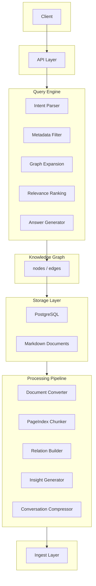

# 无向量数据库知识问答系统设计文档

---

# 1. 系统目标

本系统设计一个 **无需向量数据库（Vector DB）** 的知识问答系统。

系统能力：

* 文档统一转换为 Markdown
* PageIndex 结构化分块
* Always-on-memory 知识关系构建
* PostgreSQL 存储知识图谱
* LLM 推理式检索
* 对话历史压缩

核心思想：

```text
结构化知识 > 向量相似度
关系推理 > embedding 相似度
```

相比向量 RAG：

| 能力    | 本系统 | 向量RAG |
| ----- | --- | ----- |
| 结构理解  | 强   | 弱     |
| 可解释性  | 强   | 弱     |
| 数据库依赖 | 低   | 高     |
| 推理能力  | 强   | 一般    |


系统通过以下组合实现 **无向量知识系统**：Markdown 文档、PageIndex 分块、Always-on-memory 关系构建、PostgreSQL 知识图谱、LLM 推理检索。核心模块：Document Ingest → Document Converter → PageIndex Chunker → Relation Builder → Knowledge Graph → Query Engine → Memory Compressor。系统具备可解释、可扩展、低成本、高质量问答能力。

---

# 2. 系统核心理念

系统借鉴两个核心思想。

## 2.1 PageIndex

PageIndex 的核心能力：

* 按文档结构进行语义分块
* 构建文档主题树
* 保留上下文结构

结构示例：

```text
Document
 ├── Chapter
 │   ├── Section
 │   │   ├── Semantic Block
```

---

## 2.2 Always-on Memory

Always-on-memory 的核心理念：

系统持续执行：

```text
读取新知识
发现关系
生成洞察
更新知识图谱
```

最终形成 **动态知识网络**。

---

# 3. 系统总体架构



接口与认证设计见第 31 节。Web 交互与页面设计见第 32 节。

---

# 4. 文档接入系统

## 4.1 支持文档类型

| 类型       | 处理方式          |
| -------- | ------------- |
| PDF      | 转图片后多模态模型处理      |
| Word     |  go 开源库       |
| 图片       | 多模态模型处理           |
| HTML     | go 开源库 |
| Markdown | 直接解析          |

---

## 4.2 文档转换

所有文档统一转换为 Markdown：

```text
storage/docs/{doc_id}.md
```

示例：

```markdown
# CRM系统设计

## 客户管理

客户信息包括：
- 公司名称
- 联系人
```

---

# 5. 文档分块系统

当文档长度 > 500 字

触发 PageIndex 分块。

---

## 5.1 分块流程

```text
读取文档
解析标题结构
生成章节树
语义拆分长段
生成节点
生成摘要
```

---

## 5.2 节点结构

每个分块节点：

```text
node_id
doc_id
parent_id
title
short_summary
long_summary
tags
importance_score
page_range
char_range
```

---

# 6. 知识关系系统

系统构建 **知识图谱**。

---

## 6.1 关系类型

| 关系          | 说明   |
| ----------- | ---- |
| same_topic  | 相同主题 |
| supports    | 支持   |
| contradicts | 矛盾   |
| references  | 引用   |
| elaborates  | 扩展   |
| summary_of  | 摘要   |

---

## 6.2 关系构建流程

采用 **节点侧概念抽取 + SQL 概念交集**，不再使用 LLM 两两对比节点摘要。

```text
节点入库
  ↓
从 long_summary 抽取核心概念（Concepts）与可选三元组（LLM，每节点 1 次）
  ↓
写入 nodes.concepts（及可选 entity_triples）
  ↓
PostgreSQL 中按相同概念交集用 SQL 推导 same_topic / references 等关系
  ↓
写入 node_relations（confidence 可由概念重叠度推导）
```

关系类型约定：**same_topic**、**references** 由概念交集确定；**supports**、**contradicts**、**elaborates** 等可由同一批抽取的三元组谓语写入（可选）。详见 20. 知识关系构建算法。

---

# 7. 洞察生成（Insight Generation）

系统会生成跨文档洞察。

示例：

```text
洞察：
CRM系统通常包含：

客户管理
销售机会
合同管理
```

洞察也作为节点存储。

---

# 8. 数据库设计

数据库使用 PostgreSQL。

---

## 8.1 ER 图

```text
documents
   │
   ├── nodes
   │     │
   │     └── node_relations
   │
   ├── tags          （可选，或由 nodes.tags 数组覆盖）
   │
   └── conversations （对话历史表，结构略；可选实现）
```

---

## 8.2 documents 表

| 字段 | 类型 | 说明 |
|------|------|------|
| doc_id | UUID | 主键，文档唯一标识 |
| title | TEXT | 文档标题 |
| source_path | TEXT | 源文件路径 |
| original_format | TEXT | 原始格式（如 PDF、Word） |
| language | VARCHAR(10) | 语言代码 |
| author | TEXT | 作者 |
| page_count | INT | 页数 |
| ingest_ts | TIMESTAMP | 入库时间 |

---

## 8.3 nodes 表

| 字段 | 类型 | 说明 |
|------|------|------|
| node_id | UUID | 主键，节点唯一标识 |
| doc_id | UUID | 所属文档 ID，外键关联 documents |
| parent_id | UUID | 父节点 ID，用于章节树结构 |
| title | TEXT | 节点标题 |
| short_summary | TEXT | 短摘要 |
| long_summary | TEXT | 长摘要 |
| importance | FLOAT | 重要度评分 |
| tags | TEXT[] | 标签数组 |
| concepts | TEXT[] | 核心概念（由 LLM 从 long_summary 抽取，用于 SQL 关系推导） |
| entity_triples | JSONB | 可选，三元组实体 (subject, predicate, object)，用于 references/supports 等有向关系 |
| page_start | INT | 起始页 |
| page_end | INT | 结束页 |
| char_start | INT | 可选，起始字符偏移（用于精确定位） |
| char_end | INT | 可选，结束字符偏移 |

---

## 8.4 node_relations 表

| 字段 | 类型 | 说明 |
|------|------|------|
| relation_id | UUID | 主键，关系唯一标识 |
| from_node | UUID | 源节点 ID，外键关联 nodes |
| to_node | UUID | 目标节点 ID，外键关联 nodes |
| relation_type | TEXT | 关系类型（如 same_topic、supports 等） |
| confidence | FLOAT | 置信度 |
| evidence | TEXT | 依据/证据描述 |

---

# 9. 查询引擎设计

查询流程：

```text
用户问题
  ↓
Intent Parser
  ↓
Metadata Filter
  ↓
Graph Expansion
  ↓
LLM Ranking
  ↓
Answer Generation
```

**预处理并发**：意图解析（Intent Parser）、标签提取（Tag 提取）、基础查询重写（Query Rewrite）可并发执行；输入为 `query` 与可选 `conversation_summary`，输出合并后进入检索。采用方案 A：意图与标签基于原始 query，检索基于 rewritten_query。详见 30.14 Prompt 调用链。

---

# 10. Graph Traversal 设计

系统使用 **BFS 扩展节点**。

参数：

```text
depth = 2
max_nodes = 500
```

算法：

```text
seed nodes
   ↓
expand neighbors
   ↓
score edges
   ↓
limit result
```

---

# 11. 节点评分算法

节点最终评分：

```text
Score =
0.4 * relevance
+0.2 * importance
+0.2 * relation_score
+0.2 * recency
```

说明：

| 字段             | 说明    |
| -------------- | ----- |
| relevance      | LLM评分 |
| importance     | 节点重要度 |
| relation_score | 关系权重（由扩展边上的 confidence 聚合，confidence 来自概念重叠度或三元组；见 20.4、20.5） |
| recency        | 文档新鲜度 |

---

**注**：原「12. Query Engine 伪代码」已合并至第 9 节流程说明及 21.7 完整伪代码。

---

# 13. 对话历史压缩

触发条件：

```text
context > 4096 tokens
```

压缩策略：

```text
时间窗口压缩
主题压缩
摘要生成
```

---

# 14. LLM 调度策略

系统采用 **多模型架构**。

| 阶段       | 模型        |
| -------- | --------- |
| 分块生成     | small LLM |
| 概念与三元组抽取 | small LLM |
| 相关性评分    | small LLM |
| 答案生成     | large LLM |

---

# 15. 后台任务

| 任务   | 周期   |
| ---- | ---- |
| 文档解析 | 实时   |
| 关系构建 | 30分钟（概念抽取 + SQL 推导，无两两 LLM） |
| 洞察生成 | 2小时  |
| 对话压缩 | 实时   |

---

# 16. 性能优化

关键策略：

```text
short_summary 检索
relation index
Graph traversal 限制
LLM 批量评分
结果缓存
```

查询引擎预处理阶段（意图解析、标签提取、查询重写）可并发执行以降低延迟。

---

# 17. 系统可靠性

设计：

| 能力    | 方案       |
| ----- | -------- |
| 任务失败  | 重试队列     |
| 数据一致性 | 事务       |
| 模型错误  | fallback |
| 日志    | 审计日志     |

---

# 18. 安全设计

包括：

```text
文档权限
API 鉴权（OAuth2，详见第 31 节）
数据加密
访问审计
```

---


# 19. PageIndex 结构化分块算法

## 19.1 设计目标

传统 RAG 的 chunk 方法：

```text
固定 500 token
```

问题：

* 语义断裂
* 上下文丢失
* 无结构

PageIndex 分块目标：

```text
结构优先
语义完整
可定位原文
```

---

## 19.2 分块流程

分块流程：

```text
文档读取
  ↓
结构解析
  ↓
章节树构建
  ↓
语义分割
  ↓
节点生成
  ↓
摘要生成
```

---

## 19.3 结构解析算法

解析 Markdown 标题：

```text
# 一级标题
## 二级标题
### 三级标题
```

生成初始结构树：

```text
Document
 ├── Section
 │   ├── SubSection
 │   │   ├── Paragraph
```

伪代码：

```python
def parse_structure(markdown):

    sections = []

    for line in markdown:
        if line.startswith("#"):
            level = count_hash(line)
            create_section(level)

    return section_tree
```

---

## 19.4 语义分割算法

当段落长度：

```text
> 2000 字
```

触发语义拆分。

拆分规则：

1 保留完整句子
2 避免跨主题
3 保持上下文连续

伪代码：

```python
def semantic_split(text):

    sentences = split_by_sentence(text)

    chunks = []
    current = ""

    for s in sentences:

        if len(current) + len(s) < MAX_SIZE:
            current += s
        else:
            chunks.append(current)
            current = s

    chunks.append(current)

    return chunks
```

---

## 19.5 节点生成

每个 chunk 生成 node：

```text
node_id
doc_id
parent_id
title
short_summary
long_summary
tags
importance
char_range
```

---

## 19.6 importance 计算

节点重要度：

```text
importance =
0.5 * title_weight
+0.3 * keyword_density
+0.2 * section_level
```

示例：

| 章节   | importance |
| ---- | ---------- |
| 一级标题 | 0.9        |
| 二级标题 | 0.7        |
| 普通段落 | 0.4        |

---

## 19.7 最终结构

示例：

```text
Node1  CRM系统
 ├─ Node2 客户管理
 │   ├─ Node3 客户信息结构
 │   └─ Node4 联系人信息
 └─ Node5 销售机会
```

---

# 20. 知识关系构建算法

## 20.1 问题

如果直接比较所有节点：

```text
N nodes
```

关系计算复杂度：

```text
O(N²)
```

当：

```text
N = 100万
```

将无法运行。

---

## 20.2 解决方案

采用 **节点侧概念/三元组抽取 + SQL 概念交集**，避免 O(N²) LLM 两两对比。

步骤：

```text
节点入库时：LLM 从 long_summary 抽取 concepts（及可选 entity_triples）
写入 nodes.concepts / nodes.entity_triples
关系构建时：PostgreSQL 内通过概念交集等 SQL 逻辑推导 same_topic、references
可选：从 entity_triples 谓语推导 supports、contradicts、elaborates 等有向关系
```

---

## 20.3 节点侧概念与三元组抽取

在节点入库（或关系构建前批处理）时，对每个节点执行一次 LLM 调用。

输入：`node.long_summary`。

输出（写入 nodes 表）：

- **concepts**：核心概念列表（TEXT[]），用于后续 SQL 交集判定 same_topic / references。
- **entity_triples**（可选）：三元组数组，如 `[{"s":"主体","p":"references","o":"对象"}]`，用于有向关系（references、supports 等）。

Prompt 见 30.11 概念与三元组抽取。建议对概念做归一化（同义合并、小写等）以提升交集命中率。

---

## 20.4 基于概念交集的关系推导（SQL）

在 PostgreSQL 中，通过**相同概念的交集**确定节点对关系，无需 LLM 两两调用。

**same_topic**：两节点 concepts 数组存在交集即视为同主题。可设最小交集数或 Jaccard 阈值以控制密度。

示例（同一标签组内建边，控制规模）：

```sql
INSERT INTO node_relations (from_node, to_node, relation_type, confidence)
SELECT a.node_id, b.node_id, 'same_topic',
       (SELECT COUNT(*) FROM unnest(a.concepts) AS c WHERE c = ANY(b.concepts))::float / NULLIF(array_length(a.concepts, 1), 0)
FROM nodes a
JOIN nodes b ON a.node_id < b.node_id
WHERE a.tags && b.tags
  AND a.concepts && b.concepts
  AND (SELECT COUNT(*) FROM unnest(a.concepts) AS c WHERE c = ANY(b.concepts)) >= 1
ON CONFLICT DO NOTHING;
```

**references**：若仅需“有关联”的对称边，可与 same_topic 共用概念交集；若需有向“A 引用 B”，则从 `entity_triples` 中 predicate=references 的三元组写入 (from_node, to_node, 'references')。

---

## 20.5 关系过滤与置信度

- **same_topic / references（概念交集）**：confidence 可由重叠概念数或归一化重叠度推导；仅保留 confidence 高于阈值（如 0.3）或重叠数 ≥ 1 的边。
- **来自三元组的关系**：confidence 可固定或由抽取阶段给出；过滤规则同 6.1 / 8.4。

可选：对同一节点对限制 top_k 条关系或合并为单边取最高 confidence。

---

## 20.6 关系构建伪代码

```python
# 节点侧（入库或批处理）：每节点 1 次 LLM
def extract_concepts_and_triples(node):
    concepts, triples = llm_extract_concepts_and_triples(node.long_summary)
    node.concepts = normalize(concepts)
    node.entity_triples = triples  # 可选
    save_node(node)

# 关系侧：纯 SQL，无 LLM
def build_relations_sql():
    # same_topic: 概念交集
    execute("""
        INSERT INTO node_relations (from_node, to_node, relation_type, confidence)
        SELECT ... FROM nodes a, nodes b
        WHERE a.concepts && b.concepts AND ...
    """)
    # 可选：从 entity_triples 写入 references / supports 等
    insert_relations_from_triples()
```

---

## 20.7 批处理与索引

- **概念抽取**：与节点入库流水线结合，或定时对未抽取节点批处理；每批可数百节点，按节点维度线性扩展。
- **关系构建**：定时（如每 30 分钟）或触发式执行 SQL，无 N² LLM 调用；可先在同标签/同文档子集上做交集以缩小计算量。
- **索引**：对 `nodes.concepts` 建 GIN 索引以加速 `&&` 交集查询（见 23. 查询性能优化）。

---

## 20.8 图谱构建方案评估：概念抽取 + SQL 关系 vs LLM 两两对比

**当前采用方案**：上文 20.2–20.7 已按本方案实施。不再在关系构建阶段用 LLM 两两对比节点摘要；改为在节点入库时从 `long_summary` 抽取**核心概念（Concepts）**和**三元组实体**，在 PostgreSQL 中通过**相同概念的交集**用 SQL 确定 same_topic / references 等关系，消除 O(N²) 的 LLM 对比成本。

- **是否满足知识查询**：same_topic 由概念交集推导与“同主题扩展”需求一致；references 对称边可由概念交集得到，有向引用可由三元组产出。supports/contradicts/elaborates 可选地由三元组谓语写入。
- **对检索准确性的影响**：有利于规模与可复现性；需注意概念归一化以减轻同义不同词漏边、同概念不同主题误连；relation_score 可按概念重叠度或 confidence 计算（见 11 节）。
- **建议**：concepts 与 entity_triples 在入库时由 30.11 Prompt 抽取；关系构建仅用 SQL 与可选三元组写入，不再调用两两关系识别。

---

# 21. 三层检索算法（替代向量检索）

## 21.1 设计目标

传统 RAG：

```text
embedding
vector search
topK
```

本系统替代方案：

```text
metadata filter
graph expansion
LLM ranking
```

---

## 21.2 三层检索架构

```text
Layer1 Metadata Filter
Layer2 Graph Expansion
Layer3 LLM Ranking
```

---

## 21.3 第一层 Metadata Filter

基于：

```text
tags
document type
time
importance
```

SQL 示例：

```sql
SELECT node_id
FROM nodes
WHERE tags && ARRAY['crm']
ORDER BY importance DESC
LIMIT 200
```

输出：

```text
seed nodes
```

---

## 21.4 第二层 Graph Expansion

通过关系扩展：

```text
BFS depth = 2
```

示例：

```text
seed node
  ├─ related node
  │   ├─ related node
```

伪代码：

```python
def graph_expand(seeds):

    visited = set()
    queue = seeds

    for depth in range(2):

        next_nodes = []

        for n in queue:
            neighbors = get_relations(n)

            next_nodes.extend(neighbors)

        queue = next_nodes

    return visited
```

---

## 21.5 第三层 LLM Ranking

对节点进行相关性评分。

输入：

```text
query
short_summary
tags
```

输出：

```text
relevance_score
```

保留：

```text
Top 30
```

---

## 21.6 最终回答生成

主模型读取：

```text
long_summary
source
```

生成回答。

---

## 21.7 Query Engine 完整伪代码

```python
def query_engine(query):

    intent = parse_intent(query)

    seeds = metadata_filter(intent)

    expanded = graph_expand(seeds)

    ranked = llm_rank(query, expanded)

    top_nodes = ranked[:20]   # 与 24.5、29.8 一致，可配置

    answer = llm_answer(query, top_nodes)

    return answer
```

---

# 22. PageIndex 自动目录生成算法

本章节中**章节识别与目录生成**的流程与规则与 [PageIndex](https://github.com/VectifyAI/PageIndex) 项目保持一致，便于复用其 TOC 检测与树解析逻辑。

## 22.1 设计目标

很多文档（尤其 PDF）没有规范标题结构，因此需要自动生成文档结构。

目标：

```text
自动识别章节结构
构建语义目录树
支持文档定位
```

输出结构（与 PageIndex 树索引一致）：

```text
Document (root)
 ├── Section (title, page_range, node_id)
 │   ├── SubSection
 │   │   ├── Semantic Block
```

---

## 22.2 目录识别输入（对齐 PageIndex）

识别章节以 **TOC（目录）检测** 为主，辅以结构标记与标题验证。

| 信号/步骤 | 说明 |
|-----------|------|
| TOC 检测 | 扫描文档**前 N 页**（如 `toc_check_page_num`，默认 20）识别目录页与结构标记 |
| 结构提取 | 从 TOC 解析「标题–页码」对及层级关系，得到 parent-child 结构 |
| 标题验证 | 在**指定页码**上做模糊匹配，确认提取的标题确实出现在该页，避免错位 |
| Markdown 辅助 | 若源为 Markdown，则用 `#` / `##` / `###` 与编号模式（阿拉伯数字、英文/罗马字母、中文数字等，见 22.4）辅助层级 |

无显式 TOC 的文档可采用**兜底方法**：由大模型生成全文大纲并基于大纲构建目录（见 22.5.1）。

---

## 22.3 TOC 检测与结构提取

与 PageIndex 一致：**先定位 TOC，再解析层级与页码**，而非仅靠单行标题规则。

流程：

```text
文本抽取（如 PDF 解析）
  ↓
扫描前 toc_check_page_num 页，识别 TOC 区域与结构标记
  ↓
结构提取：解析 (title, page_index) 及层级
  ↓
树解析：构建父子关系，每节点含 title、page_range、可选 summary
  ↓
标题验证：在对应页上模糊匹配标题，校验并修正
  ↓
节点后处理：摘要、token 统计、与文档长度校验
```

可配置项（参考 PageIndex）：

| 参数 | 含义 | 典型值 |
|------|------|--------|
| toc_check_page_num | 参与 TOC 检测的页数 | 20 |
| max_page_num_each_node | 单节点最大页数 | 10 |
| max_token_num_each_node | 单节点最大 token | 20000 |

---

## 22.4 章节层级推断

从 TOC 解析得到的层级与页码为主；无 TOC 时可用**编号模式**辅助推断层级。需支持以下常见编号形式：

| 类型 | 示例 | 说明 |
|------|------|------|
| 阿拉伯数字 | `1`、`1.1`、`1.1.1` | 点数表示层级，点数 +1 即 level |
| 英文字母 | `A`/`a`、`B`/`b`、`Appendix A` | 按字母序或“前缀+字母”识别层级 |
| 罗马数字 | `I`/`i`、`II`/`ii`、`III`、`IV`、`V` | 常用于章/附录，需解析罗马数字再映射层级 |
| 中文数字 | `一`、`二`、`三`；`第一章`、`第一节`；`（一）`、`（二）` | 需支持简体/繁体及「第 X 章/节」等变体 |

示例（混合罗列）：

```text
1 系统介绍
1.1 系统目标
1.1.1 核心能力

第一章 概述
第一节 背景
（一）项目缘起

A. 设计原则
B. 实现方式

I. 总则
II. 分则
Appendix A 术语表
```

层级推导逻辑：先识别编号类型与前缀（如「第」「Section」「Appendix」），再根据**同一类型内的顺序或点数/字母序**确定 level；多级混合时以出现顺序与缩进/字体等辅助判断层级。

```python
def section_level_from_numbering(title):
    # 阿拉伯数字：点数 + 1
    if re.match(r"^\d+(\.\d+)*\s", title):
        return title.split()[0].count(".") + 1
    # 中文「第 X 章/节」、罗马数字、英文字母等需单独规则或查表
    # 返回 inferred_level (1-based)
```

有 TOC 时，层级由**结构提取**直接给出，与 PageIndex 返回的 `nodes` / `sub_nodes` 层级一致。

---

## 22.5 自动目录生成与标题验证

生成目录树时需包含 **标题验证** 步骤，与 PageIndex 一致。

伪代码：

```python
def build_toc(toc_entries):
    stack = []
    for entry in toc_entries:
        level = entry.level
        while stack and stack[-1].level >= level:
            stack.pop()
        parent = stack[-1] if stack else None
        node = create_node(entry.title, entry.page_index, parent)
        # 标题验证：在 entry.page_index 页上模糊匹配 entry.title
        if not verify_title_on_page(entry.title, entry.page_index):
            node.verified = False  # 可标记或修正
        stack.append(node)
    return tree
```

---

## 22.5.1 兜底：大模型全文大纲

当 **TOC 检测失败或文档无显式目录** 时，采用兜底方法：由大模型对全文生成大纲，再基于大纲构建目录树。

要点：

- **输入**：全文或分段后的长文本（可按页/按块切分以控制上下文长度）。
- **输出**：层级化大纲，每项含「标题 + 层级 + 可选起止位置/页码」。
- **标题偏好**：大纲中的标题**尽量直接采用原文中出现的标题**（原句引用），仅在没有合适原文时才由模型概括；便于与正文一一对应、后续做标题验证或定位。

流程：

```text
全文/分段文本
  ↓
调用大模型：生成全文大纲（结构化 JSON/列表）
  ↓
约束：大纲标题优先从原文摘录，层级由模型推断
  ↓
根据大纲项 + 起止位置/页码 构建目录树节点（与 22.5 相同结构）
  ↓
可选：对能定位到页的标题做模糊匹配校验
```

Prompt 约束示例：

```text
请阅读文档并输出层级化大纲。
要求：
1. 大纲标题尽量使用文档中的原文标题（摘录），勿改写。
2. 每项注明层级（如 1、2、3）及在文中的大致起止位置或页码（若可识别）。
3. 输出格式：[{ "title": "原文标题", "level": 1, "start_page": 3, "end_page": 5 }, ...]
```

得到大纲后，用与 22.5 相同的栈式算法将各项转为父子节点，生成与 PageIndex 一致的目录树；若有 `start_page`/`end_page`，可写入节点的 `page_range` 并做标题验证。

---

## 22.6 目录优化（可选）

在 TOC 检测与标题验证（或兜底大纲）之后，可用 LLM 做可选优化：

```text
修复错误层级
合并重复章节
生成/规范化节点标题与 summary
```

输出节点可含 `title`、`level`、`summary`、`page_index`（与 PageIndex 树节点一致）。

---

## 22.7 最终目录示例

与 PageIndex 树索引结构一致：

```text
Document (root)

├── 客户管理 (node_id, page_range)
│   ├── 客户信息
│   └── 联系人管理
│
└── 销售机会
    ├── 商机创建
    └── 商机跟进
```

---

# 23. PostgreSQL 图查询优化

系统使用 PostgreSQL 存储知识图谱。

但 PostgreSQL 不是原生图数据库，因此需要优化。

---

## 23.1 关系索引

必须建立索引：

```sql
CREATE INDEX idx_relation_from ON node_relations(from_node);

CREATE INDEX idx_relation_to ON node_relations(to_node);
```

---

## 23.2 Tag 与 concepts 索引

tags 与 concepts 均使用 GIN，以支持 Metadata Filter 与关系构建时的概念交集查询：

```sql
CREATE INDEX idx_nodes_tags ON nodes USING GIN(tags);
CREATE INDEX idx_nodes_concepts ON nodes USING GIN(concepts);
```

---

## 23.3 BFS 查询优化

Graph Expansion 查询：

```sql
SELECT to_node
FROM node_relations
WHERE from_node = $1
LIMIT 50
```

限制邻居数量：

```text
max_neighbors = 50
```

避免图爆炸。

---

## 23.4 邻居缓存

系统维护缓存：

```text
node_neighbors_cache
```

缓存结构：

```text
node_id → [neighbor_ids]
```

TTL：

```text
10 minutes
```

---

## 23.5 热节点优化

高连接节点：

```text
degree > 1000
```

处理策略：

```text
限制扩展
随机采样
```

---

# 24. Query Engine 并行检索架构

查询流程：

```text
User Query
   │
   ▼
Intent Parser
   │
   ▼
Parallel Retrieval
   │
   ▼
Ranking
   │
   ▼
Answer Generation
```

---

## 24.1 并行检索策略

同时执行三类检索：

```text
Tag Search
Graph Search
Keyword Search
```

示意：

```text
        Query
          │
 ┌────────┼────────┐
 │        │        │
Tag     Graph    Keyword
Search  Search    Search
 │        │        │
 └────────┴────────┘
         Merge
```

---

## 24.2 并行执行伪代码

```python
def retrieve(query):

    tag_nodes = search_by_tag(query)

    graph_nodes = graph_expand(query)

    keyword_nodes = keyword_match(query)

    results = merge(tag_nodes, graph_nodes, keyword_nodes)

    return results
```

---

## 24.3 结果去重

节点去重：

```python
def merge(a,b,c):

    nodes = set()

    nodes.update(a)
    nodes.update(b)
    nodes.update(c)

    return list(nodes)
```

---

## 24.4 LLM 排序

排序输入：

```text
query
short_summary
tags
importance
```

输出：

```text
relevance score
```

---

## 24.5 TopK 控制

最终输入模型：

```text
Top 20 nodes
```

避免上下文爆炸。

---

# 27. 知识压缩算法

随着系统运行，知识节点会不断增加。

需要进行 **知识压缩**。

---

## 27.1 压缩目标

减少：

```text
重复知识
冗余节点
碎片知识
```

---

## 27.2 压缩流程

```text
节点聚类
摘要生成
新节点生成
旧节点标记
```

---

## 27.3 节点聚类

根据：

```text
tags
same_topic
supports
```

生成 cluster。

示例：

```text
Cluster

Node1 CRM介绍
Node2 CRM功能
Node3 CRM模块
```

---

## 27.4 生成摘要节点

LLM 输入：

```text
cluster nodes
```

输出：

```text
summary node
```

示例：

```text
CRM系统通常包含：

客户管理
销售机会
合同管理
```

---

## 27.5 压缩伪代码

```python
def compress_nodes(cluster):

    summary = llm_summary(cluster)

    new_node = create_node(summary)

    for n in cluster:
        create_relation(new_node, n, "summary_of")

    return new_node
```

---

## 27.6 压缩策略

触发条件：

```text
cluster_size > 10
```

压缩比例：

```text
10 → 1
```

---

## 27.7 压缩收益

压缩后：

| 数据        | 变化     |
| --------- | ------ |
| nodes     | 减少 40% |
| relations | 减少 30% |
| 查询速度      | 提升 2x  |

---

# 29. Query Engine 核心实现

Query Engine 是整个系统的核心组件，负责将用户问题转换为知识检索任务，并生成最终回答。

其核心目标：

```text
高相关性
低延迟
低模型成本
可解释回答
```

---

## 29.1 查询整体流程

完整查询流程如下：

```text
User Query
   │
   ▼
Intent Parser
   │
   ▼
Metadata Retrieval
   │
   ▼
Graph Expansion
   │
   ▼
Candidate Ranking
   │
   ▼
Answer Generation
```

流程说明：

| 阶段                 | 说明     |
| ------------------ | ------ |
| Intent Parser      | 解析用户问题 |
| Metadata Retrieval | 标签筛选   |
| Graph Expansion    | 关系扩展   |
| Candidate Ranking  | LLM评分  |
| Answer Generation  | 最终回答   |

**预处理并发**：在进入 Retrieval 之前，Intent Parser、Tag 提取、Query Rewrite 可并发执行（输入：query + conversation_summary；输出合并后供 Metadata Retrieval 与检索使用）。

---

## 29.2 Query Engine 内部架构

```text
                 Query Engine

              ┌─────────────────┐
              │  Intent Parser   │
              └────────┬────────┘
                       │
           ┌───────────▼───────────┐
           │  Retrieval Orchestrator│
           └───────────┬───────────┘
                       │
        ┌──────────────┼──────────────┐
        │              │              │
   Tag Search     Graph Search    Keyword Search
        │              │              │
        └──────────────┴──────────────┘
                       │
                Candidate Pool
                       │
               LLM Ranking Engine
                       │
               Answer Generation
```

---

## 29.3 Intent Parser

Intent Parser 负责解析用户问题。

输出：

```json
{
 "intent": "knowledge_query",
 "keywords": ["crm","客户管理"],
 "tags": ["crm"],
 "time_range": null
}
```

---

## Prompt

System

```text
你是问题解析器。
请从用户问题中提取：

1 查询意图
2 关键词
3 主题标签
```

User

```text
用户问题：
{query}

输出 JSON：
intent
keywords
tags
```

---

## 29.4 Metadata Retrieval

根据 tags 检索节点。

SQL：

```sql
SELECT node_id
FROM nodes
WHERE tags && ARRAY['crm']
ORDER BY importance DESC
LIMIT 200;
```

输出：

```text
seed nodes
```

---

## 29.5 Graph Expansion

Graph Expansion 负责扩大候选集合。

算法：

```text
BFS depth = 2
max_neighbors = 50
```

伪代码：

```python
def graph_expand(seeds):

    visited=set()
    queue=seeds

    for depth in range(2):

        next_nodes=[]

        for node in queue:

            neighbors=get_neighbors(node)

            next_nodes.extend(neighbors)

        queue=next_nodes

    return visited
```

---

## 29.6 Candidate Pool

合并多个来源的节点：

```text
Tag Search
Graph Search
Keyword Search
```

最终候选：

```text
300 nodes
```

---

## 29.7 LLM Ranking Engine

使用小模型评分。

输入：

```text
query
short_summary
tags
importance
```

输出：

```json
{
 "node_id": "xxx",
 "score": 0.87
}
```

---

## Ranking Prompt

System

```text
你是相关性评分器。
请评估节点是否与问题相关。
```

User

```text
问题：
{query}

节点：
{short_summary}

输出：
score (0-1)
reason
```

---

## 29.8 TopK 控制

最终进入回答阶段：

```text
Top 20 nodes
```

避免：

```text
上下文爆炸
```

---

## 29.9 Answer Generation

主模型生成最终回答。

输入：

```text
query
long_summary
source info
```

输出：

```text
回答
引用节点
推理说明
```

---

## Prompt

System

```text
你是知识助手。
只能使用提供的节点回答问题。
必须引用节点ID。
```

User

```text
问题：
{query}

候选节点：
{nodes}
```

---

## 29.10 LLM 调度策略

系统使用 **分级模型架构**。

| 阶段                | 模型    |
| ----------------- | ----- |
| Intent Parser     | small |
| Ranking           | small |
| Answer Generation | large |

---

示例：

```text
small model → 7B
large model → 32B
```

---

## 29.11 Token 成本优化

关键策略：

### 1 使用 short_summary 检索

避免读取全文。

```text
short_summary ≈ 80 tokens
```

---

### 2 TopK 控制

```text
候选节点
300 → 20
```

---

### 3 批量评分

多个节点一起评分。

---

### 4 缓存回答

缓存：

```text
query hash → answer
```

TTL：

```text
5 minutes
```

---

## 29.12 毫秒级查询架构

查询优化：

```text
metadata index
relation index
node cache
```

目标：

| 阶段                | 延迟    |
| ----------------- | ----- |
| Metadata Filter   | 5ms   |
| Graph Expansion   | 10ms  |
| LLM Ranking       | 200ms |
| Answer Generation | 1s    |

---

## 29.13 查询伪代码

完整 Query Engine：

```python
def query_engine(query):

    intent=parse_intent(query)

    seeds=metadata_filter(intent)

    graph_nodes=graph_expand(seeds)

    keyword_nodes=keyword_search(query)

    candidates=merge(seeds,graph_nodes,keyword_nodes)

    ranked=llm_rank(query,candidates)

    top_nodes=ranked[:20]

    answer=llm_answer(query,top_nodes)

    return answer
```

---

# 29. Query Engine 可解释性

系统返回：回答、引用节点、来源文档。示例：

```text
CRM系统通常包含：客户管理、销售机会、合同管理
来源：Node123 CRM介绍、Node456 客户管理模块
```

---


# 30. LLM Prompt 设计

本章节定义系统在各个阶段使用的 LLM Prompt。
所有 Prompt 均采用：

```text
System Prompt
User Prompt
```

---

## 30.1 图片转 Markdown Prompt

这是系统最核心的 多模态 Prompt，用于文档解析阶段的图片 → Markdown 转换（对应 3. 系统总体架构中的 Document Converter 模块）。

输入：图片

输出：markdown

### System Prompt

```text
你是一个文档解析助手。

你的任务是将图片中的内容转换为结构化 Markdown 文档。

解析规则：

1 保留原文内容
2 识别标题结构
3 识别列表
4 识别表格
5 识别代码块
6 识别段落

标题规则：

较大的标题 → #
子标题 → ##
更小标题 → ###

列表规则：

项目符号 → Markdown list

表格规则：

必须转换为 Markdown table。

代码规则：

代码必须使用 Markdown code block。

禁止：

添加解释
补充不存在内容
改写文本

输出必须为 Markdown 文本。
```

### User Prompt
```text
请解析这张图片中的内容。

要求：

1 保留原始文本
2 转换为结构化 Markdown
3 标题层级合理
4 表格转换为 Markdown table
5 列表转换为 Markdown list

只输出 Markdown。
不要输出解释。
```
---

# 30.2 用户问题分析 Prompt

Intent Parser 用于解析用户问题，提取查询信息（对应 9. 查询引擎设计与 29.3 Intent Parser）。

输出结构：

```json
{
  "intent": "knowledge_query",
  "keywords": [],
  "tags": [],
  "time_range": null
}
```

---

## System Prompt

```text
你是一个查询解析器。

你的任务是解析用户问题，并提取结构化信息。

必须提取：

1 查询意图 intent
2 关键词 keywords
3 主题标签 tags
4 时间范围 time_range

规则：

intent 只允许以下值：
knowledge_query
document_lookup
concept_explain
comparison

keywords 为用户问题中的核心词。

tags 为可能对应知识库主题标签，例如：
crm
sales
contract
finance
architecture

time_range 仅在用户明确提到时间时填写。

输出必须为 JSON。
禁止输出任何解释文本。
```

---

## User Prompt

```text
对话上下文：

{conversation_summary}

用户最新问题：

{query}

请解析用户意图。

输出 JSON：

{
 "intent": "",
 "keywords": [],
 "tags": [],
 "time_range": null
}
```

---

# 30.3 PageIndex 结构修复 Prompt

用于修复自动识别的文档目录结构（对应 19. PageIndex 结构化分块算法与 22. PageIndex 自动目录生成算法）。

输入：

```json
{
 "headings": []
}
```

输出：

```json
{
 "toc": []
}
```

---

## System Prompt

```text
你是文档结构分析助手。

你的任务是根据标题列表生成合理的文档目录结构。

规则：

1 识别标题层级
2 修复错误层级
3 生成合理目录树
4 每个节点包含 title level summary

level 范围：
1 到 4

summary 为该章节简短描述（不超过30字）。

输出必须为 JSON。
禁止输出解释。
```

---

## User Prompt

```text
文档标题列表：

{headings}

输出格式：

{
 "toc":[
   {
    "title":"",
    "level":1,
    "summary":""
   }
 ]
}
```

---

# 30.4 节点摘要生成 Prompt

用于生成节点摘要（对应 5.2 节点结构与 6.2 关系构建流程中的「获取节点摘要」）。

输入：

```json
{
 "text": ""
}
```

输出：

```json
{
 "short_summary": "",
 "long_summary": "",
 "tags": []
}
```

---

## System Prompt

```text
你是知识摘要生成器。

你的任务是将文本转换为知识节点摘要。

必须生成：

short_summary
long_summary
tags

规则：

short_summary
不超过80 tokens
用于检索

long_summary
不超过300 tokens
用于回答问题

tags
提取主题标签

标签数量不超过5个。

输出必须为 JSON。
禁止解释。
```

---

## User Prompt

```text
文本内容：

{text}

输出 JSON：

{
 "short_summary":"",
 "long_summary":"",
 "tags":[]
}
```

---

# 30.5 节点评分 Prompt

用于对节点进行相关性评分（对应 9. 查询引擎设计、11. 节点评分算法与 29. Query Engine 可解释性）。

输入：

```json
{
 "query": "",
 "nodes": []
}
```

输出：

```json
{
 "scores":[
   {
    "node_id":"",
    "score":0,
    "reason":""
   }
 ]
}
```

说明：`reason` 用于可解释性、调试与排序分析。

---

## System Prompt

```text
你是相关性评分器。

你的任务是评估知识节点是否与用户问题相关。

评分范围：

0 到 1

评分标准：

1 完全相关
0 完全无关

评分依据：

语义匹配
主题一致
知识关联

输出 JSON。

禁止解释文本。
```

---

## User Prompt

```text
用户问题：

{query}

候选节点：

{nodes}

每个节点包含：

node_id
short_summary
tags

输出：

{
 "scores":[
   {
    "node_id":"",
    "score":0,
    "reason":""
   }
 ]
}
```

---

# 30.6 问答 Prompt

用于生成最终回答（对应 9. 查询引擎设计中的 Answer Generation 与 29.9 Answer Generation）。

输入：

```json
{
 "query": "",
 "nodes": []
}
```

输出：

```json
{
 "answer": "",
 "citations": []
}
```

---

## System Prompt

```text
你是知识助手。

你的回答必须严格基于提供的知识节点。

规则：

1 只能使用提供节点
2 禁止编造信息
3 必须引用节点ID
4 回答要结构清晰

如果节点不足以回答问题，请回答：

"知识库中未找到足够信息"
```

---

## User Prompt

```text
对话上下文：

{conversation_summary}

用户问题：

{query}

知识节点：

{nodes}

每个节点包含：

node_id
long_summary

输出 JSON：

{
 "answer":"",
 "citations":[]
}

```

---

# 30.7 知识压缩 Prompt

用于生成知识压缩节点（对应 27. 知识压缩算法）。

输入：

```json
{
 "cluster":[]
}
```

输出：

```json
{
 "summary_node":""
}
```

---

## System Prompt

```text
你是知识压缩助手。

你的任务是将多个相似知识节点合并为一个摘要节点。

规则：

1 保留核心知识
2 去除重复信息
3 生成清晰总结

输出 JSON。
```

---

## User Prompt

```text
节点集合：

{cluster}

输出：

{
 "summary_node":""
}
```

# 30.8 历史会话压缩 prompt

用于压缩历史会话（对应 13. 对话历史压缩与 15. 后台任务中的「对话压缩」）。


### System Prompt

```text
你是对话压缩助手。

你的任务是将多轮历史对话压缩为简洁的上下文摘要，
用于后续问题理解。

压缩目标：

1 保留关键事实
2 保留用户真实需求
3 保留重要实体（公司、产品、系统等）
4 保留问题上下文
5 保留逻辑链

删除内容：

寒暄
重复信息
无关内容

输出必须为 JSON。
禁止输出解释。
```

---

### User Prompt

```text
历史对话：

{conversation_history}

请压缩为上下文摘要。

输出：

{
 "conversation_summary": "",
 "key_entities": [],
 "open_questions": []
}
```

---

## 压缩输出示例

```json
{
 "conversation_summary": "用户正在咨询CRM系统的客户管理功能设计",
 "key_entities": ["CRM系统", "客户管理"],
 "open_questions": ["CRM系统如何管理客户联系人"]
}
```

---

# 30.9 查询重写 prompt

用于将上下文不完整的用户问题改写为可检索的完整查询（对应 9. 查询引擎设计、21.7 Query Engine 完整伪代码与 29. Query Engine 核心实现中的 Query Rewrite 步骤）。

### System Prompt

```text
你是查询改写助手。

你的任务是结合对话上下文，
将用户问题改写为完整、清晰的查询语句。

规则：

1 保留原始问题含义
2 补充缺失上下文
3 生成完整查询
4 不改变问题意图

输出 JSON。
禁止解释。
```

---

### User Prompt

```text
对话上下文：

{conversation_summary}

用户问题：

{query}

请生成改写后的查询。

输出：

{
 "rewritten_query":""
}
```

---

## 示例

输入：

```
context:
用户正在咨询CRM系统设计

query:
联系人怎么设计
```

输出：

```json
{
 "rewritten_query": "CRM系统客户联系人表结构如何设计"
}
```

# 30.10 文档大纲生成 Prompt

用于无 TOC 文档生成目录（对应 22.5.1「兜底：大模型全文大纲」）。

---

## System Prompt

```text
你是文档结构分析助手。

你的任务是从文档中提取层级化目录结构。

要求：

1 识别章节标题
2 判断层级关系
3 保留原文标题
4 推断章节层级

输出 JSON：

{
 "outline":[
   {
    "title":"",
    "level":1,
    "start_page":0,
    "end_page":0
   }
 ]
}

禁止解释。
```

---

## User Prompt

```text
请阅读文档并输出层级化大纲。

输出：

{
 "outline":[
   {
    "title":"",
    "level":1,
    "start_page":0,
    "end_page":0
   }
 ]
}
```

---

# 30.11 概念与三元组抽取 Prompt

用于节点入库时从 long_summary 抽取核心概念与可选三元组，供 PostgreSQL 内通过概念交集推导 same_topic/references 等关系（对应 6.2 关系构建流程与 20.3 节点侧概念与三元组抽取）。**已替代原“两两关系识别”**，不再对节点对做 LLM 关系判断。

输入：`node.long_summary`。

输出：写入 `nodes.concepts`（TEXT[]）、可选 `nodes.entity_triples`（JSONB）。

---

## System Prompt

```text
你是知识概念抽取助手。

你的任务是从知识节点内容中抽取：

1 核心概念（Concepts）：该节点涉及的主要概念、实体、主题词，用于后续同主题关联。
   - 数量 3–15 个，英文小写或统一归一化，便于与其它节点概念做交集匹配。
   - 示例：crm, customer_management, contact, api, integration

2 三元组（可选）：(主体, 谓语, 对象)，用于有向关系如 references、supports。
   - 谓语仅使用：references, supports, contradicts, elaborates, summary_of
   - 若无可抽取的三元组可输出空数组。

输出 JSON：

{
 "concepts": ["concept1", "concept2", ...],
 "entity_triples": [
   {"s": "主体描述", "p": "references", "o": "对象描述"},
   ...
 ]
}
```

---

## User Prompt

```text
节点内容（long_summary）：

{long_summary}

请抽取核心概念与可选三元组。概念需可归一化、便于跨节点匹配。

输出：

{
 "concepts": [],
 "entity_triples": []
}
```

---

# 30.12 Tag 提取 Prompt

用于从用户问题中识别知识主题标签，供 Metadata Filter 使用（对应 9. 查询引擎设计与 21.3 Metadata Filter）。

---

## System Prompt

```text
你是主题标签识别助手。

你的任务是从用户问题中识别知识主题标签。

标签示例：

crm
sales
contract
finance
architecture
database
ai

规则：

最多输出5个标签
标签必须为英文小写
如果无法判断返回 []

输出 JSON：

{
 "tags":[]
}
```

---

## User Prompt

```text
用户问题：

{query}

请提取知识主题标签。

输出：

{
 "tags":[]
}
```

---

# 30.13 Insight 生成 Prompt

用于跨文档洞察生成，从多个知识节点中发现共性规律并生成总结性结论（对应 7. 洞察生成与 15. 后台任务中的「洞察生成」）。

---

## System Prompt

```text
你是知识洞察生成助手。

你的任务是从多个知识节点中发现共性规律。

目标：

1 识别共同主题
2 发现知识模式
3 生成总结性结论

输出 JSON：

{
 "insight":"",
 "supporting_nodes":[]
}
```

---

## User Prompt

```text
知识节点列表：

{nodes}

请生成跨节点洞察。

输出：

{
 "insight":"",
 "supporting_nodes":[]
}
```

---

# 30.14 Prompt 调用链

**采用方案 A**：预处理阶段三者并发、输入均为当前请求（意图与标签基于原始 query，检索基于 rewritten_query），以降低延迟。

完整 Query Pipeline：

**串行阶段 1**：Conversation Compressor → 得到 conversation_summary。

**并行阶段（预处理并发）**：在拥有 query 与 conversation_summary 后，以下三者并发执行，输入如下：

- Intent Parser(**query**)
- Tag 提取(**query**)
- Query Rewrite(**query**, conversation_summary)

**串行阶段 2（并发之后）**：合并三者输出。检索与排序使用 `rewritten_query`；Metadata Filter / 路由使用 `intent` 与 `tags`。随后 Retrieval → LLM Ranking → Answer Generation。

```
User Query (+ 已有 conversation_summary 时)
    │
    ▼
Conversation Compressor  ──────────────────────────────────────── 串行阶段 1
    │
    ▼
conversation_summary
    │
    ├────────────────────── 并行（预处理并发，方案 A）────────────────┐
    │  输入：query（共） + conversation_summary（仅 Query Rewrite）     │
    ▼              ▼              ▼                                  │
Query Rewrite   Intent Parser   Tag 提取                             │
(query, summary)   (query)        (query)                             │
    │              │              │                                  │
    ▼              ▼              ▼                                  │
rewritten_query  intent/keywords  tags                               │
    │              │              │                                  │
    └──────────────┴──────────────┘                                  │
                       │ 合并：检索用 rewritten_query，过滤用 intent/tags
                       ▼
                 Retrieval  ─────────────────────────────────────── 串行阶段 2
                       │
                       ▼
                 LLM Ranking
                       │
                       ▼
                 Answer Generation
```

---


# 30.15 Prompt 完整覆盖表

| 编号   | 用途             |
| ------ | ---------------- |
| 30.1   | 图片 → Markdown  |
| 30.2   | Intent Parser    |
| 30.3   | PageIndex 修复   |
| 30.4   | 节点摘要         |
| 30.5   | 节点评分（含 reason） |
| 30.6   | 问答生成         |
| 30.7   | 知识压缩         |
| 30.8   | 历史会话压缩     |
| 30.9   | 查询重写         |
| 30.10  | 文档大纲生成     |
| 30.11  | 概念与三元组抽取   |
| 30.12  | Tag 提取         |
| 30.13  | Insight 生成     |
| 30.14  | Prompt 调用链    |

---

# 31. API 接口设计

API 层对外提供 HTTP 接口，采用 OAuth2 鉴权；与第 3 节架构图中的 API Layer、第 18 节安全设计中的 API 鉴权对应。

---

## 31.1 概述

API Layer 承接客户端请求，将文档接入、查询问答等能力以 HTTP 接口暴露（对应第 3 节系统总体架构中的 API Layer）。

约定：

* **Base URL**：`/api/v1/`（版本号便于后续兼容）
* **通用约定**：REST 风格；请求/响应 Body 使用 `Content-Type: application/json`；字符编码 UTF-8

---

## 31.2 OAuth2 认证

本系统 API 采用 **OAuth2** 进行鉴权，与第 18 节「安全设计」中的「API 鉴权」对应。

**认证流程简述**

* **Authorization Code**：适用于浏览器或第三方前端，用户授权后用 code 换取 token。
* **Client Credentials**：适用于服务端到服务端（如后台任务、接入服务调用 API），无用户参与，用 client_id/client_secret 换取 token。

**端点**

* 获取 Token：`POST /oauth/token`（参数依 grant_type：如 code、client_credentials）
* 可选：用户授权页 `GET /oauth/authorize`（授权码模式）

**调用方式**

请求业务接口时在 Header 中携带：

```text
Authorization: Bearer <access_token>
```

**Token 策略**

* access_token 有效期建议较短（如 2 小时）；refresh_token 可选，用于刷新 access_token。
* 若定义 scope，可按资源细分（如 `read:docs`、`write:ingest`），便于后续权限控制。

**安全**

* 所有接口均需在 HTTPS 下使用；token 不得写入日志或前端持久化明文存储；支持 refresh 与 revoke 策略。

---

## 31.3 接口分类与列表

按业务域划分，与现有文档/查询/对话等模块对应：

| 分类     | 方法   | 路径（示例）           | 说明           |
| -------- | ------ | ---------------------- | -------------- |
| 文档接入 | POST   | /api/v1/documents      | 上传/登记文档  |
| 文档接入 | GET    | /api/v1/documents/{id} | 文档状态与元信息 |
| 查询问答 | POST   | /api/v1/query          | 提交问题，返回回答 |
| 查询问答 | POST   | /api/v1/query/stream   | 流式回答（可选） |
| 对话     | GET    | /api/v1/conversations  | 对话历史列表（若有） |

详细请求/响应体见 31.4 或各子节实现说明。

---

## 31.4 请求与响应约定

**统一响应结构**

```json
{
  "code": 0,
  "message": "success",
  "data": { ... }
}
```

* `code`：0 表示成功；非 0 为业务或系统错误码。
* `message`：可读说明。
* `data`：业务负载；列表可分页。

**错误码**

* `401 Unauthorized`：未提供或无效 token，需重新获取。
* `403 Forbidden`：无权限访问该资源或 scope 不足。
* 其他 4xx/5xx 与业务错误码由后端统一约定。

**分页**

若接口返回列表，建议使用：`page`（从 1 开始）、`page_size`、`total`（总条数）。

---

# 32. Web 页面交互设计

Web 端作为系统架构中 Client 的一种形态，通过第 31 节 API（OAuth2）与后端交互，提供查询、对话、文档管理与执行过程可解释等能力。

---

## 32.1 概述

* **Web 端角色**：对应第 3 节架构图中的 Client，通过第 31 节 API 与 API Layer 通信，采用 OAuth2 鉴权。
* **设计原则**：与 API 一一对应；可解释（执行过程可见）；支持文档全生命周期（上传 → 处理 → 查询）。

---

## 32.2 功能模块与页面

按五大能力划分，每项对应页面/区域、主要交互及所依赖 API：

| 功能         | 页面/区域         | 主要交互说明                                                                 | 对应 API |
| ------------ | ----------------- | ---------------------------------------------------------------------------- | -------- |
| 查询相关内容 | 检索/知识浏览页   | 关键词/筛选检索，结果列表与详情，可跳转原文或节点                             | 文档/节点列表、搜索类接口（若扩展） |
| 对话问答     | 问答/对话页       | 输入问题、发送，展示多轮对话与回答（可接流式）                               | POST /api/v1/query、/api/v1/query/stream |
| 显示执行过程 | 执行过程面板/区域 | 展示当前请求的检索步骤、命中节点、排序与生成状态等                           | 查询响应中的中间结果或专用接口（见 32.4） |
| 上传文档     | 文档上传页/入口   | 选择文件上传，可选登记元数据，提交后进入处理队列                             | POST /api/v1/documents |
| 查看文档信息 | 文档列表与详情页  | 列表展示文档状态/元数据，详情页展示单文档信息与节点结构等                     | GET /api/v1/documents、GET /api/v1/documents/{id} |

---

## 32.3 关键交互流程

**文档流程**

```text
上传 → 处理中状态 → 完成 → 在「文档信息」中查看
```
失败时在列表或详情页展示错误信息。

**问答流程**

```text
输入问题 → 展示「执行过程」（Intent、检索、排序、生成）→ 展示最终回答与引用
```
可与执行过程面板联动，支持流式输出时边生成边展示。

---

## 32.4 与 API 的对应关系

| 功能         | API 对应 |
| ------------ | -------- |
| 查询相关内容 | GET 文档/节点列表、搜索类接口（若第 31 节有扩展） |
| 对话问答     | POST /api/v1/query、POST /api/v1/query/stream |
| 显示执行过程 | 由查询接口响应中返回中间步骤（如 steps、candidates、reasoning），或后续扩展 GET /api/v1/query/{request_id}/steps 等；以第 31 节 API 设计为准 |
| 上传文档     | POST /api/v1/documents |
| 文档信息     | GET /api/v1/documents（分页列表）、GET /api/v1/documents/{id} |

Web 端调用方式与页面设计以本节为准；接口契约以第 31 节为准。

---
