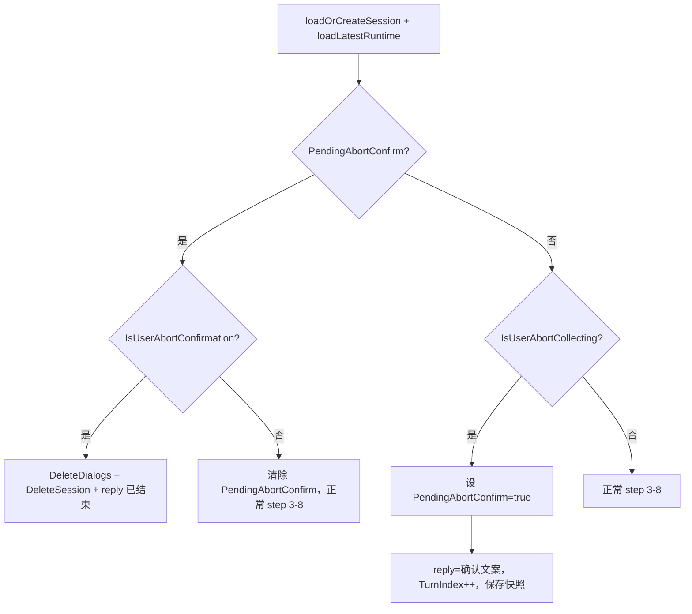

# 用户中断对话设计方案

## 现状简述

- **COLLECTING 阶段**：系统按状态机顺序收集客户跟进信息（客户名 → 联系人 → 跟进方式 → 内容 → 目标 → 结果 → 下一步计划），`[rule_engine.go](records/internal/engine/rule_engine.go)` 在 COLLECTING 下不允许 state 回退。
- **现有“阶段内意图”模式**：  
  - OUTPUTTING：用 `IsCustomerFollowRelated` 判断用户是否在发新的跟进信息，否则返回 `outputting_ended`；  
  - ASKING_OTHER_CUSTOMERS：用 `IsUserNoMoreCustomers` 判断是否“没有其他客户”；  
  - CONFIRMING：用 `IsUserConfirmation` 判断是否确认。
- **缺口**：COLLECTING（以及 CONFIRMING、ASKING_OTHER_CUSTOMERS）下用户说“先不记了”“算了不弄了”等时，没有“中断”分支，会照常走语义分析、规则引擎和生成回复。

## 设计目标

- **适用范围**：用户中断机制（含“先确认再结束”两步）在 **COLLECTING、CONFIRMING、ASKING_OTHER_CUSTOMERS 三阶段均需生效**，共用同一套逻辑，不按阶段区分实现。
- **中断粒度**：中断以**会话为单位**。一次确认即结束**当前整个会话**，该会话内正在收集的**全部客户**的未落库状态一并放弃；**不实现**“仅中止当前客户、保留其他客户”等按客户粒度的部分中止。这样实现简单、状态清晰、易维护；若按客户部分中止需维护部分 PendingUpdates、重算 focus/status 并处理 CONFIRMING 等边界，复杂度高。
- 在上述三阶段中，识别用户**主动结束当前记录**的意图。
- **先发一条确认消息**（如“确定要结束本次记录吗？未保存的内容将不会保留。回复「确定」结束，或继续补充信息。”），待用户确认后再结束会话；若用户不确认则继续正常收集流程。
- 用户确认后：**结束当前会话**（方案 B：删除该 session 的 dialogs 与 session 记录），**不落库**未确认的 pending 数据，返回**可配置的结束语**。
- 下次用户发消息时，`GetActiveSession` 返回 nil，`[loadOrCreateSession](records/internal/orchestrator/turn_orchestrator.go)` 会创建新会话，自然进入新的 COLLECTING。

## 流程：两步中断（先确认再结束）

- **第一步（用户表达“先不记了”等）**：识别到中断意图后**不立即结束**，而是置“待确认”状态、发确认文案、并**正常消耗一轮**（TurnIndex++、保存快照），以便下一轮能识别“用户是在回复确认问题”。
- **第二步（下一轮用户回复）**：若上一轮已处于“待确认”，则只判断用户是否**确认结束**（如“确定”“好的结束”）；确认则按方案 B 删除 dialogs + session 并返回结束语；不确认则清除“待确认”并按正常收集流程处理本轮输入。

“待确认”状态需要持久化到运行态快照，以便下一轮读取：在 runtime 中增加 **`PendingAbortConfirm bool`**（并写入 `RuntimeState` / dialog 快照）。

## 实现要点

### 1. AI 层：两个意图接口

- **IsUserAbortCollecting**（首次表达“想结束”）：在 `Client` 中增加  
`IsUserAbortCollecting(ctx context.Context, userInput string) (bool, error)`。  
Prompt 语义：用户明确表示**暂停/取消/结束当前记录**（如“先不记了”“算了”“不弄了”“下次再说”等），且**不是**在回答当前收集问题（避免把“没有”“不填”等误判为中断）。输出 `true`/`false`。
- **IsUserAbortConfirmation**（回复确认问题）：在 `Client` 中增加  
`IsUserAbortConfirmation(ctx context.Context, userInput string) (bool, error)`。  
Prompt 语义：在系统刚问过“确定要结束本次记录吗？”的前提下，用户是否**确认结束**（如“确定”“好的”“结束吧”等）；若用户表示不结束（如“不”“继续”）则输出 false。  
实现方式同现有 `IsUserConfirmation`（Semantic 模型 + 独立 prompt）。

### 2. 运行态：持久化“待确认”

- 在 **RuntimeContext** 与持久化结构 **RuntimeState**（如 `models.RuntimeState` 或当前 snapshot 所用结构）中增加 **`PendingAbortConfirm bool`**。
- 从 dialog 快照恢复 runtime 时解析该字段；保存快照时写入该字段。若旧数据无此字段，默认为 false。

### 3. 配置

- **Prompts**：  
  - `is_user_abort_collecting`：仅当用户想结束/取消本次记录时输出 true，回答当前字段时输出 false。  
  - `is_user_abort_confirmation`：在刚问过“是否结束本次记录”的前提下，用户确认结束输出 true，否则 false。
- **Messages**：  
  - `collecting_abort_confirm`：发一条让用户确认的文案，例如：“确定要结束本次记录吗？未保存的内容将不会保留。回复「确定」结束，或继续补充信息。”  
  - `collecting_aborted`：用户确认后发出的结束语，例如：“好的，本次记录已结束。之后有新的客户跟进要整理，再找我即可。”

### 4. 编排层：ProcessTurn 中的两处分支

- **位置**：均在 step 2（`loadLatestRuntime`）之后；先判断“待确认”，再判断“是否首次表达中断”。
- **分支一（上一轮已发确认、本轮在等用户回复）**  
  - 若 `runtime.PendingAbortConfirm == true`：  
    - 调用 `IsUserAbortConfirmation(ctx, userInput)`。  
    - 若 true：同一事务内先 `DeleteDialogsBySession(session.ID)`，再 `DeleteSession(session.ID)`（方案 B）；不执行 step 3–8，不写本轮快照，`reply = collecting_aborted`。  
    - 若 false：将 `runtime.PendingAbortConfirm = false`，然后**照常执行** step 3–8（语义分析、规则引擎、生成回复、保存快照），用户输入按正常收集处理。
- **分支二（首次表达“想结束”）**  
  - 仅当 `PendingAbortConfirm == false` 且 `session.Status` 为 COLLECTING / CONFIRMING / ASKING_OTHER_CUSTOMERS 时调用 `IsUserAbortCollecting`。  
  - 若 true：设置 `runtime.PendingAbortConfirm = true`，**不**改 Session 状态，**照常**执行 step 3–8，但**跳过语义分析与规则引擎**（不更新客户/字段），仅 `reply = collecting_abort_confirm`、TurnIndex++、保存快照（含 PendingAbortConfirm=true）。  
  - 若 false 或调用失败：按未中断继续正常 step 3–8。

### 5. 三阶段统一处理（COLLECTING / CONFIRMING / ASKING_OTHER_CUSTOMERS）

- 用户中断的判断与确认流程在三个阶段**完全一致**：仅当 `session.Status` 为三者之一时进入“分支二”（IsUserAbortCollecting）；一旦进入待确认（PendingAbortConfirm），下一轮只做 IsUserAbortConfirmation，与当前处于哪一阶段无关。实现上不按阶段分支，共用同一套逻辑。

### 6. 数据与副作用

- **发确认消息的那一轮**：正常消耗一轮（TurnIndex++、保存快照），不落库客户数据，不推进 state；仅 runtime 多一个 PendingAbortConfirm=true。
- **用户确认结束的那一轮**：不写本轮 dialog（不 TurnIndex++、不 saveRuntimeSnapshot），返回结束语。**采用方案 B**：同一事务内先 `DeleteDialogsBySession(session.ID)`、再 `DeleteSession(session.ID)`（repository 已有方法；因 `dialogs.session_id` 外键引用 `sessions(id)` 必须此顺序）。用户取消的会话在库中不留痕，与 OUTPUTTING 完成后 worker 的清理一致。**用户再次发消息时**：`GetActiveSession` 返回 nil → `loadOrCreateSession` 会新建 session 并 `CreateSession`；`loadLatestRuntime` 因无 dialog 返回初始运行态；首轮会通过 `saveRuntimeSnapshot` 写入新会话的第一条 dialog。即会重新创建 sessions 与 dialogs 记录，无需额外逻辑。
- **用户不确认的那一轮**：清除 PendingAbortConfirm，按正常收集处理并保存。

### 7. 与 OUTPUTTING 的对比

| 维度   | OUTPUTTING 阶段“非跟进”       | COLLECTING 阶段“中断”     |
| ---- | ------------------------ | --------------------- |
| 意图   | 用户发的是否为**新的**客户跟进信息      | 用户是否要**结束/取消当前**记录    |
| 会话   | 不结束，仅返回提示语               | 会话结束（删除 session + dialogs） |
| 下次消息 | 仍为同一 session（OUTPUTTING） | 新 session（COLLECTING） |

两者语义不同，故保留两套判断（`IsCustomerFollowRelated` vs `IsUserAbortCollecting`），不合并。

## 涉及文件小结

- **records/internal/ai/client.go**：接口增加 `IsUserAbortCollecting`、`IsUserAbortConfirmation`；各自实现（Semantic 模型 + prompt）。
- **records/internal/models/models.go**（或当前 snapshot 所用结构）：RuntimeState 增加字段 `PendingAbortConfirm bool`；从 dialog 反序列化时兼容缺省为 false。
- **records/internal/config/config.go**：`Prompts` 增加 `IsUserAbortCollecting`、`IsUserAbortConfirmation`；`Messages` 增加 `CollectingAbortConfirm`、`CollectingAborted`。
- **records/config.yml**：上述 prompt 与两条文案的配置值。
- **records/internal/orchestrator/turn_orchestrator.go**：  
  - 构造函数增加参数 `collectingAbortConfirm`、`collectingAborted`；  
  - RuntimeContext 增加 `PendingAbortConfirm`，加载/保存快照时读写该字段；  
  - ProcessTurn 在 step 2 后：先处理 `PendingAbortConfirm` 分支（IsUserAbortConfirmation → 删除会话或清 flag 后正常流程），再处理三阶段下的 `IsUserAbortCollecting`（设 flag、发确认、保存快照并跳过语义/规则引擎）。
- **构造链**：创建 `TurnOrchestrator` 处（如 `server.go`）传入 `collectingAbortConfirm`、`collectingAborted`。  
- 用户确认中断时在 ProcessTurn 分支一内调用 `repo.DeleteDialogsBySession(session.ID)`、`repo.DeleteSession(session.ID)`（方案 B，与 output_worker 正常结束后的清理一致）。

## 风险与注意

- **误判**：用户说“没有联系人”“不填”等应识别为“回答当前字段”而非“中断”；`is_user_abort_collecting` 需写清“仅当用户明确表示要结束/取消本次记录时输出 true”。
- **确认轮误判**：`is_user_abort_confirmation` 需限定在“刚问过是否结束”的上下文中，避免把正常补充信息（如“确定是电话联系的”）判成确认结束。
- **模型失败**：`IsUserAbortCollecting` / `IsUserAbortConfirmation` 出错时按“未中断/未确认”处理，保证对话可继续。
